# 1110119_璞真文林中正案_結構銷售簡報

---
extracted_main_title: "未命名簡報"
file_hash: "3d729bda429f432f92be04a9129195bb"
---

## 第 1 頁

璞真建設股份有限公司
台北市北投區軟橋段71 地號等1 筆
文林中正集合住宅新建工程
建築設計：林秀芬建築師事務所
結構設計：凱巨工程顧問有限公司
2021年10 月22日

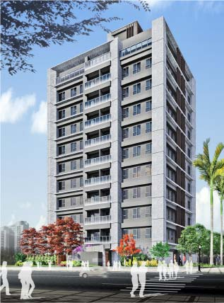

---
## 第 2 頁
### 簡報綱要
壹、建築設計概要
貳、結構設計說明
參、結構分析結果
肆、基礎型式及地質說明
伍、設計及施工細節

---

## 第 3 頁
### 壹、建築設計概要
#### 建築規劃
基地位於台北市北投區文林北路75巷。
地震分區為臺北盆地(台北一區) 。
預計興建一棟地上11F+B3F之集合住宅大樓。
建築物總高度為38.5m(1FL抬高0.3m) 。
1F樓高為4.20m 、2~11F樓高為3.40m 。
B1F樓高為3.80m ；B3F~B2F樓高為3.20m。
本案開挖深度約12.3m。
本案位於台北市北投區建民里，法規設計等值EPA=0.24g。

---
## 第 4 頁
### 壹、建築設計概要
基地位置

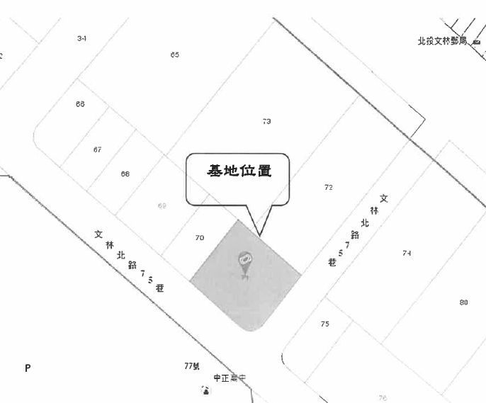

---
## 第 5 頁
### 壹、建築設計概要
#### 地下標準層(停車空間)

40cm RC牆(TYP.)

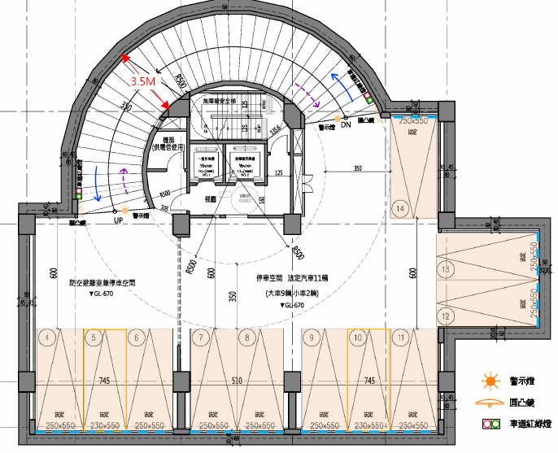

---
## 第 6 頁
### 壹、建築設計概要

一層平面(車道出入口、門廳、公共服務空間、店舖)

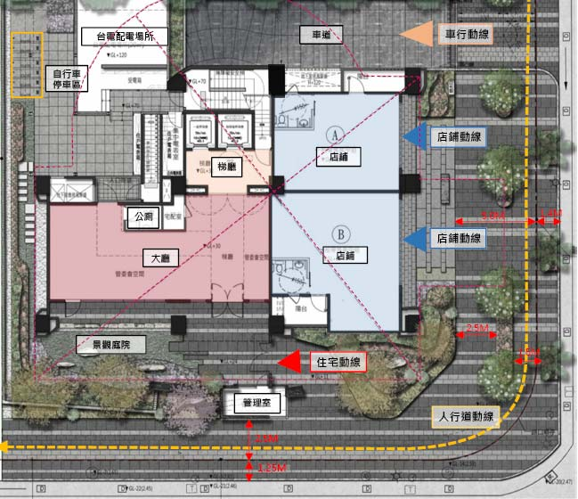

---
## 第 7 頁
### 壹、建築設計概要

標準層平面(集合住宅)

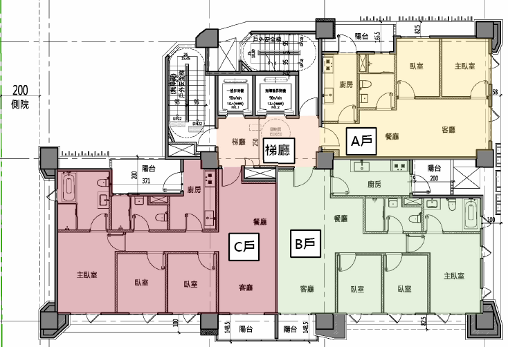

---
## 第 8 頁
### 貳.結構設計說明
#### 結構系統及尺寸

本基地工程結構體採用鋼筋混凝土(RC)之韌性抗彎構架系統(SMRF)。

##### 主要結構尺寸如下：
柱：90 x 90cm、90 x 110cm 等其他尺寸。
大梁：65 x 80cm、70 x 80cm 等其他尺寸。
小梁：30 x 70cm 等其他尺寸。
地梁：60 x 230cm、100 x 230cm 等其他尺寸。

---
## 第 9 頁
### 貳、結構設計說明

基礎版：60cm RC版
一般樓版：15cm RC版
一樓室外區樓版：24cm RC版
一樓室內區樓版：15cm RC版
外牆: 15cm RC牆
隔戶牆: 15cm RC牆
隔間牆: 輕質隔間牆
連續壁:  60cm

---
## 第 10 頁
### 貳.結構設計說明
#### 2.材料強度說明

##### 混凝土︰符合CNS相關規定
fc’= 280 kgf/cm2 (3F以上)
fc’= 350 kgf/cm2 (3FL 版以下，含3FL 版)
fc’= 280 kgf/cm2 (連續壁混凝土)
##### 鋼筋︰符合CNS相關規定
fy = 4200 kgf/cm2 (#3～#10)
##### 連續壁鋼筋︰符合CNS相關規定
fy = 4200 kgf/cm2 (#6～#10) 
fy = 2800 kgf/cm2 (#3～#5)。
##### 鋼筋續接器︰
機械式續接器續接性能等級採第二類(SA級)相關規定。

---
## 第 11 頁
### 貳、結構設計說明
#### 3.耐震設計標準
##### 最新設計規範(最新)

依100年1月頒佈之「建築物耐震設計規範與解說」
依100年1月頒佈之「混凝土結構設計規範」耐震標準
本案使用用途為集合住宅，屬於一般建築物，所以用途係數I為1.0。
基地位於台北市北投區建民里，震區屬於臺北盆地(台北一區)
設計地震力依法規要求採EPA=0.24g 設計，屬於5級耐震強度。

---
## 第 12 頁
### 貳、結構設計說明
地震分區依100年1月19日施行規範設計

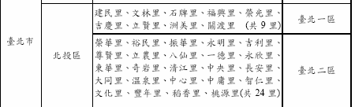

---
## 第 13 頁
### 貳、結構設計說明
4.地震震度分級說明

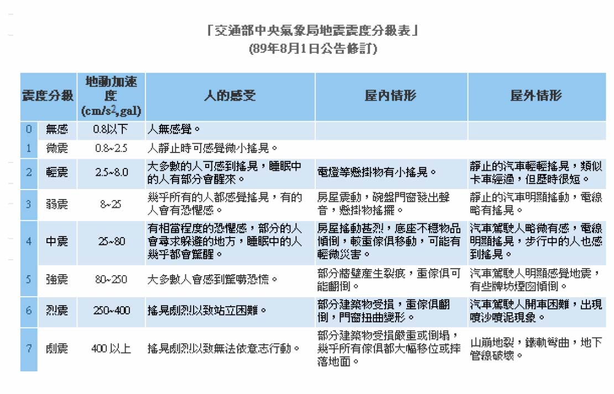

---
## 第 14 頁
### 貳、結構設計說明
#### 5.設計活載重

設計活載重標準層(住宅)採用200 kg/m2、(屋頂平台)300 kg/m2。
一層室外活載重採用1000 kg/m2，一層室內活載採用500 kg/m2。
地下三層~地下一層為一般停車場，活載重採用500 kg/m2 。台電配電室活載採用900 kg/m2。
屋頂水箱水重併入地震力計算。

---
## 第 15 頁
### 貳、結構設計說明

筏基層平面

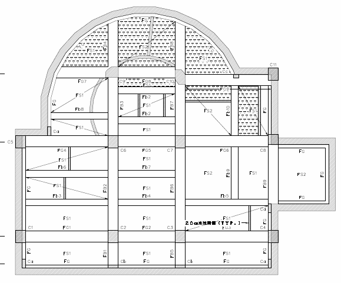

---
## 第 16 頁
### 貳、結構設計說明
地下標準層平面

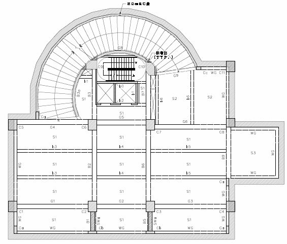

---
## 第 17 頁
### 貳、結構設計說明
標準層平面

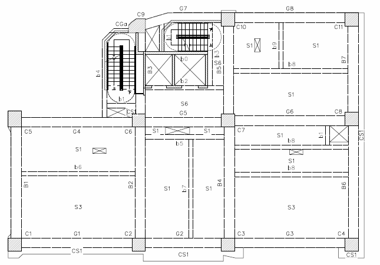

---
## 第 18 頁
### 參、結構分析結果
結構分析模型

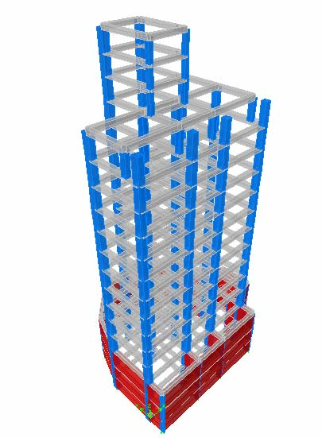
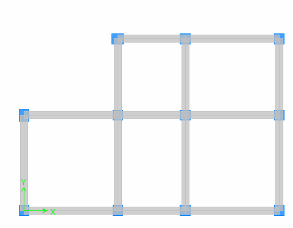
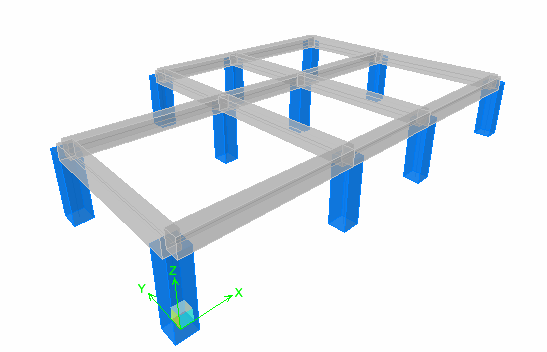

---
## 第 19 頁
### 參、結構分析結果
#### 地震力&風力分析圖表
地震力分析
風力分析

---
## 第 20 頁
### 肆、基礎型式及地質說明
開挖深度12.3m
基礎座落於第二層土層（粉土質黏土層）

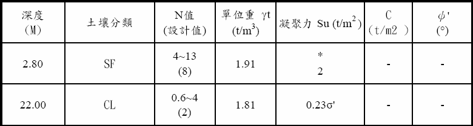

---
## 第 21 頁
### 肆、基礎型式及地質說明
#### 地下水位及基礎承載力檢討

1.地下水位
2.基礎承載力

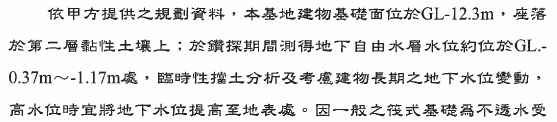
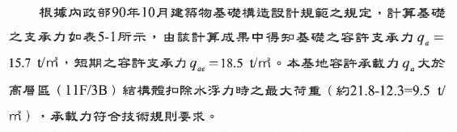

---
## 第 22 頁
### 肆、基礎型式及地質說明
土壤液化檢討

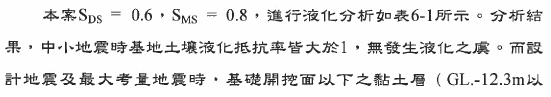
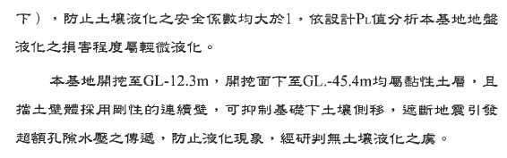

---
## 第 23 頁
### 肆、基礎型式及地質說明
基礎差異沉陷檢討

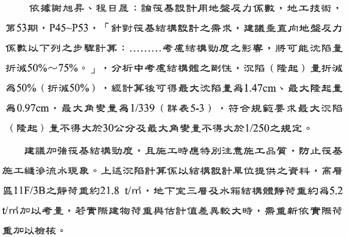

---
## 第 24 頁
### 肆、基礎型式及地質說明
#### 開挖擋土措施-順打開挖+安全支撐
開挖深度=12.3m
60cm連續壁，L=30.7m

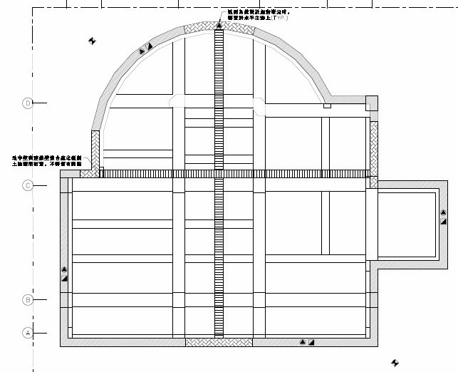

---
## 第 25 頁
### 肆、基礎型式及地質說明
#### 開挖擋土措施-開挖支撐平面圖
開挖深度=12.3m
60cm連續壁，L=30.7m

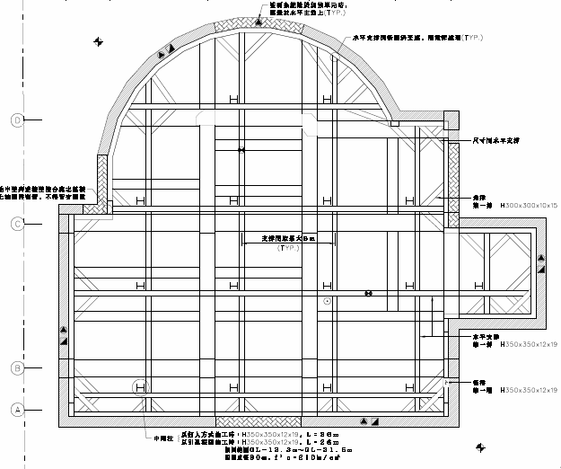

---
## 第 26 頁
### 肆、基礎型式及地質說明
#### 開挖擋土措施-開挖支撐剖面圖

分析結果列表

變位/開挖深度= 1/290<1/240

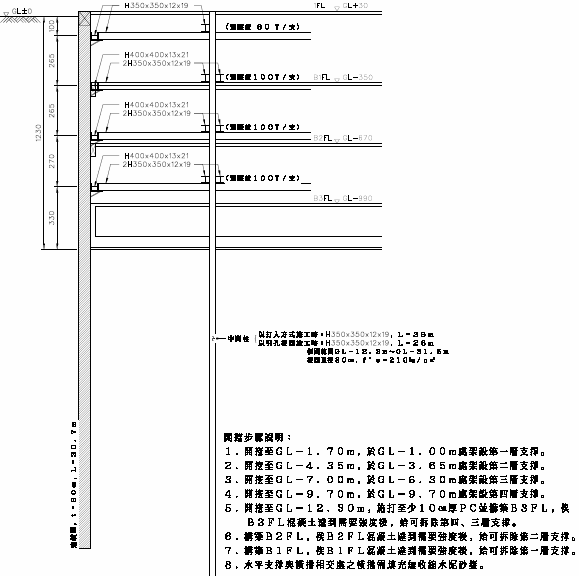

---
## 第 27 頁
### 伍、設計及施工細節
#### 基礎及側牆
基礎型式採用筏式基礎。
筏基層地梁深度為2.3m，筏基版厚度60cm。
地下室外牆為60cm連續壁，亦提供建物一穩定之基面向上發展，內側並施作防水複壁，免除牆面滲水情形。
#### 耐震設計細部
本案之鋼筋設計及施工，皆採韌性設計並依「結構混凝土設計規範」、「結構混凝土施工規範」之規定辦理，有關韌性箍筋及相關鋼筋施工標準亦依規定施工。

---
## 第 28 頁

---
