# 1110215_文林中正_機電銷講簡報

---
extracted_main_title: "文林中正     銷售講習簡報"
file_hash: "d25bcf70619d51e1a1bfa0c784b40926"
---

## 第 1 頁
### 文林中正     銷售講習簡報

文林中正     銷售講習簡報 
                                機電設計 111.02.15

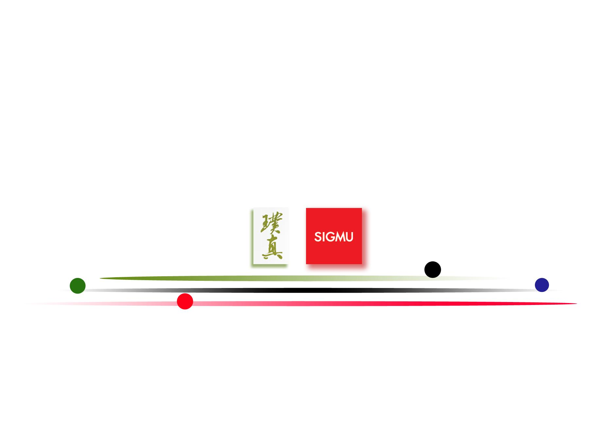

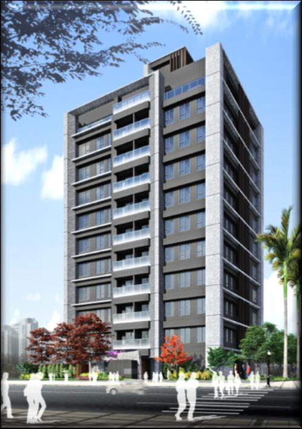

---
## 第 2 頁

■ .建築設計：林秀芬建築師事務所 
■ .結構設計：凱巨工程顧問有限公司 
■ .門廳公設：即美室內裝修設計公司 
■ .燈光設計：肯緒照明設計 
■ .景觀設計：境業景觀設計 
■ .機電設計：永業設計有限公司
規劃設計團隊 
建築物基本資料 
 
■ .基地位置：台北市北投區軟橋段71地號 
■ .基地面積：975.88m2 
■ .建築規模：地上11FL 、地下3FL 
■ .樓層高度：38.5米 
■ .總計戶數：29戶(住宅)、2戶(店鋪)

---
## 第 3 頁
### 簡報大鋼

---
## 第 4 頁

---
## 第 5 頁
### 公共區：

• 供電系統：3∮3W 220V 。
• 發電機：150KW一台，油箱設計容量可連續供電7.5小時。
• 自來水蓄水量：地下蓄水池+屋頂水塔合計約36噸，符合法規日用水量。
• 雨水再生蓄水量：筏基內雨水回收池最大蓄水量約40噸。
• 空調：B1F/1F/R1F公共區採VRV變頻空調系統。
• 管材：污排水明管採PVC厚管；冷熱水採不銹鋼被覆管。

---
## 第 6 頁
### 2F~11F 專有住宅：

• 供電電壓：各戶均採1∮3W 110/220V獨立電錶。
• 供水口徑： 2F-10F A戶採 1” ，11F A戶採1 ½”
2F-11F B戶採1” ，2F-10F C戶採1 ½”
1F零售業採3/4”
• 發電機供電 : 停電時供應各戶室內四處插座使用
(冰箱、客廳、主臥、宅內箱)。
• 管材：污排水採PVC厚管 ；冷熱水採不銹鋼被覆管。
• 電視設備：設置數位共同天線或預留有線電視搭配使用。

---
## 第 7 頁
### 1F~2F 金融保險業：

• 供電電壓：均採1∮3W 110/220V獨立電錶。
• 供水口徑： C戶(金融保險)採1” 。
• 緊急發電機供電 : 停電時供應各戶三處插座+宅內箱使用。
• 管材：污排水採鑄鐵管(管道內採PVC厚管) ；冷熱水採不銹鋼被覆管。
• 電視設備：設置數位共同天線，預留有線電視搭配使用。

---
## 第 8 頁

---
## 第 9 頁
### 系統管材概要說明

機械接頭-消防管材接頭
使用壽命長、抗震性能佳 
 
 
不鏽鋼保溫披覆管-冷水、熱水管
避免溫差大，造成冷凝水滴
隔熱性能好 可確實達到保溫及 
    節能效果

---
## 第 10 頁

---
## 第 11 頁
### 機電重點設備及特色

綜合佈線、資訊通訊 
1
安全防災 
2
舒適節能 
3
貼心便利 
4

---
## 第 12 頁
### 綜合佈線、資訊通訊

行動通訊改善
節省佈線空間，提高住戶高速資通
資訊智慧 
宅內整合箱建置 
無線網路 
FTTH 
光纖到府建置

---
## 第 13 頁
### 資訊智慧宅內整合箱建置

本案示意
網路 (Switch)模組
電話模組
110Vac 插座模組
有線電視分配模組
他案案例

以模組方式整合住戶內電話、光纖網路、有線及無線電視訊號。

設置多組網路、電話、電視專用插座，方便住戶隨時擴充。

整體箱體內外美觀整齊，看不到雜亂無章的電線。

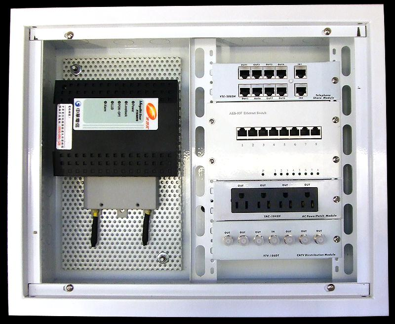
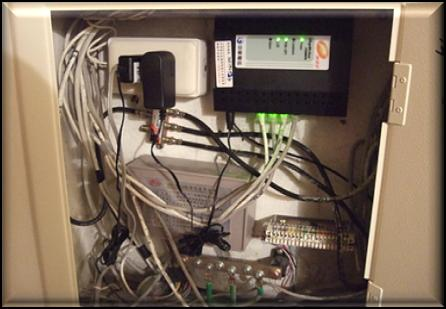

---
## 第 14 頁
### 社區無線網路

社區住戶可於公共使用空間 
透過公共無線專屬網路  Wi-Fi上網 
(如交誼廳、大廳、停車空間…)

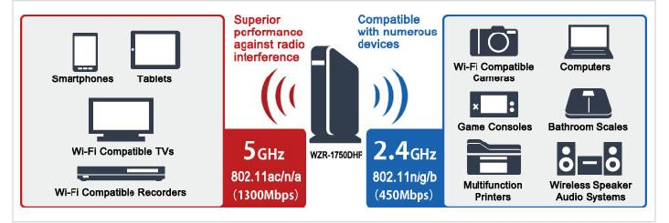

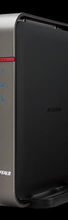

---
## 第 15 頁
### 行動通訊改善

Donor antenna
Splitter
R24
Service antenna
Cable

解決建築物收訊死角

建置於各樓層梯廳、電梯車箱、停車空間
，並預留供住戶可引接至室內

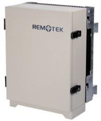

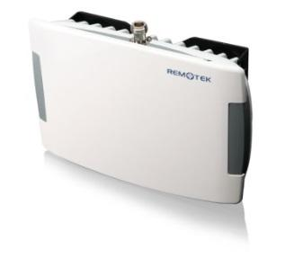

---
## 第 16 頁
### 各層梯廳預留日後客戶自行擴充接點

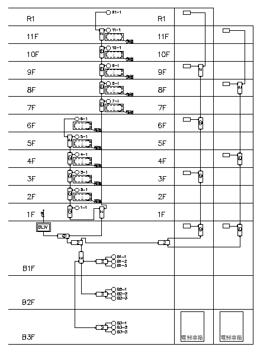
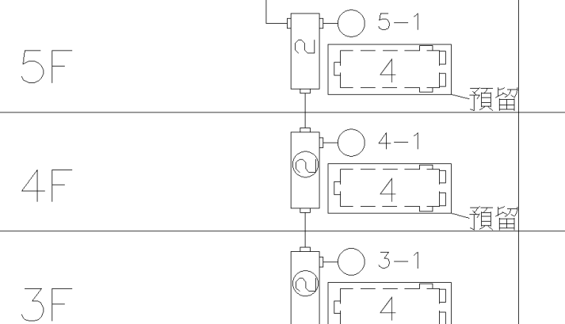

---
## 第 17 頁
### FTTH光纖到府建置

優劣比較 
FTTH 
ADSL傳統網路
線 路 
 媒 介
光纖-傳輸品質高、
傳輸距離遠
銅纜線-品質低、
傳輸距離短
電 器  
特 性 
電磁屏蔽、不受干擾 
易受電器干擾或受潮故障
信 號  
轉 換
光電轉換器- 
整合智能宅內箱 
數據機
擴充性 
擴充不需重新佈線 
擴充速率受影響

建置光纖社區，全面升級數位生活

提高未來系統傳輸可擴充性

降低日後擴充時之佈線難度及費用

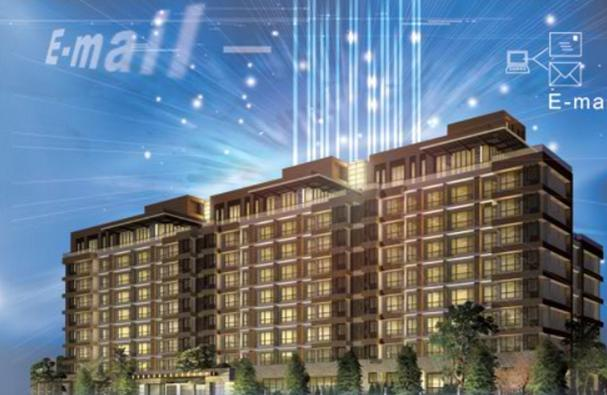

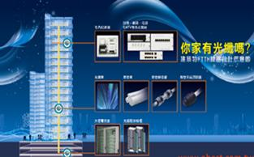

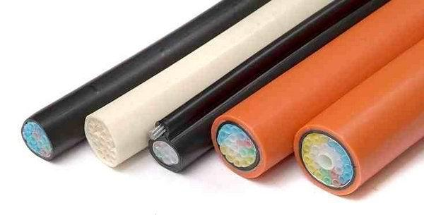

---
## 第 18 頁
### 安全防災

空間 
防火阻絕
火警連動
提升大樓安全防災及防護能力，減少物管派駐人力與管理費用

---
## 第 19 頁
### 空間為何需要防火阻絕

火勢阻絕，人員爭取 
有效逃生時間及空間
火勢延穿越牆壁
管線縫隙蔓延
火勢延樓板 
管道上下蔓延 
火勢延管線蔓延
空間防火阻絕

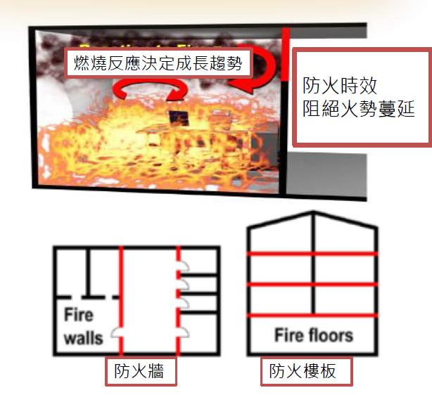

---
## 第 20 頁
### 他案常見錯誤施作案例

一般非防火發泡
沒綁防火帶、防火阻絕不確實
未填防火材料
常見方便行事只填砂漿替代

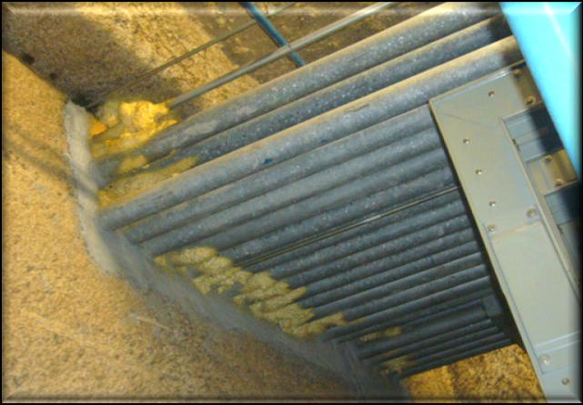
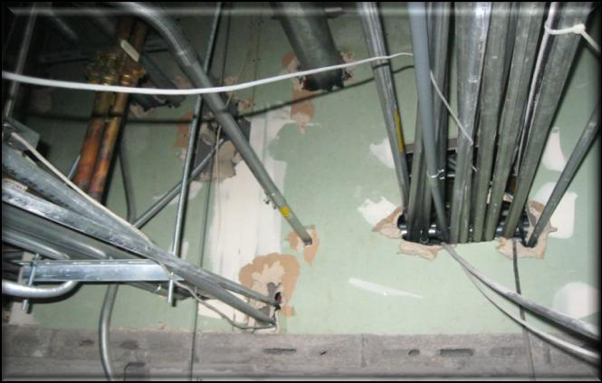
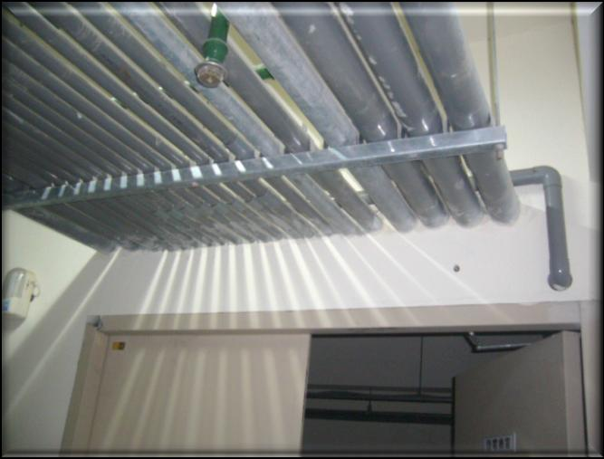

---
## 第 21 頁

防火阻絕有效及重點位置： 
管道間 
機房 
梯廳及排煙室
•本案採用有防火認證個別工法的防火材料填塞。
•在不同管材施予不同的個別工法認證，明確訂
定嚴謹的施工程序及規範。
•能有效防止火燄及濃煙延燒，以增取逃生時間。

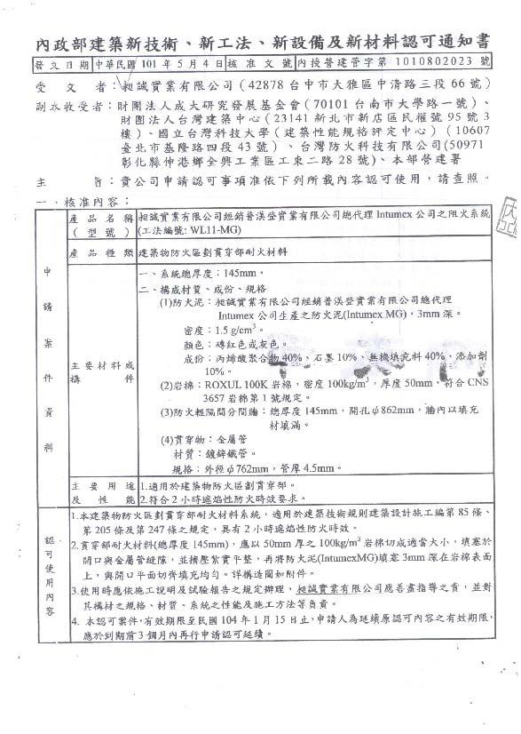
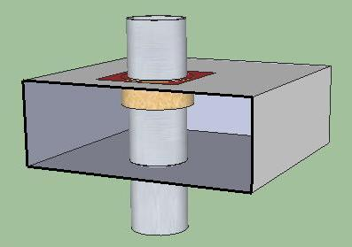

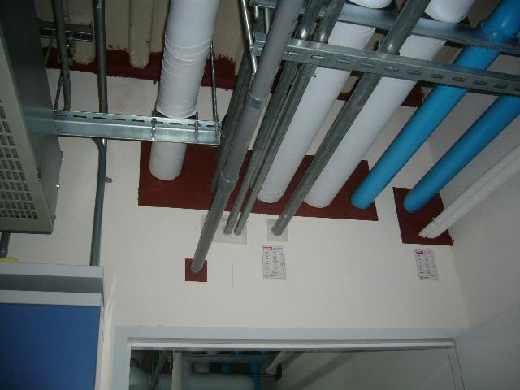

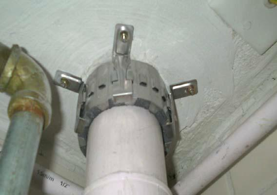

---
## 第 22 頁

標準樓層 
(防火阻絕施作位置)

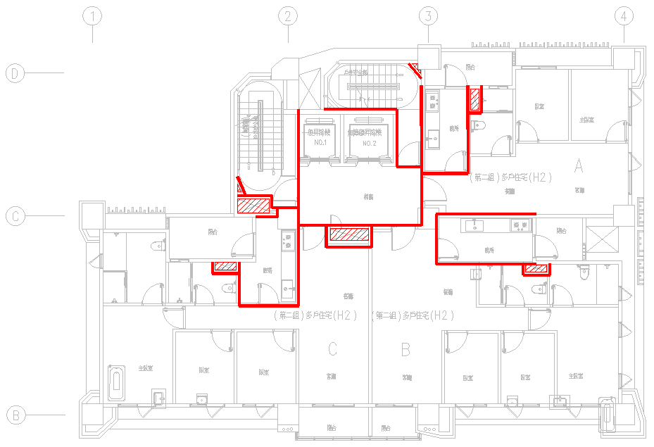

---
## 第 23 頁
### 火警連動

O2
O2
O2 
O2
CO2 CO2
CO2 CO2 
X
火警連動消防通道安全門、風車： 
火災發生時,進風設備自動關閉,開啟安全門(避免新鮮空氣持續引入，造成火勢助燃)

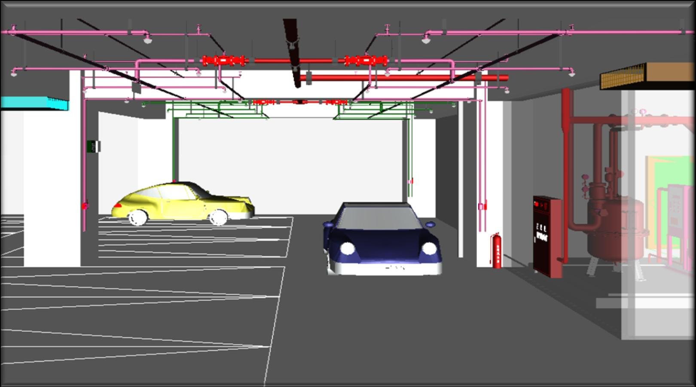

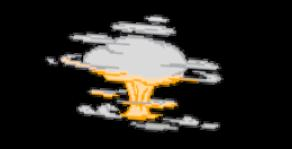

---
## 第 24 頁
### 舒適節能

直接效益可節省能源及低碳排放， 
達到住戶更舒適居住環境
中央 
淨水處理
停車場 
一氧化碳 
連動控制
感應燈具
應用 
燈具自動 
排程控制
公設空間 
新風設備建置
雨水回收
再利用
制音防治
措施

---
## 第 25 頁
### 停車場一氧化碳連動控制

誘導式風機
排風管道+風機設備 
進風管道+風機設備
偵測器

停車場24小時一氧化碳濃度監控。

停車場進風、排風除定時控制外，當一氧化碳濃度過高時，
則自動強制進行進排風換氣 。

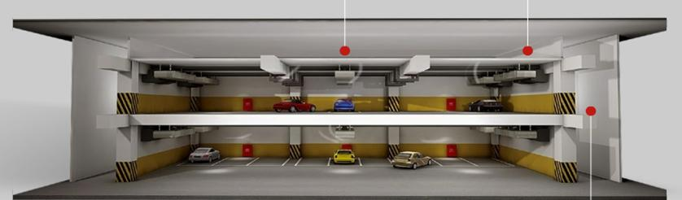

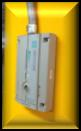

---
## 第 26 頁
### 燈具自動排程控制

燈光控制主機
建築物立面、室內公共、戶外景觀等區域
，燈光控制採系統自動排程控制，並可依
四季時序的不同自動調整

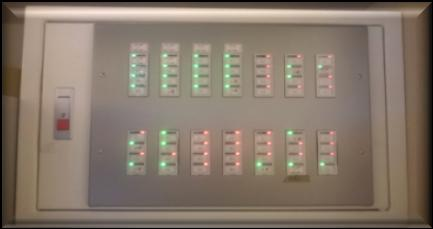

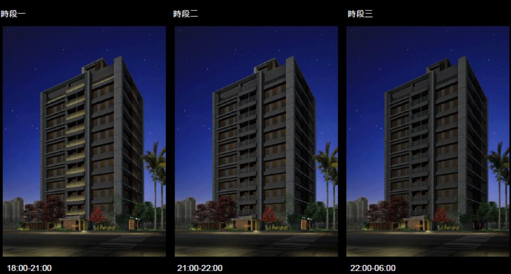
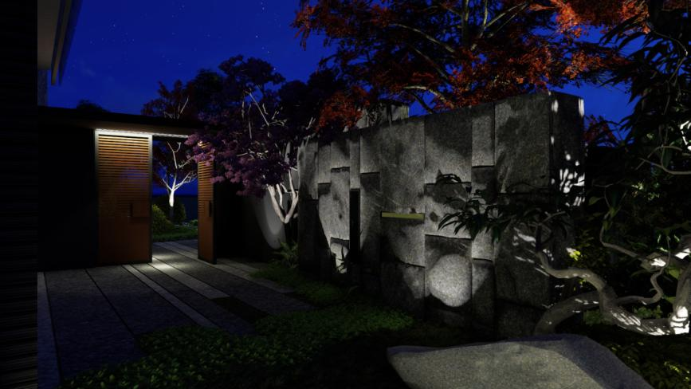
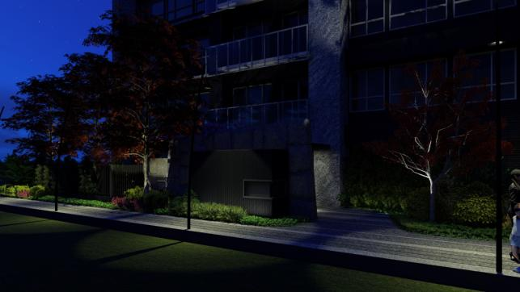

---
## 第 27 頁
### 感應燈具應用

樓梯感應燈
應用場所：停車位、樓梯間
人員靠近時，感應燈管自動點亮 
平時無人時，感應燈管休眠狀態

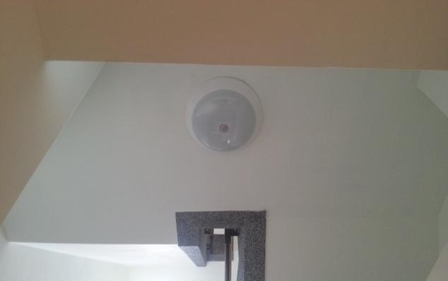
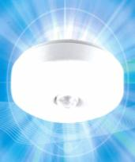

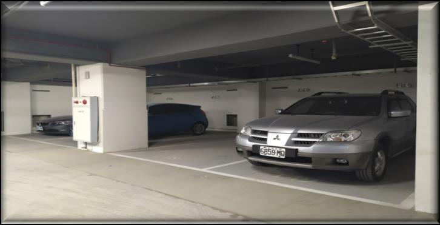
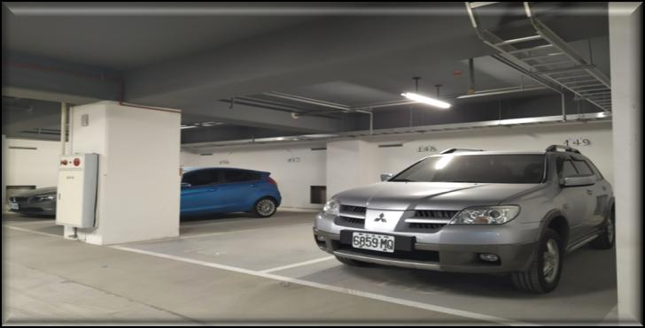

---
## 第 28 頁

停車樓層 
(感應燈具位置)
標準樓層 
(感應燈具位置)

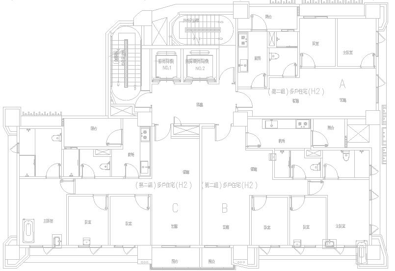
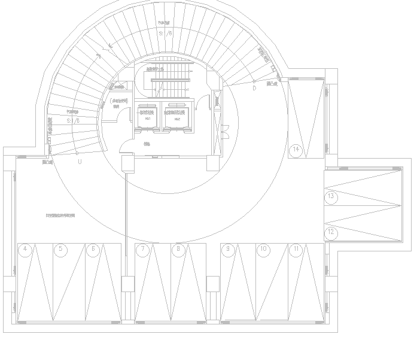

---
## 第 29 頁
### 公設空間新風設備建置


引入室外活氧空氣，過濾灰塵並清除污染過敏原，提供乾淨且新鮮的呼吸空氣

控制溫度交換，降低冷暖房的能源損耗

設置地點：1F迎賓大廳、健身房、閱覽室等、R1F交誼空間
自動調節室內空氣品質：
當環境狀況超過條件設定值時，發出訊號，自動啟動新風設備。
室內空氣品質偵測器 
(設備示意圖)

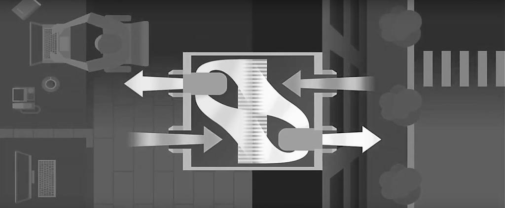
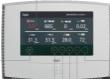
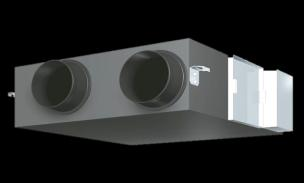

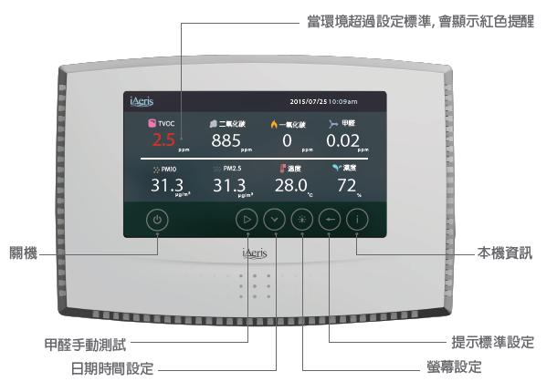

---
## 第 30 頁
### 雨水回收再利用


屋頂雨水經專屬管路集中再回收

經沉沙及除質後，引入綠能再生水槽供庭園澆灌

有效降低公共用水量，貫側綠建築理念與自然共生

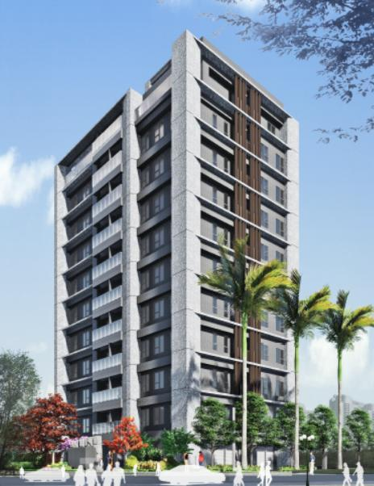

---
## 第 31 頁
### 制音防治措施

項
次 
項目 
設計標準 
設計制音對策
1 
B1F緊急發電機 
依環保署噪音管制區類別設計
1.風機設計消音箱 
2.機房內頂板及牆面設計吸音材料處理 
3.浮動地版設計，且與設備基座分開 
4.採用隔音防火門
2 
給水管路 
水錘吸收器設計

機房 制音：
風機消音箱
浮動地板
頂版+牆面吸音材料

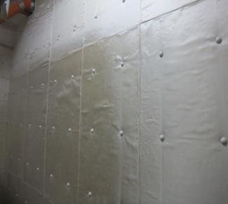

---
## 第 32 頁

公共機房 
揚水管轉折處
專有浴廁 
水管末端

管路 制音：
水錘吸收器

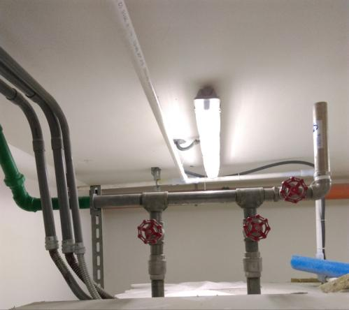

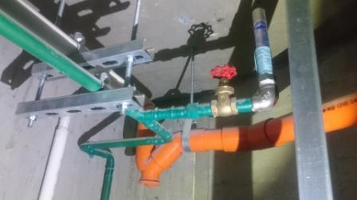

---
## 第 33 頁
### 中央淨水處理

地下水池設置雜質過濾設備，屋頂水塔採殺菌設備
完全防護客戶飲用水安全
第
二
道
殺
菌
處
理
(頂樓)
(上水塔循環淨水處理)
下水管
(地下室)
揚水管
第一道 
雜質過濾
處理
自來水引進
第1道處理
第2道處理
自來水引進

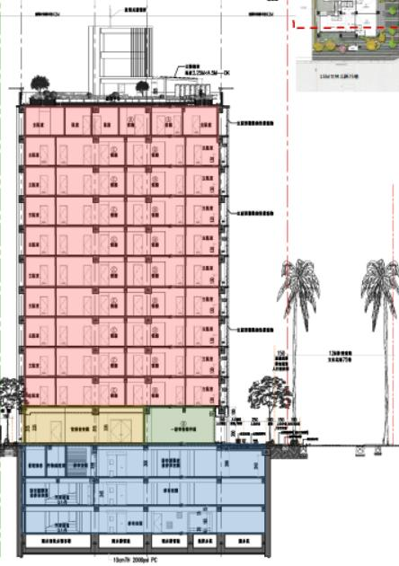
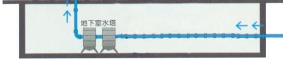
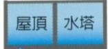

---
## 第 34 頁
### 貼心便利

提供生活需求化的便利性服務
專有戶內預留
裝修排水
集中式
垃圾 
資源回收室
專有戶內
自來水 
總閥設置
汽車充電樁
用電預留
專有戶內 
 停電備用電源
自來水 
子母水箱

---
## 第 35 頁
### 專有戶內預留裝修排水

排水口
裝修排水立管
專用沉沙池

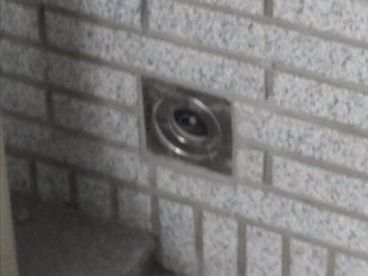

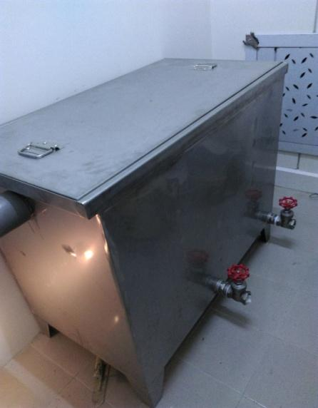

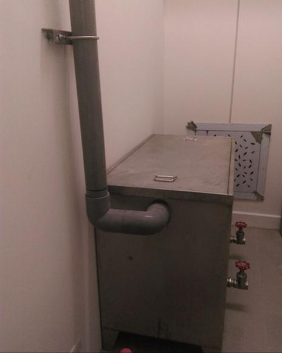

---
## 第 36 頁
### 工作陽台自來水總閥設置

它案設置 
梯廳天花內
屋頂水錶區
法定總閥
自來水總閥-設置在工作陽台
便於管路維養或緊急狀況時啟閉

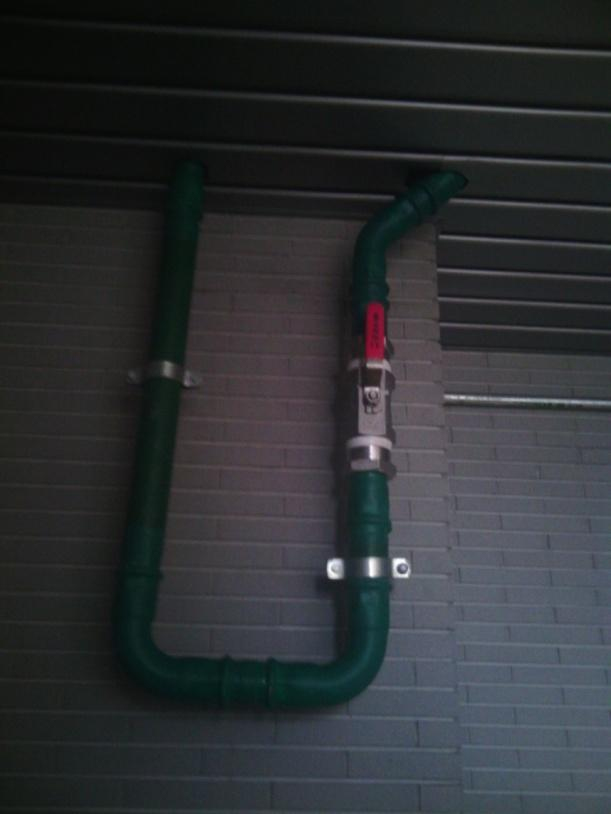

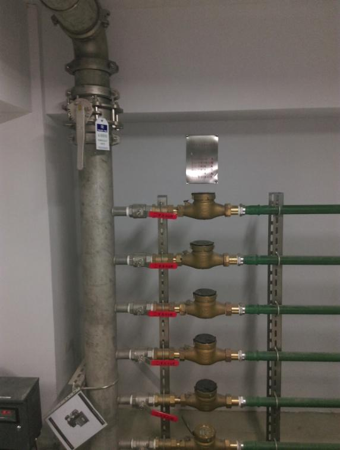

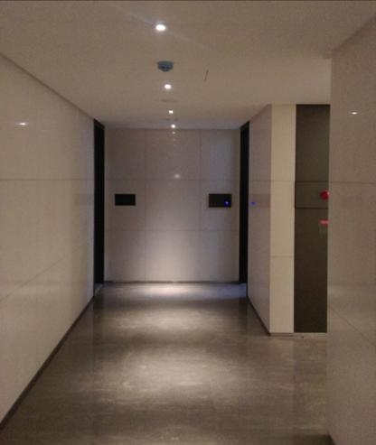

---
## 第 37 頁
### 集中式垃圾冷藏及資源回收室

地下一層

地下一層設計符合綠建築規範，具有空間充足且
合理運出動線的集中垃圾冷藏室。

室內設置廚餘冷藏、垃圾及資源回收儲藏、排風
設備、空間內紫外線殺菌等。

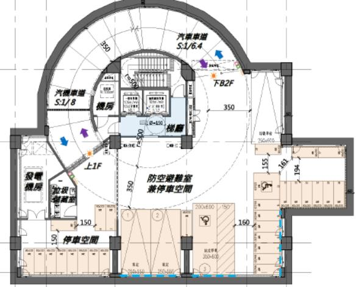

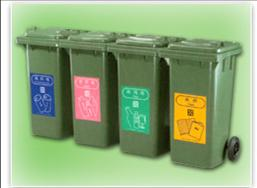

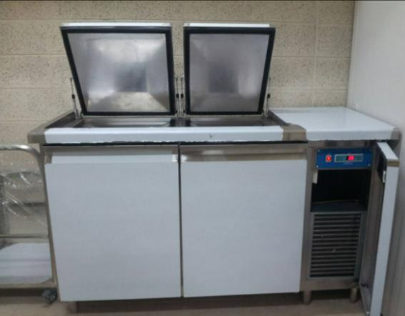

---
## 第 38 頁
### 汽車充電預留

車充專用 
台電公共電錶
車充總盤
車位後方 
建置線槽
當樓層分區盤 
(內含私設電表) 
充電器 
220V/32A
c
日後車主 
建置範圍
前期系統建置 
後續客戶自行施作(含配線)
各專有戶車位：
預留配電線用電纜線架
系統採車充專用公共電表+軟體計費管理
預留配線 
電纜線架
軟體計費 
整合管理
系統 
優點
公共專用 
車充電表
可採時間電價便宜計費 
 (每度約1.4~4.4元)
客戶日後自行建置及配線 
  引接便利
所有車位皆可建置充電樁

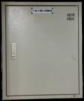
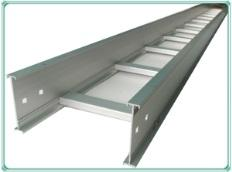

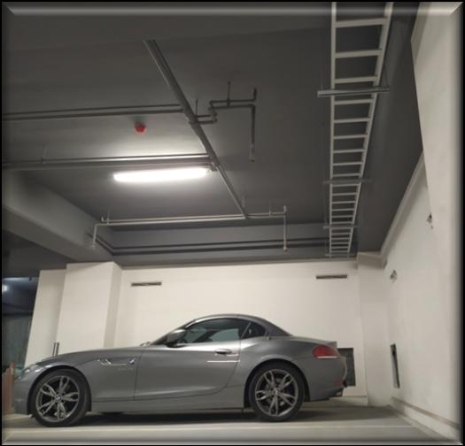

---
## 第 39 頁

配線電纜架
當層配電盤
停車樓層 
(電動車充電預留)

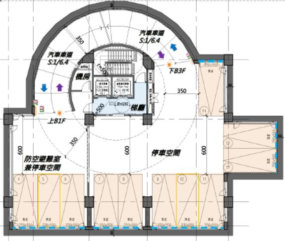

---
## 第 40 頁
### 專有戶內 停電備用電源

緊急電自動切換開關
宅內配電箱
停電時，室內自動切換由發電機供電範圍： 
室內四處插座使用 (冰箱、客廳、主臥、宅內箱)

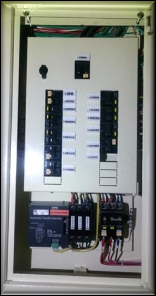

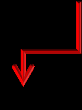

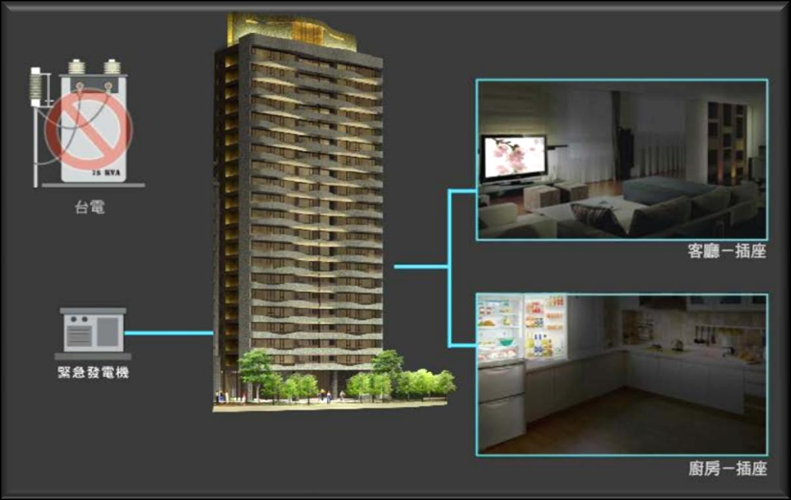

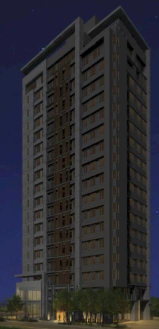

---
## 第 41 頁

標準樓層 
(緊急插座位置) 
停電緊急插座

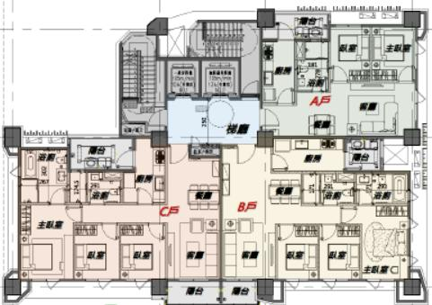

---
## 第 42 頁
### 自來水子母雙水箱

雙水箱設計 
洗水塔不停水
屋頂水塔採雙獨立水塔，管路交替補水的設計
當清洗水塔時,住戶端持續正常供水

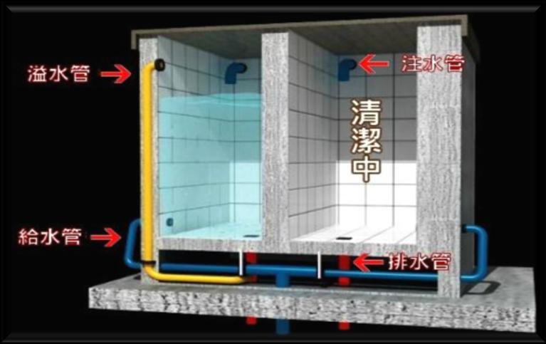

---
## 第 43 頁

---
## 第 44 頁
### 污排水轉折層分流設計

污排水轉折層幹管與轉折當層支管採分流， 
至下層管道內後才匯集，避免堵塞時直接 
回灌當層器具。

---
## 第 45 頁
### 浴廁當層排氣及管道垂直/水平區劃

管道間樓版皆採RC澆築封閉，樓
板不放空，管路穿越事先預埋套管 
管道間配管後，管縫隙塡實封閉 
主浴/次浴廁當層排氣罩
當層排氣優點： 
   利用浴室本身排風裝置直接將 
   浴室廢氣排出至戶外 
 
管道垂直/水平區劃優點： 
   避免火災發生時之煙囪效應產 
   生，確保居住之安全。

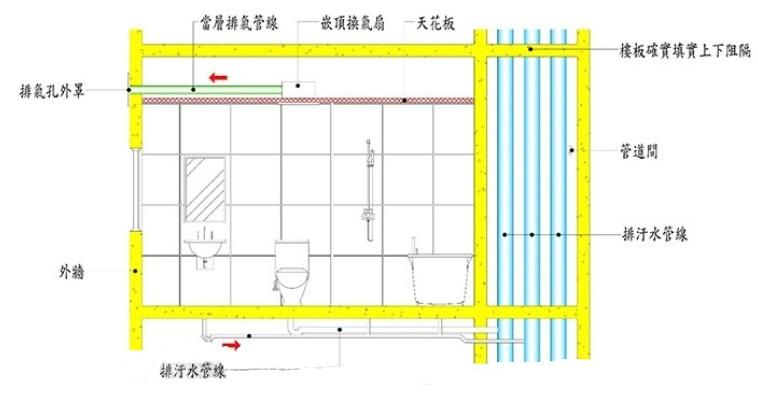
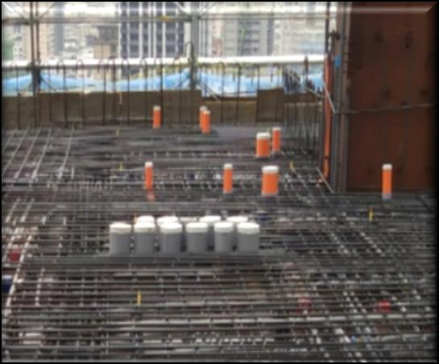

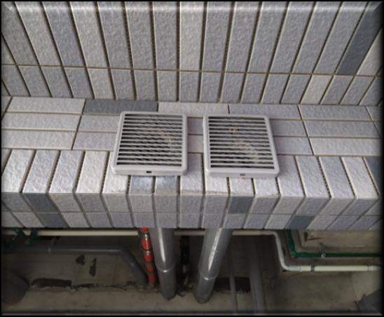

---
## 第 46 頁
### 專有戶內配電宅內箱配線槽引線

配線槽收線優點： 
   專有戶配電宅內箱處樓板暗埋管數量多，以線槽分散 
   配管位置，避免樓板保護層厚度不足造成日後樓板龜裂。 
 
增築輕隔間厚度，內崁電氣宅內箱優點： 
   避免內崁分戶牆，造成牆壁龜裂風險及降低隔音效果。
(它案示意)
頂板配線槽
輕隔間增築 
內崁電氣宅內箱

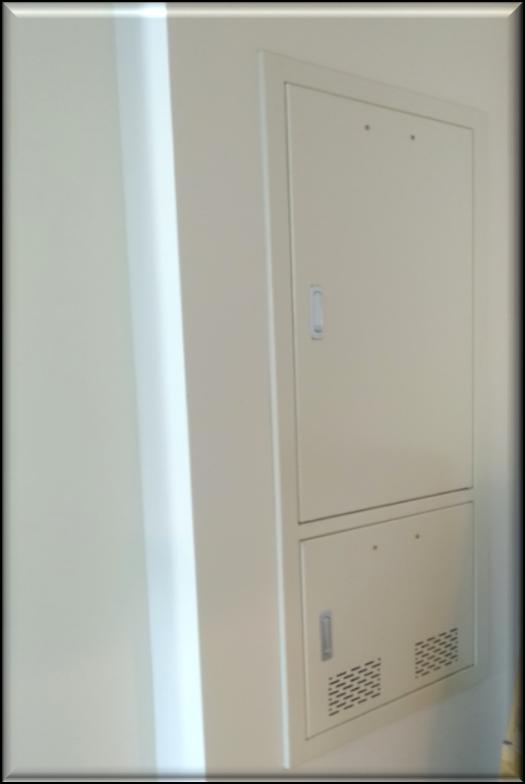

---
## 第 47 頁

---
