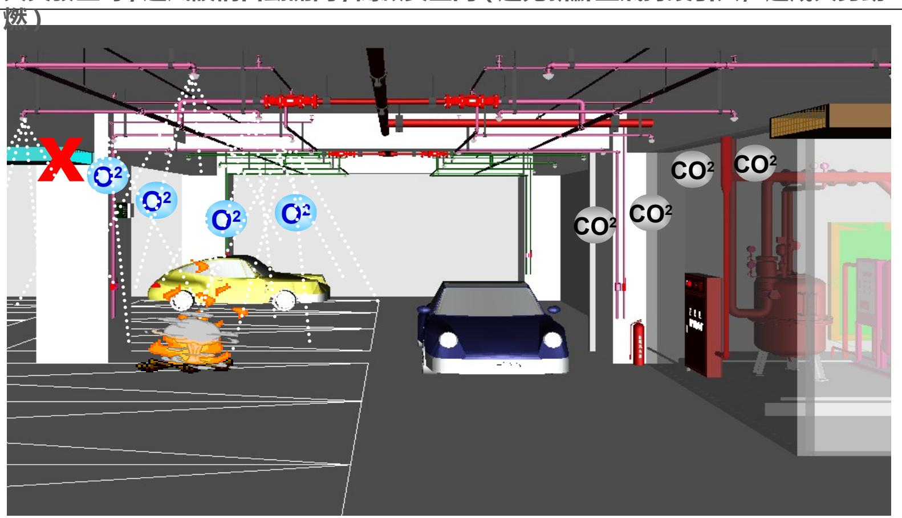
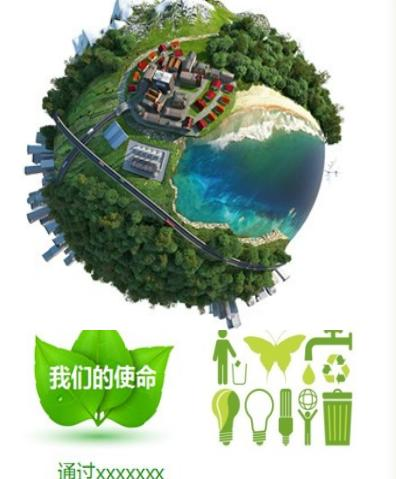

# 1130927_文林北路_機電銷講簡報

---
extracted_main_title: "文林北路     銷售講習簡報"
file_hash: "05134dd0dd8911f689cfb8df4e8a37d0"
---

## 第 1 頁
### 文林北路     銷售講習簡報

文林北路     銷售講習簡報
                                機電工程 113.09.27

---
## 第 2 頁
### 建築物基本資料 規劃設計團隊

**■ . 基地位置:台北市北投區軟橋段 36 地號**

**■ . 基地面積: 1801.95m2**

**■ . 建築規模:地上 18FL 、地下 4FL ■ . 樓層高度: 65.5 米 ( 高層建築物 )**

**■ . 總計戶數: 61 戶 ( 住宅 ) 、 2 戶 ( 金融保險業 )**

**■ . 建築設計:林秀芬建築師事務所 ■ . 結構設計:凱巨工程顧問有限公司 ■ . 門廳公設:即美室內裝修設計公司**

**■ . 燈光設計:肯緒照明設計**

**■ . 景觀設計:竑皓景觀國際有限公司**

**■ . 機電設計:永業設計有限公司**

---
## 第 3 頁
### 簡報大鋼

## **簡報大鋼**

- **◎ 工程概要**
- **◎ 系統管材概要說明**
- **◎ 重點設備及特色**

 ****

---
## 第 4 頁

- **◎ 系統管材概要說明**
- **◎ 重點設備及特色**

 ****

---
## 第 5 頁
### 公共區：

•  供電系統：3∮4W 220/380V 。
•  發電機：750KW 一台，油箱設計容量可連續供電4.5 小時。
•  自來水蓄水量：地下蓄水池+ 屋頂水塔合計約62 噸，符合法規日用水
量。
•  雨水再生蓄水量：筏基內雨水回收池最大蓄水量約102 噸。
•  空調：B1F/1F/R1F 公共區採VRV 變頻空調系統。
•  管材：污排水明管採鑄鐵管( 管道內採PVC 厚管) ；冷熱水採不銹鋼被
覆管。

---
## 第 6 頁
### 2F~18F 專有住宅：

•  供電電壓：各戶均採1∮3W 110/220V 獨立電錶。
•  供水口徑： 標準樓層A 、B 、D 戶採 1 〞， C 戶採1 ½” ，
18F 合併A 戶採 1 ½” 。
•  發電機供電 : 停電時供應各戶室內四處插座使用
( 冰箱、客廳、主臥、宅內箱) 。
•  空調：統一建置變頻冷暖空調室外主機
•  電視設備：設置數位共同天線或預留有線電視搭配使用。

---
## 第 7 頁
### 1F~2F 金融保險業：

•  供電電壓：均採3∮4W 220/380V 獨立電錶，室內照明
採220V ，並設變壓器降壓至110V 供插座使用。
•  供水口徑： C 戶( 金融保險) 採1” 。
•  緊急發電機供電 : 停電時供應各戶三處插座+ 宅內箱使用。
•  空調：統一建置VRV 變頻空調系統。
•  電視設備：設置數位共同天線，預留有線電視搭配使用。

---
## 第 8 頁

**◎ 重點設備及特色**

 ****

---
## 第 9 頁
### 系統管材概要說明

EMT
鋼管- 強弱電明管配置
高等級安全防火管材
機械接頭- 消防管材接頭
使用壽命長、抗震性能佳
CIP 塗裝鑄鐵管：污水管、廢水管( 明
管)
PVC
厚管: 污水管、廢水管( 管道內暗管)
使用年限長
防火、抗腐蝕性強
低流體摩擦係數( 低噪音)
不鏽鋼保溫披覆管- 冷水、熱水管
避免溫差大，造成冷凝水滴
隔熱性能好 可確實達到保溫及
    節能效果
特性：防火、耐用、低噪音、保溫

---
## 第 10 頁

- **◎ 系統管材概要說明**
- **◎ 重點設備及特色**

 ****

---
## 第 11 頁
### 機電重點設備及特色

綜合佈線、資訊通訊
1
安全防災
2
舒適節能
3
貼心便利
4

---
## 第 12 頁
### 綜合佈線、資訊通訊

## *Four core* policy tasks

資訊智慧 宅内整合箱建置

無線網路

行動通訊改善

FTTH 光纖到府建置

節省佈線空間,提高住戶高速資通

---
## 第 13 頁
### 資訊智慧宅內整合箱建置

本案示意
網路 (Switch) 模組
電話模組
110Vac 插座模組
有線電視分配模組
他案案例

以模組方式整合住戶內電話、光纖網路、有線及無線電視訊號。

設置多組網路、電話、電視專用插座，方便住戶隨時擴充。

整體箱體內外美觀整齊，看不到雜亂無章的電線。

---
## 第 14 頁
### 社區無線網路

社區住戶可於公共使用空間
透過公共無線專屬網路  Wi-Fi 上網
( 如交誼廳、大廳、停車空間… )

---
## 第 15 頁
### 行動通訊改善

Donor antenna
Splitter
R24
Service antenna
Cable

解決建築物收訊死角

建置於各樓層梯廳、電梯車箱，並預留供
住戶可引接至室內

---
## 第 16 頁
### 各層梯廳預留日後客戶自行擴充接點

---
## 第 17 頁
### FTTH 光纖到府建置

優劣比較
FTTH
ADSL 傳統網路
線 路
 媒 介
光纖- 傳輸品質高、
傳輸距離遠
銅纜線- 品質低、
傳輸距離短
電 器
特 性
電磁屏蔽、不受干擾
易受電器干擾或受潮故障
信 號
轉 換
光電轉換器-
整合智能宅內箱
數據機
擴充性
擴充不需重新佈線
擴充速率受影響

建置光纖社區，全面升級數位生活

提高未來系統傳輸可擴充性

降低日後擴充時之佈線難度及費用

---
## 第 18 頁
### 安全防 安全防災災

**吸收反射式 避雷針**

**空間**

**防火阻絕 火警連動**

**提升大樓安全防災及防護能力,減少物管派駐人力與管理費用**

---
## 第 19 頁
### 吸收反射式避雷針

他案屋頂層雷擊點
擊碎石片散落1F 地面
他案屋突一層雷擊點
設備型式
傳統式
放電式
吸收反射式
分類
補救性避雷
補救性避雷
預防性避雷
避雷方式
引雷
主動式引雷
主動式驅雷
本案為了人員及建築物安全，採用能確
實有效防護建築物的吸收反射式避雷
針。

---
## 第 20 頁

電暈效果可達平均
高度2500 公呎以
上
故障監視
避雷保護頭
特色：
1. 採預防性驅雷，能有效降低在保護範圍內的雷擊發生。
2. 可在防災中心加裝避雷系統故障監視器，可明確知道避雷系統組件是否故障
或線路斷路等情形，能隨時監視避雷系統是否健全，提高其可靠性。

---
## 第 21 頁
### 空間防火阻絕

火勢阻絕，人員爭取
有效逃生時間及空間
火勢延穿越牆壁
管線縫隙蔓延
火勢延樓板
管道上下蔓延
火勢延管線蔓延

---
## 第 22 頁
### 他案常見錯誤施作案例

一般非防火發泡
沒綁防火帶、防火阻絕不確實
未填防火材料
常見方便行事只填砂漿替代

---
## 第 23 頁

防火阻絕有效及重點位置：
管道間
機房
梯廳及排煙室
• 本案採用有防火認證個別工法的防火材料填
塞。
• 在不同管材施予不同的個別工法認證，明確訂
定嚴謹的施工程序及規範。
• 能有效防止火燄及濃煙延燒，以增取逃生時
間。

---
## 第 24 頁

1. 梯廳、排煙室
2. 緊急昇降梯間
3. 特別安全梯
4. 公共管道
5. 排水管道間
6. 廚房
標準樓層
( 防火阻絕施作位置)
A3
A2
A1

---
## 第 25 頁
### 火警連動

## 火警連動

## 火警連動消防通道安全門、風車:

火災發生時,進風設備自動關閉,開啟安全門(避免新鮮空氣持續引入,造成火勢助

---
## 第 26 頁
### 舒適節能 舒適節能

**停車場 一氧化碳 連動控制** **燈具自動 排程控制** **感應燈具 應用**

**公設空間 新風設備建置** **雨水回收 再利用**

**中央 淨水處理** **制音防治 措施**

**直接效益可節省能源及低碳排放, 達到住戶更舒適居住環境** 

---
## 第 27 頁
### 停車場一氧化碳連動控制

誘導式風機
排風管道+ 風機設備
進風管道+ 風機設備
偵測器

停車場24 小時一氧化碳濃度監控。

停車場進風、排風除定時控制外，當一氧化碳濃度過高時，
則自動強制進行進排風換氣 。

---
## 第 28 頁
### 燈具自動排程控制

燈光控制主機
建築物立面、室內公共、戶外景觀等區域，
燈光控制採系統自動排程控制，並可依四季
時序的不同自動調整

---
## 第 29 頁
### 感應燈具應用

樓梯感應燈
應用場所：停車位、樓梯間
人員靠近時，感應燈管自動點亮
平時無人時，感應燈管休眠狀態

---
## 第 30 頁

停車樓層
( 感應燈具位置)
標準樓層
( 感應燈具位置)

---
## 第 31 頁
### 公設空間新風設備建置


引入室外活氧空氣，過濾灰塵並清除污染過敏原，提供乾淨且新鮮的呼吸空氣

控制溫度交換，降低冷暖房的能源損耗

設置地點：1F 迎賓大廳、健身房、閱覽室等、R1F 交誼空間
自動調節室內空氣品質：
當環境狀況超過條件設定值時，發出訊號，自動啟動新風設備。
室內空氣品質偵測器
( 設備示意圖)

---
## 第 32 頁
### 雨水回收再利用


屋頂雨水經專屬管路集中再回收

經沉沙及除質後，引入綠能再生水槽供庭園澆灌

有效降低公共用水量，貫側綠建築理念與自然共生

---
## 第 33 頁
### 制音防治措施

項
次
項目
設計標準
設計制音對策
1
B1F 緊急發電機
依環保署噪音管制區類別設計
1. 進氣機及排氣機設計消音箱
2. 機房內頂板及牆面設計吸音材料處
理
3. 浮動地版設計，且與設備基座分開
4. 採用隔音防火門
2
R2F 消防中繼機房
浮動地版設計，且與設備基座分開
3
給水管路
水錘吸收器設計

機房 制音：
風機消音箱
浮動地板
頂版+ 牆面吸音材料

---
## 第 34 頁

專有浴廁
水管末端
公共機房
揚水管轉折處

管路 制音：
水錘吸收器

---
## 第 35 頁
### 中央淨水處理

地下水池設置雜質過濾設備，屋頂水塔採殺菌設備
完全防護客戶飲用水安全
第1 道處理
第2 道處理
自來水引進
第
二
道
殺
菌
處
理
( 頂樓)
( 上水塔循環淨水處
理)
下水管
( 地下室)
揚水管
第一道
雜質過濾
處理
自來水引進

---
## 第 36 頁
### 貼心便利 貼心便利

**專有戶內預留 裝修排水**

**專有戶內 自來水 總閥設置**

**集中式 垃圾 資源回收室**

**汽車充電樁 用電預留**

**電子 讀卡信箱**

**專有戶內 停電備用電源**

**自來水 子母水箱**

---
## 第 37 頁
### 專有戶內預留裝修排水

排水口
裝修排水立管
專用沉沙池

---
## 第 38 頁
### 工作陽台自來水總閥設置

它案設置
梯廳天花內
屋頂水錶區
法定總閥
自來水總閥- 設置在工作陽台
便於管路維養或緊急狀況時啟閉

---
## 第 39 頁
### 集中式垃圾儲藏及資源回收室

地下一層

地下一層設計符合綠建築規範，具有空間充足且
合理運出動線的集中垃圾冷藏室。

室內設置廚餘冷藏、垃圾及資源回收儲藏、排風
設備、空間內紫外線殺菌等。
圖示僅供參考

---
## 第 40 頁
### 汽車充電樁用電預留

車充專用
台電公共電錶
車充總盤
車位後方
建置線槽
當樓層分區盤
( 內含私設電表)
充電器
220V/32A
c
日後車主
建置範圍
前期系統建置
後續客戶自行施作( 含配
線)
各專有戶車位：
預留配電線用電纜線架
系統採車充專用公共電表+ 軟體計費管
理
預留配線
電纜線架
軟體計費
整合管理
系統
優點
公共專用
車充電表
可採時間電價便宜計費
 ( 每度約1.4~4.4 元)
客戶日後自行建置及配線
  引接便利
所有車位皆可建置充電樁

---
## 第 41 頁

配線電纜架
當層配電盤
停車樓層
( 電動車充電預留)

---
## 第 42 頁
### 電子讀卡( 信箱) 系統

•  讓社區住戶更便利的生活
•  不需攜帶鑰匙
•  可透過利用電腦管制或單機作業
•  進行資料互換，住戶只需登記一次

---
## 第 43 頁
### 專有戶內 停電備用電源

緊急電自動切換開關
宅內配電箱
停電時，室內自動切換由發電機供電範圍：
室內四處插座使用 ( 冰箱、客廳、主臥、宅內箱)

---
## 第 44 頁

停電緊急插座
標準樓層
( 緊急插座位置)

---
## 第 45 頁
### 自來水子母雙水箱

雙水箱設計
洗水塔不停水
屋頂水塔採雙獨立水塔，管路交替補水的設計
當清洗水塔時, 住戶端持續正常供水

---
## 第 46 頁

- **◎ 系統管材概要說明**
- **◎ 重點設備及特色**

 ****

---
## 第 47 頁
### 污排水轉折層分流設計

污排水轉折層幹管與轉折當層支管採分
流，
至下層管道內後才匯集，避免堵塞時直接
回灌當層器具。

---
## 第 48 頁
### 浴廁當層排氣及管道垂直/ 水平區劃

管道間樓版皆採RC 澆築封閉，樓
板不放空，管路穿越事先預埋套管
管道間配管後，管縫隙塡實封閉
主浴/ 次浴廁當層排氣罩
當層排氣優點：
   利用浴室本身排風裝置直接將
   浴室廢氣排出至戶外
管道垂直/ 水平區劃優點：
   避免火災發生時之煙囪效應產
   生，確保居住之安全。

---
## 第 49 頁
### 專有戶內配電宅內箱配線槽引線

配線槽收線優點：
   專有戶配電宅內箱處樓板暗埋管數量多，以線槽分散
   配管位置，避免樓板保護層厚度不足造成日後樓板龜
裂。
增築輕隔間厚度，內崁電氣宅內箱優點：
   避免內崁分戶牆，造成牆壁龜裂風險及降低隔音效果。
( 它案示
意)
頂板配線槽
輕隔間增築
內崁電氣宅內箱

---
## 第 50 頁

---
