# 1131004 文林北路案_結構銷售簡報 .pdf

---
extracted_main_title: "未命名簡報"
file_hash: "066ee5f5e220f4b82f4a4c7463f89b60"
---

## 第 1 頁

KAICHU
軟橋段36地號
璞真建設股份有限公司 
文林北路案結構銷講簡報
建築設計：林秀芬建築師事務所
結構設計：凱巨工程顧問有限公司
2022 年6 月28 日

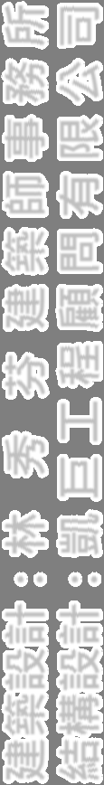

---
## 第 2 頁

KAICHU
軟橋段36地號
簡報綱要
壹、建築設計概要
貳、結構設計說明
參、結構分析結果
參
結構分析結果
肆、基礎型式及地質說明
伍、設計及施工細節
伍
設計及施工細節
陸、總結

---
## 第 3 頁

• 基地位於台北市北投區文林北路75巷交叉口南側。
¾ 建築規劃
• 地震分區為臺北盆地(台北一區) 。
• 預計興建一棟地上18F+B4F之集合住宅大樓。
• 建築物總高度為65 5m(1FL抬高0 5m) 。
建築物總高度為65.5m(1FL抬高0.5m)
• 1F樓高為5.10m 、2F樓高為3.60m 、3~15F樓高為3.50m
、16~18F樓高為3.60m 。
樓高為
樓高為
• B1F樓高為4.0m ；B4F~B2F樓高為3.20m。
• 本案開挖深度約16.2m。
• 本案位於台北市北投區建民里，法規設計等值EPA=0.24G。

---
## 第 4 頁

¾ 基地位置

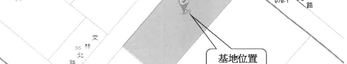
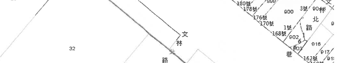
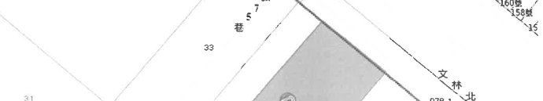
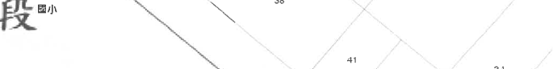
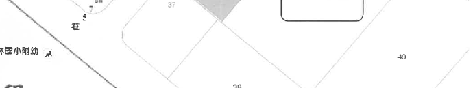
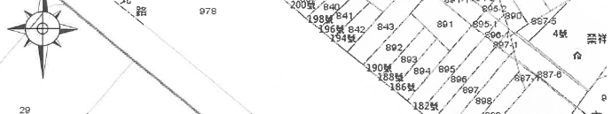

---
## 第 5 頁

¾ 地下標準層(停車空間)

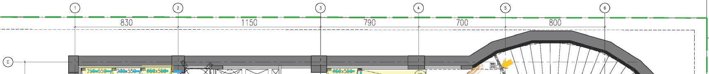
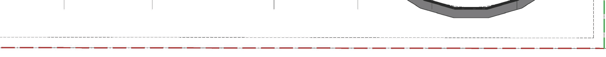
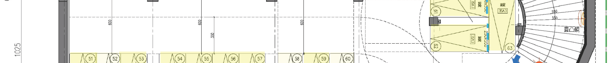
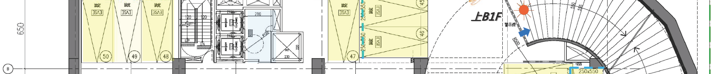
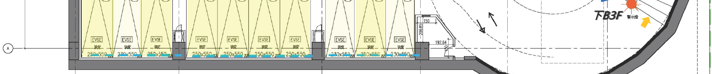

---
## 第 6 頁

¾ 一層平面(車道出入口、門廳、公共服務空間、店舖)

---
## 第 7 頁

¾ 標準層平面(集合住宅)

---
## 第 8 頁
### 貳.結構設計說明

•本基地工程結構體地下層採用鋼筋混凝土(RC)之韌性抗彎構架，
1.結構系統及尺寸
地上層為鋼骨鋼筋混凝土(SRC)之韌性抗彎構架。
•主要結構尺寸如下：
柱：
100 x 100 cm(□700 x 700 mm)。
大梁：
70 x 90 cm (H600 x 400 mm)、
70 x 90 cm (H600 x 400 mm)、
75 x 90 cm (H600 x 450 mm)等其他尺寸。
小梁：
小梁：
30 x 70cm 等其他尺寸。
基樁：
150 x 300cm。

---
## 第 9 頁

基礎版：80cm RC版
一般樓版：15cm RC版
樓室外區樓版
24
RC版
一樓室外區樓版：24cm RC版
一樓室內區樓版：15cm RC版
外 牆: 15cm RC牆
隔間牆: 輕隔間牆
連續壁:  80cm

---
## 第 10 頁
### 貳.結構設計說明

混凝土︰符合CNS相關規定
f ’
280 k f/
2 (7F以上)
2.材料強度說明
fc’= 280 kgf/cm2 (7F以上)
fc’= 350 kgf/cm2 (3F-7FL，含7FL 版)
fc’= 420 kgf/cm2 (B4F-3FL，含3FL 版)
fc’= 350 kgf/cm2 (B4FL)
g /
(
)
鋼筋︰符合CNS相關規定
fy = 4200 kgf/cm2 (#3～#10)
y
g /
(
)
鋼骨︰符合CNS及CSC相關規定:
鋼材
適用範圍
鋼柱
鋼材
適用範圍
鋼柱
SN490C
鋼柱鈑厚<40mm
15F-18F
SN490YC
鋼柱鈑厚≧40mm
15F-18F
SM570M-CHW
鋼柱
B1F-14F
鋼材
適用範圍
鋼梁
SN490B
鋼大梁鈑厚<40mm
16FL-R1FL
SN490YB
鋼大梁鈑厚≧40mm
16FL-R1FL
SN490YB
鋼大梁鈑厚≧40mm
16FL R1FL
SM570M-A
鋼大梁鈑厚<40mm
1FL-15FL
SM570M-B
鋼大梁鈑厚≧40mm
1FL-15FL

---
## 第 11 頁

• 最新設計規範(最新)
3.耐震設計標準
(
)
依100年1月頒佈之「建築物耐震設計規範與解說」
依100年1月頒佈之「混凝土結構設計規範」
耐震標準
本案使用用途為集合住宅，屬於一般建築物，所以用途
係數I 為1 0
基地位於台北市北投區建民里
震區屬於臺
係數I 為1.0。基地位於台北市北投區建民里，震區屬於臺
北盆地(台北一區)，設計地震力依法規要求採EPA=0.24g
設計，屬於5級耐震強度。

---
## 第 12 頁

KAICHU
軟橋段36地號
地
分
貳.結構設計說明
¾地震分區依100年1月19日施行規範設計

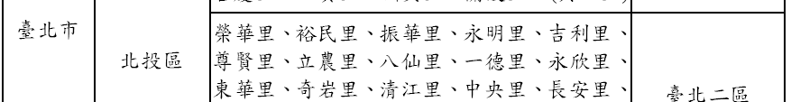
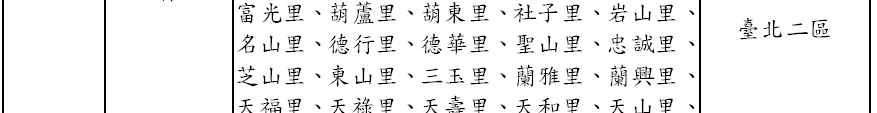
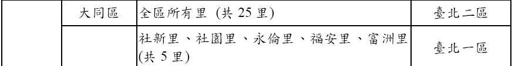
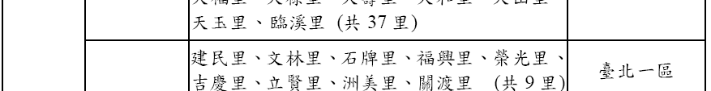
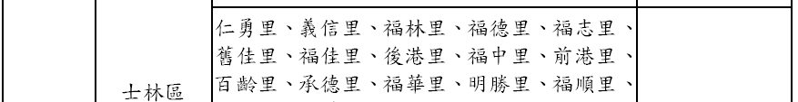
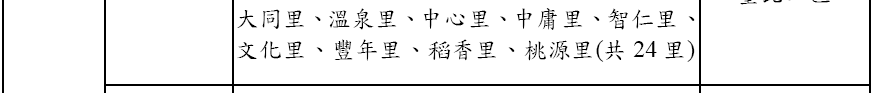

---
## 第 13 頁

4.地震震度分級說明(舊制)
震度
地動加速度
(cm/s2, gal)
人的感受
屋內情形
屋外情形
0
無感
0.8gal 以下
人無感覺。
1
微震
0 8~2 5gal
人靜止時可感覺微小搖晃。
1
微震
0.8~2.5gal
人靜止時可感覺微小搖晃。
2
輕震
2.5~8gal
大多數的人可感到搖晃，睡眠
中的人有部分會醒來。
電燈等懸掛物有小搖晃。
靜止的汽車輕輕搖晃，類
似卡車經過，但歷時很短
3
弱震
8~25gal
幾乎所有的人都感覺搖晃，有
的人會有恐懼感。
房屋震動，碗盤門窗發出聲音，
懸掛物搖擺。
靜止的汽車明顯搖動，電
線略有搖晃。
4
中震
25 80gal
有相當程度的恐懼感，部分的
人會尋求躲避的地方
睡眠中
房屋搖動甚烈，底座不穩物品傾
倒
較重傢俱移動
可能有輕微
汽車駕駛人略微有感，電
線明顯搖晃
步行中的人
4
中震
25~80gal
人會尋求躲避的地方，睡眠中
的人幾乎都會驚醒。
倒，較重傢俱移動，可能有輕微
災害。
線明顯搖晃，步行中的人
也感到搖晃。
5
強震
80~250gal
大多數人會感到驚嚇恐慌。
部分牆壁產生裂痕，重傢俱可能
翻倒。
汽車駕駛人明顯感覺地震
有些牌坊煙囪傾倒。
6
烈震
250~400gal
搖晃劇烈以致站立困難。
部分建築物受損，重傢俱翻倒，
門窗扭曲變形。
汽車駕駛人開車困難，出
現噴沙噴泥現象。
部分建築物受損嚴重或倒塌，幾
山崩地裂
鐵軌彎曲
地
7
劇震
400gal以上
搖晃劇烈以致無法依意志行動
乎所有傢俱都大幅移位或摔落地
面。
山崩地裂，鐵軌彎曲，地
下管線破壞。

---
## 第 14 頁

舊制

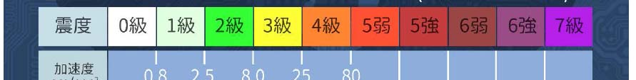

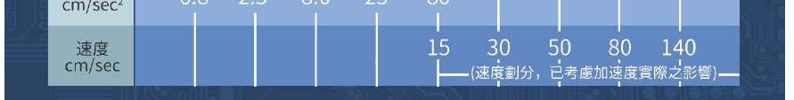
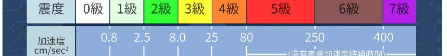

---
## 第 15 頁

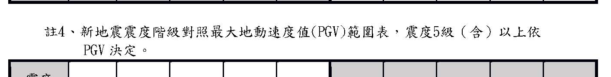
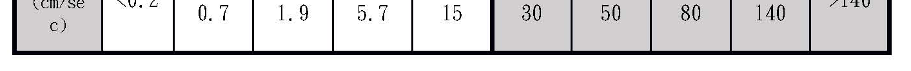
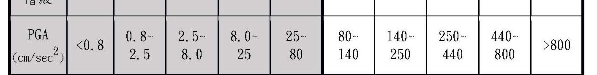
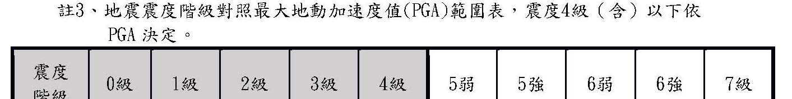
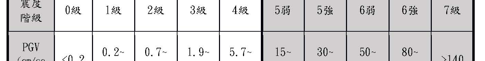

---
## 第 16 頁

5.設計活載重
• 設計活載重標準層(住宅)採用200 kg/m2、(屋頂平台)300 kg/m2。
• 一層室外活載重採用1000 kg/m2，一層室內活載採用500 kg/m2。
層室外活載重採用1000 kg/m
層室內活載採用500 kg/m
• 地下四層~地下一層為一般停車場，活載重採用500 kg/m2 。
台電配電室活載採用900 kg/m2。
屋頂水箱水重併入地震力計算
• 屋頂水箱水重併入地震力計算。

---
## 第 17 頁

¾ 地下標準層平面

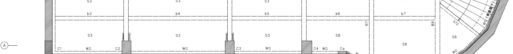

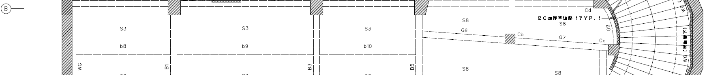
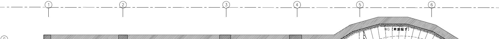
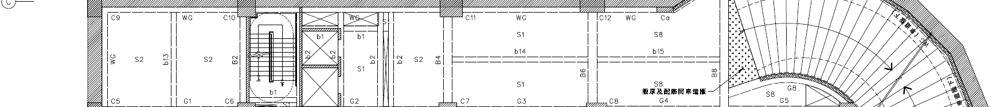

---
## 第 18 頁

¾ 標準層平面

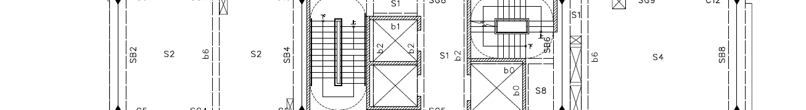
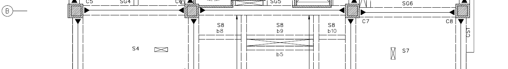
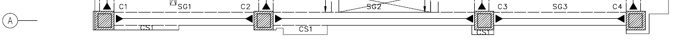
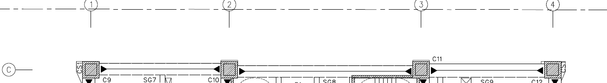
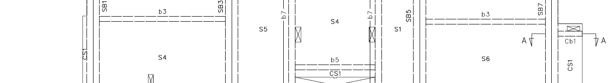

---
## 第 19 頁

¾結構分析模型

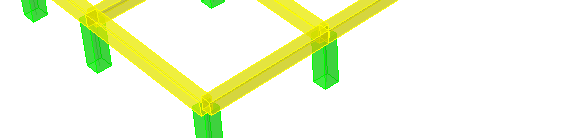
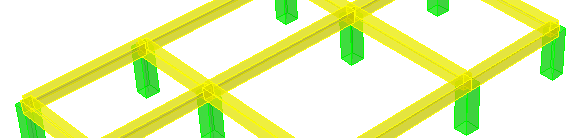

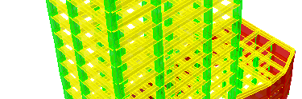
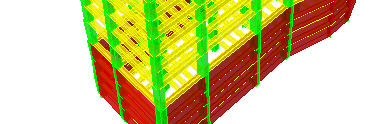
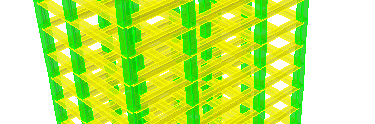
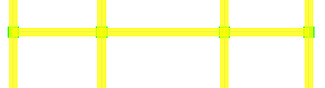
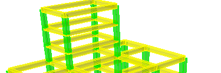
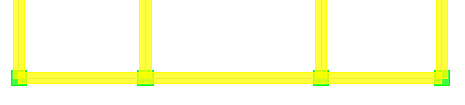
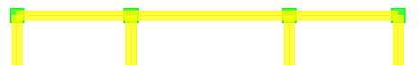
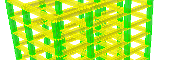

---
## 第 20 頁

地震力分析
¾ 地震力分析結果(EPA=0.24G)
動力週期
(sec)
靜力週期
(sec)
法規設計力
(ton)
最大頂層位移
(cm)
最大層間變位角
(‰)
碰撞距離
(cm)
2530 23
X向
1.78
2.25
2530.23
(0.154W)
17.04
3.24 < 5.0
51.54
Y向
1 80
2 25
2502.11
17 98
3 36 < 5 0
54 36
Y向
1.80
2.25
(0.152W)
17.98
3.36 < 5.0
54.36
¾ 風力分析結果(依風力規範檢核：42.5m/s)
受風方向
50年設計風力
(已乘1.6倍載重組合係數)
(tonf)
50年風力下
最大層間變位角
(‰)
半年風力下
最高樓層振動加速度
(m/sec2)
風力分析結
(依
力規範檢核
/ )
(tonf)
(‰)
(m/sec2)
X向
686.8
0.58(< 5 )
0.010(≦0.05)
Y向
809.8
0.65(< 5 )
0.011(≦0.05)
地震力>風力，本案屬地震力控制！

---
## 第 21 頁
### 肆.基礎型式及地質說明

KAICHU
軟橋段36地號
肆.基礎型式及地質說明(開挖深度GL.-16.2m)
依目前規劃開挖深度16.2m
本案基礎座落於第二層粉土質黏土層
本案基礎座落於第二層粉土質黏土層
1.依目前規劃開挖深度16.2m，本案基礎座落於第二層粉土質黏土層 
2.本案基礎型式依鑽探報告採樁筏共構，可提供足夠承載力並有效解決差異沉
陷之情形。

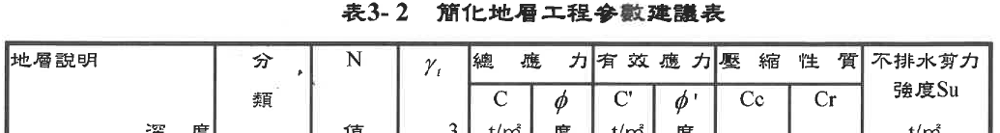
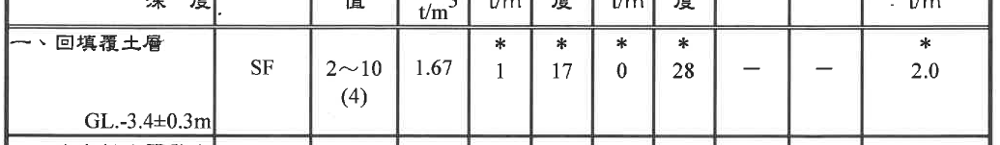
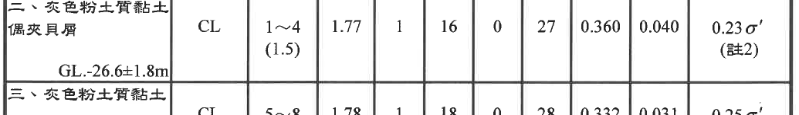
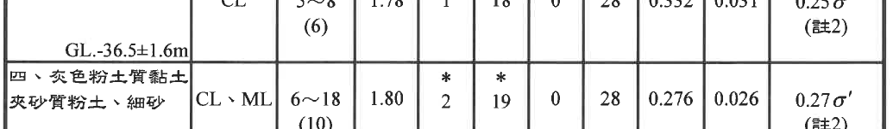
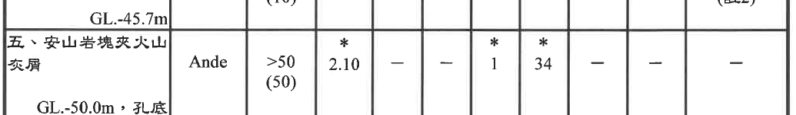

---
## 第 22 頁

KAICHU
軟橋段36地號
肆.基礎型式及地質說明
¾土壤液化檢討
本案屬低潛勢液化區，
依據鑽探報告
依據鑽探報告，
本案無土壤液化之虞。

---
## 第 23 頁
### 肆.基樁與擋土措施配置圖

KAICHU
軟橋段36地號
肆.基樁與擋土措施配置圖

---
## 第 24 頁

KAICHU
軟橋段36地號
肆.基礎型式及地質說明
¾開挖擋土措施-順打開挖+安全支撐(六挖五撐)

---
## 第 25 頁

KAICHU
軟橋段36地號
伍.設計及施工細節
•基礎型式採用樁筏共構基礎。
¾基礎及側牆
•筏基層地梁深度為3.0m，筏基版厚度80cm。
地下室外牆為80
連續壁
亦提供建物
穩定之基面向上發展
•地下室外牆為80cm連續壁，亦提供建物一穩定之基面向上發展，
內側並施作防水複壁，免除牆面滲水情形。
¾耐震設計細部
•本案之鋼骨、鋼筋設計及施工，皆採韌性設計並依
「結構混凝土設計規範
「結構混凝土施工規範
「鋼骨鋼筋
「結構混凝土設計規範」、「結構混凝土施工規範」、「鋼骨鋼筋
混凝土構造設計規範」之規定辦理，有關韌性箍筋及相關鋼筋施工
標準亦依規定施工。

---
## 第 26 頁
### 陸.總結-本案結構系統一覽表

KAICHU
軟橋段36地號
陸.總結-本案結構系統一覽表
內容
項目
內容
抗震強度
本案設計採符合耐震法規EPA=0.24，相當於五級耐震強度
度
fc’= 280 kgf/cm2 (7F以上)
fc’= 350 kgf/cm2 (3F-7FL，含7FL版)
材料
混凝土強度
fc
= 350 kgf/cm (3F-7FL，含7FL版)
fc’= 420 kgf/cm2 (B4F-3FL，含3FL版)
fc’= 350 kgf/cm2 (B4FL)
鋼筋強度
符合CNS相關規定
fy = 4200 kgf/cm2 (#3～#10)
fy
 4200 kgf/cm
(#3
#10)
鋼骨強度
符合CNS及CSC相關規定
Fy = 3310 kgf/cm2 (15F-R1FL)
Fy = 4285 kgf/cm2 (B1F-15FL)
地上
鋼骨鋼筋混凝土
之韌性抗彎構架
結構系統
地上層 
鋼骨鋼筋混凝土(SRC)之韌性抗彎構架
地下層 
鋼筋混凝土(RC)之韌性抗彎構架
地上標準層 
一般樓版15cm，梯間樓版20cm(機電埋管需求)
RC樓版厚度 
地上1層 
室內樓版15cm，室外樓版24cm
地下層 
一般樓版15cm，超挖區樓版40cm(壓重需求)
牆 
 外牆、隔戶牆、樓梯牆、電梯牆採15cmRC牆，輕隔間牆
基礎 
樁筏共構基礎，地梁深度3.0m，筏基版厚80cm，樁尺寸150x300cm
抗液化措施 
開挖面下至GL-45.7m皆為黏土層，且有連續壁貫入36.3~46.7m
擋土措施 
80cm連續壁
擋土措施
80cm連續壁
開挖工法
順打工法，以80cm連續壁配合地中壁及5層內支撐型鋼
結構外審單位
台北市結構工程工業技師公會

---
## 第 27 頁

KAICHU
軟橋段36地號

---
