# 20230428_璞真建設台北慶城街都更-結構銷講簡報全 

---
extracted_main_title: "未命名簡報"
file_hash: "7ce6b6029ea515633b1db10844d7da8f"
---

## 第 1 頁

璞真建設
台北慶城街都更
李祖原聯合建築師事務所
超偉工程顧問有限公司

---
## 第 2 頁

合理結構設計
結構銷售論述

---
## 第 3 頁

‧工程概述
‧耐震、抗風設計
‧構造規劃
‧結構系統
‧基礎構造
‧結構設計資料

---
## 第 4 頁

基地座落：
台北市松山區敦化段一小段385等7筆地號
基地區位：
東南側為慶城街，西南側為6m計畫
道路，北側為文華苑大廈及松基公園。
基地面積：3912.87m２
總樓地板面積：35745.97 m２
基地位置

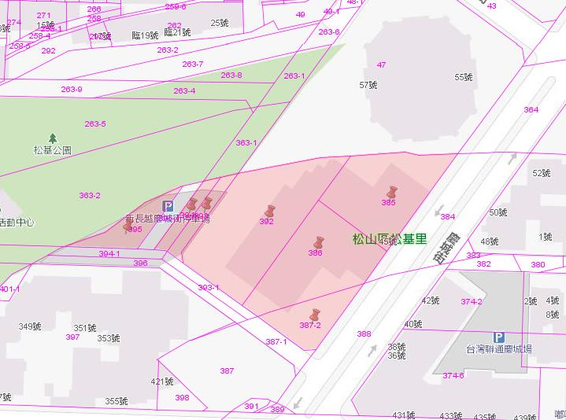

---
## 第 5 頁

本工程為地上23層地下5層之建築。
上部結構為SC+SS構造，地下室為SRC+RC構造。
地面層以上總高度90.4m (不含1F抬高)
地下室開挖深度約21.6m
SC+SS
RC
B1F
1F
2F
3F
4F
5F
6F
7F
8F
9F
10F
11F
12F
13F
14F
15F
16F
17F
18F
19F
20F
21F
22F
23F
R1F
B2F
B3F
B4F
B5F
樓層
層高
R1F~R2F
3.10m
23F
4.20m
2F~22F
3.55m
1F
5.45m
B1F
5.05m
B2F
4.60m
B2F~B5F
3.20m
筏基
2.80m

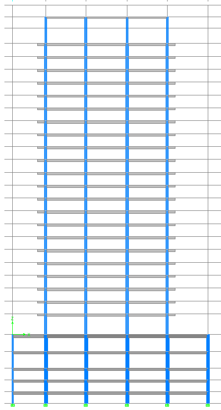

---
## 第 6 頁

本案工址為台北市松山區松基里，按現行《建築物耐震設計規範》規定
地震分區為台北一區
松山區
本基地內無斷層通過

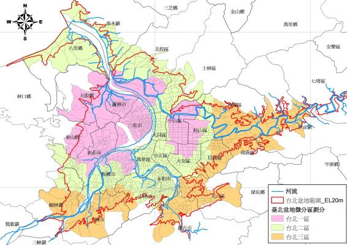

---
## 第 7 頁

本案工址為
台北市松山區松基里，屬台北一區，
用途係數( I 值)提高，採用1.1，
按最新震度分級規定，採用最大地表速度VPG
VPG=100 I SDS =100 x 1.1 x 0.6
= 66 cm/s
結構物耐震能力: 6弱(50-80 cm/s)
耐震設計與基準


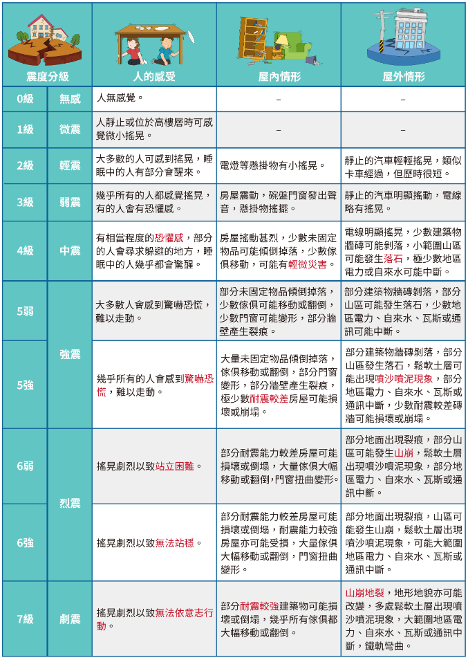

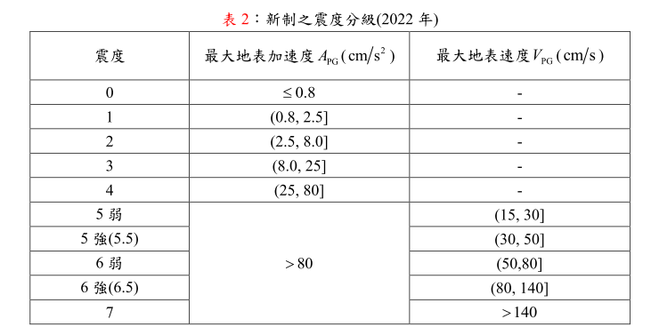

---
## 第 8 頁

超偉工程
抗風
設計
本案工址為台北市松山區，按現行《建築物耐風設計規範》規定
風力分區：台北市
基本設計風速：42.5m/sec  ( 對應封閉式柔性建築物考量)
地況分類：地況B
用途係數：I=1.0
(二) 每秒42.5公尺區：
台北市
可抵抗最大陣風
風速17級風之颱風

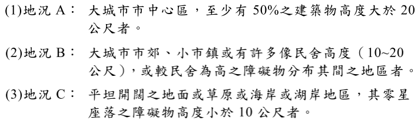

---
## 第 9 頁

超偉工程
構造
規劃
鋼構造(SS構造)+鋼骨混凝土(SC構造)
材料特性
內部SS梁柱需防鏽處理及防火被覆
外周圈SC梁柱有混凝土包覆，符合防火構造要求
側向勁度
斜撐結合外周圈SC梁柱系統，可提升勁度、提高舒適性
施工性能
主要多為鋼構造，施工性及施工品質優良
(SC梁柱採用小號鋼筋，減少與鋼骨介面的複雜性)
耐震要求
耐震能力
設計最大地表速度VPG= 66 cm/s (6弱震度)
結構系統
具韌性抗彎矩構架及挫曲束制斜撐構架之二元系統
構件規劃
內部SS鋼構件尺寸較小、不影響住宅使用空間
外周圈SC鋼骨凝土構件、與RC外牆結合、防水性佳
基礎構造
樁筏共構基礎
構築工法
逆打工法
本案採SS+SC.構造俱已符合高級住宅之需求

---
## 第 10 頁

上部標準層平面
X向– 韌性抗彎矩構架系統
+BRB+耐震間柱
Y向– 韌性抗彎矩構架系統
+BRB+耐震間柱
SC柱、SC外圈大梁
SS內部大、小梁、DECK樓版
BRB
耐震間柱
間柱(錯層)
間柱(錯層)

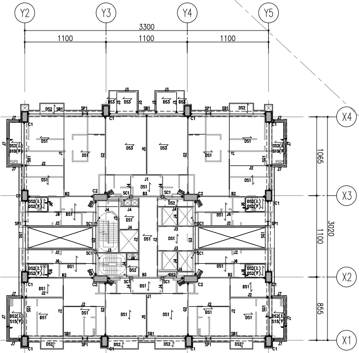

---
## 第 11 頁

BRB
X2、X3軸
Y3、Y4軸
BRB 200T
BRB 200T
BRB 300T
BRB 400T
BRB 500T
BRB 550T
BRB 400T
BRB 500T
配置由2F~22F
吃力噸數由550T漸縮至200T
BRB 300T

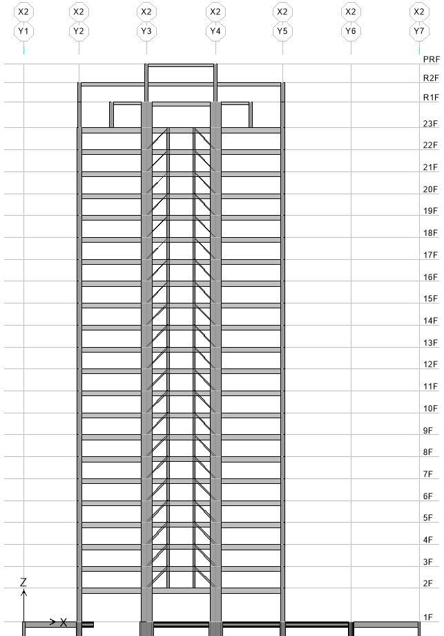
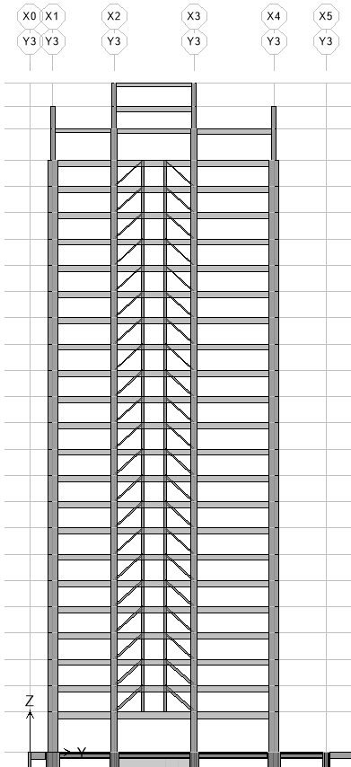

---
## 第 12 頁

耐震間柱
X1、X4軸
Y2、Y5軸
耐震間柱
耐震間柱
配置由2F~22F，採錯層配置

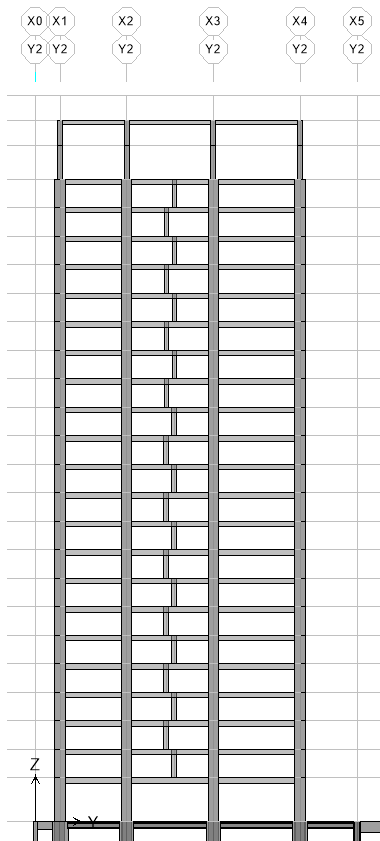
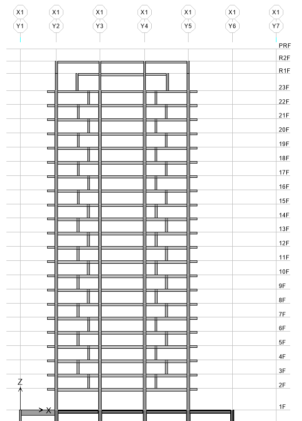

---
## 第 13 頁

梁柱構架系統
+120cm連續壁
地下室平面圖
塔樓位置
SRC柱、RC大梁，
RC小梁、RC樓版

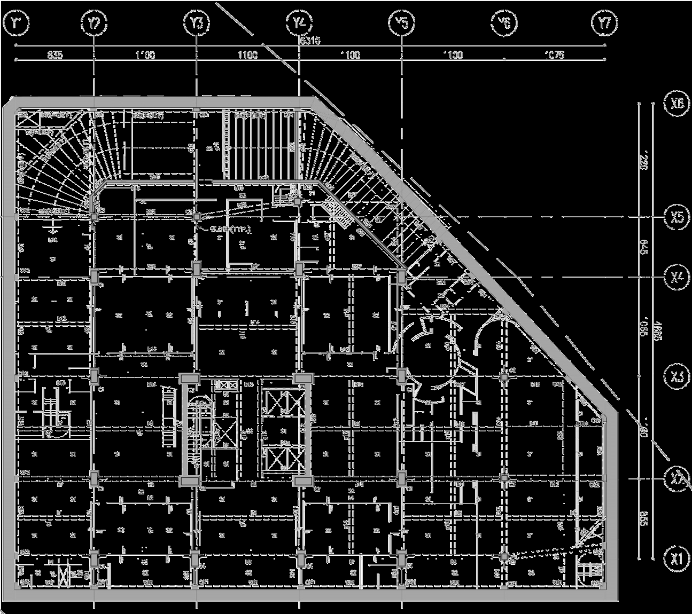

---
## 第 14 頁

梁、柱結構
SC梁
SC柱

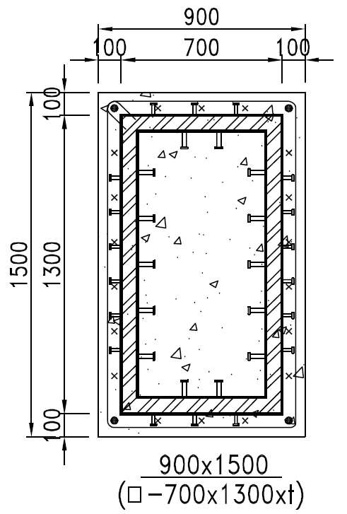
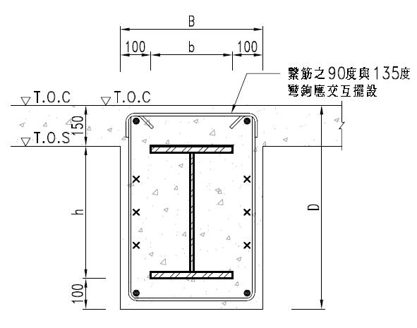

---
## 第 15 頁

梁、版結構

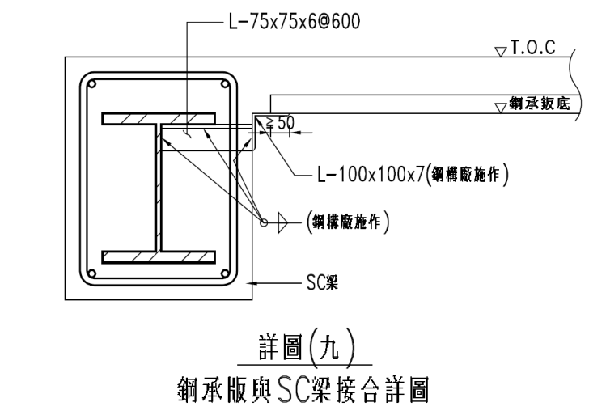
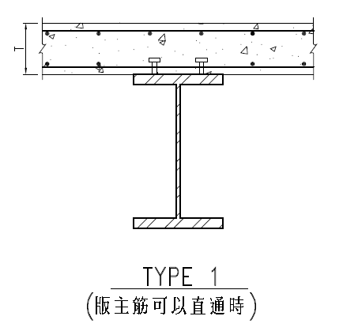
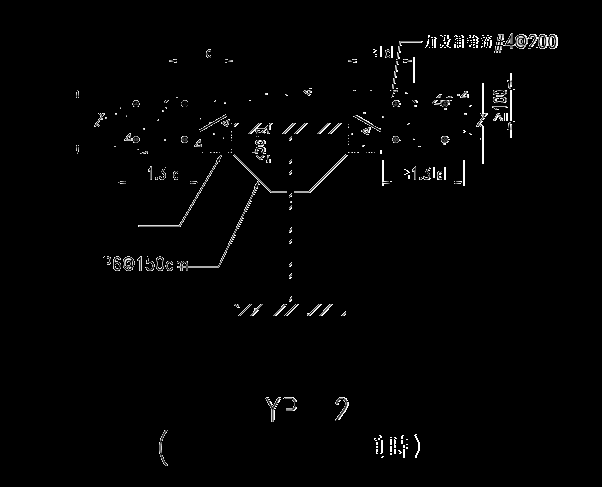

---
## 第 16 頁

客廳及陽台樓版
客廳及陽台樓版增厚為25cm(DS3)
1.可提高樓版載重強度，考量陽台後續
有植栽或覆土。
2.提高樓版勁度及振動頻率，降低振動
對住戶的影響。
3.加強隔音效果。

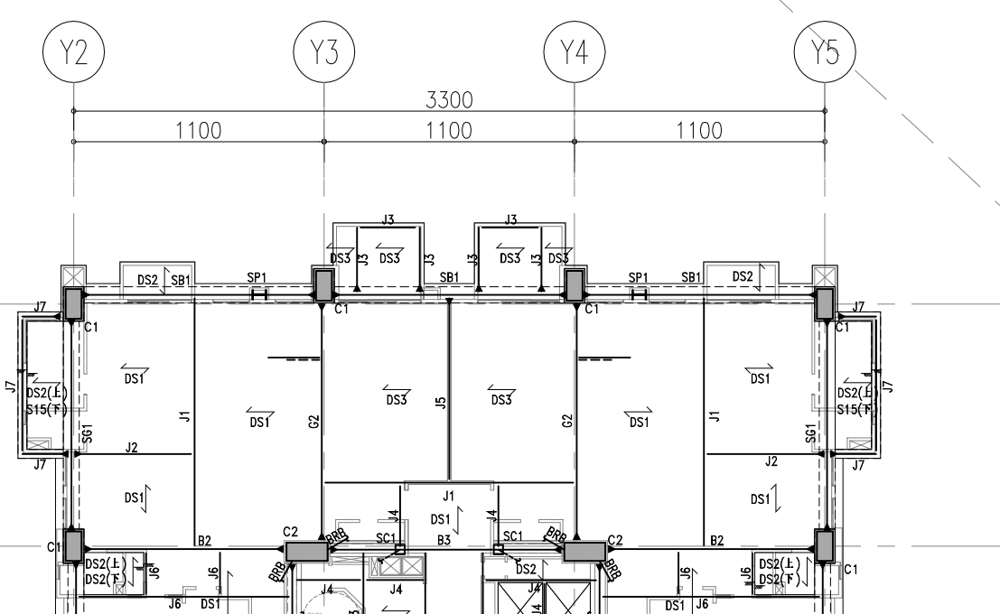

---
## 第 17 頁

主衛浴降版細部
SG1
J7
15cm RC版
主衛浴雙層版下方採15cm 
RC版與J7梁下緣切齊，上版
採用15cm DECK版。
H600x400外圈收
SC梁(60x85)
H500x200外圈收
SC梁(40x70)

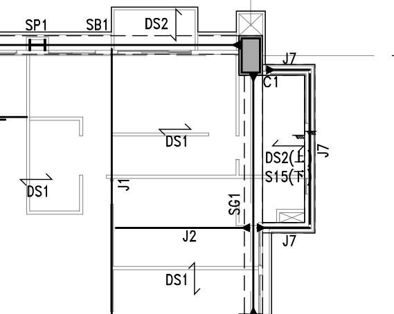
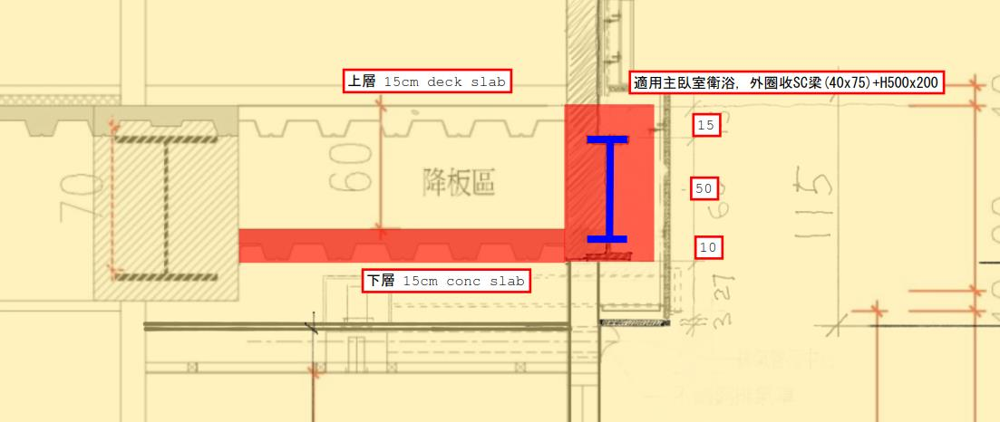

---
## 第 18 頁

次衛浴降版細部
B2
J6
H600x200
SS梁
次衛浴雙層版下方採15cm DECK
版與J6梁下緣切齊，上版也採用
15cm DECK版。
H850x500
SS梁
打剪力釘灌混凝土。

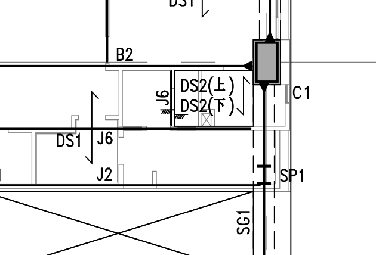
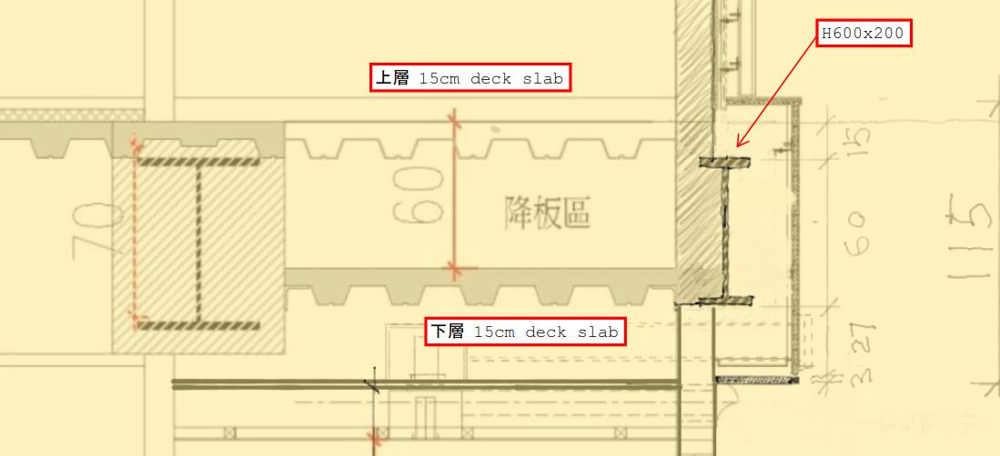

---
## 第 19 頁

超偉工程
基礎
構造
基地位置及概況

基地約略成三角型，現況地勢平坦，
基地面積約3912.87m2 。

本工程地下室共五層，總開挖深度
為21.70m。

基地現況為12F/3B建築物，北側鄰
15F/4B，西側為公園，西南側隔約
6.0 m道路為停車場，東南側約20 
m慶城街為7F/1B建築物。

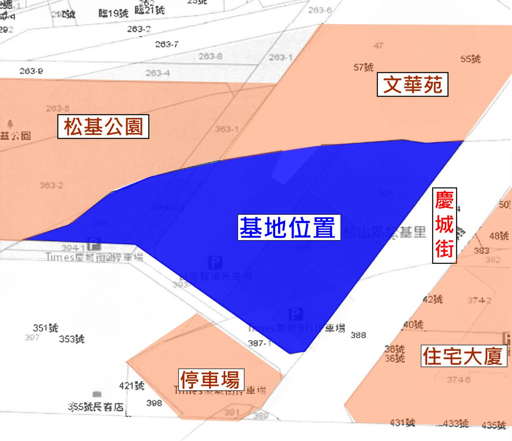

---
## 第 20 頁

基
礎
及
連
續
壁
座
落
土
層
基地土層特性
地層
分布範圍GL (m)
STP-N值
回填層(SF1)
(既有建築物)
現地表下~-12.4
1.5~8
(3)
粉土質黏土層
(CL2)
-12.4~-50.5
2~33
粉土質細砂層
(SM3)
-50.5~-52.6
29~68
(43)
卵礫石層
(GM4)
-52.6~58.6
>50
按中聯技術顧問”台北市松山區敦化段一小段385等地號新建工程地質鑽探分析報告”內容:

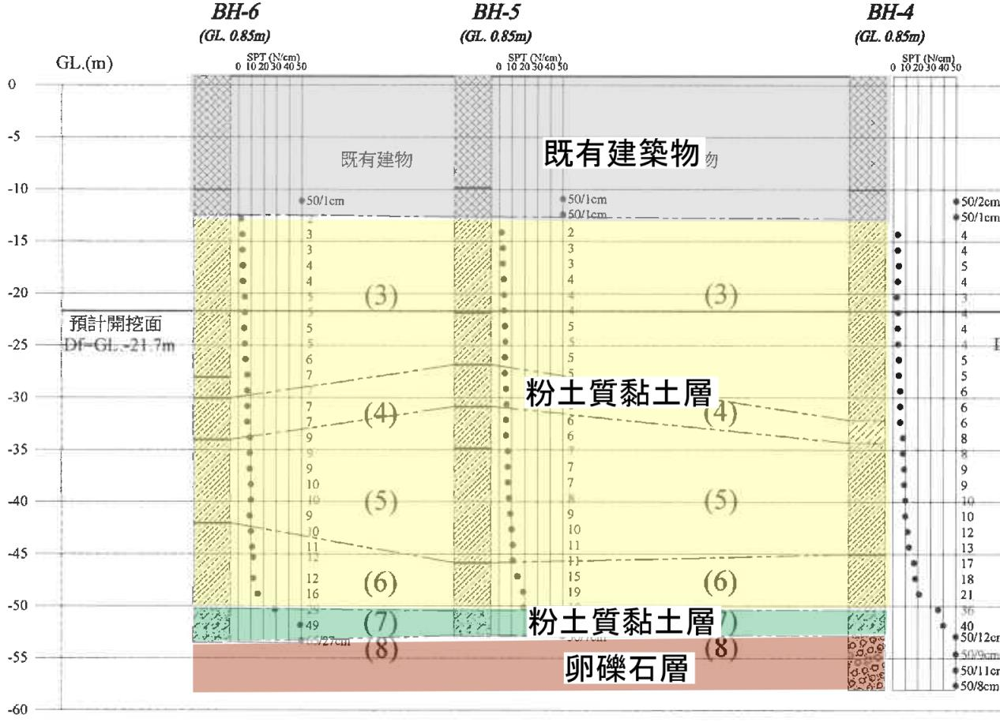

---
## 第 21 頁

超偉工程
開挖
工法
地下開挖構築工法規劃

基礎開挖深度：GL-21.70m
(含10cm P.C. ，地下五層)

構築開挖工法：逆打工法
(分七階段開挖)
架設一層水平鋼支撐
設置四道內扶壁
開挖擋土規劃: 120cm 連續壁
(連續壁兼作永久性地下室外牆)
--- 有效抑制開挖對於鄰房之影響
連續壁
t=120cm
GL-44.0m及GL-52.0m

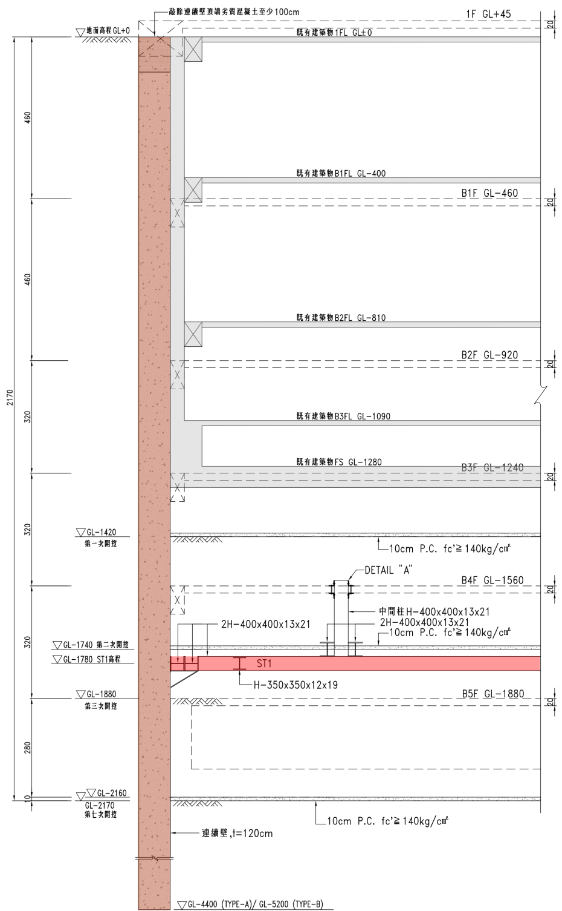

---
## 第 22 頁

基礎構造系統規劃
地下水位考量：
設計常時水位為GL-1.5m，高水位GL± 0.0m
無土壤液化現象：
按鑽探報告書評估，因本案地表下20.0m內皆為黏土層，
並無飽和疏鬆之砂土層，且基礎深度超過20m以上，
故應無土壤液化危害之虞。
基礎構造系統:
樁筏共構基礎
柱位處設置基樁(一柱一樁)
筏式基礎=箱形地梁+ BS版& FS版
矩形壁樁=獨立壁樁
--- 獲得足夠的承載力，克服水浮力及減少基礎差異沉陷量
壁樁規劃:
本案壁樁深度GL-58.0m，入卵礫石層5.0m，
尺寸330cm× 150cm及740cm× 150cm

---
## 第 23 頁

樁筏共構基礎
柱位處設置基樁(一柱一樁)
以獲得足夠的承載力
克服水浮力及減少基礎沉陷量

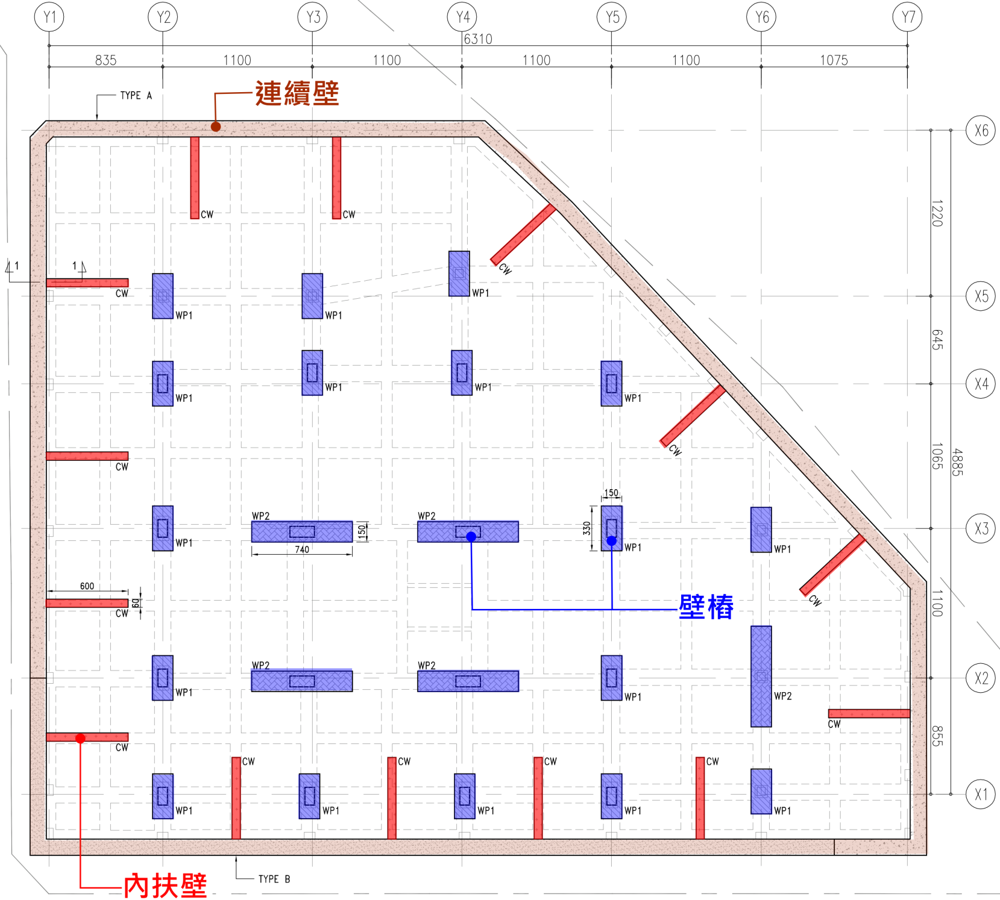

---
## 第 24 頁

PHRF
—
0.75
0.30
屋頂平台
R2F
3.10
0.72
1.00
電梯機房
R1F
3.10
15
0.72
0.76
0.50
0.30
機房
無覆土屋頂平台
25
1.47
0.30
覆土屋頂平台
23F
4.20
15
0.78
0.20
集合住宅
25
1.00
2.80
0.30
無覆土屋頂平台
覆土屋頂平台
2F~22F
3.55
15
0.78
0.20
集合住宅
25
1.02
1F(室內)
5.45
20
0.91
0.20
室內
施工階段：0.48
1.00

---
## 第 25 頁

1F(室外)
5.45
30
0.94
1.02
3.30~4.06
0.50
0.50
0.50
車道
室外無覆土
室外覆土1.2~1.6m
施工階段：0.72
1.50
40
4.30
0.50
室外覆土1.6m
施工階段：0.96
1.50
B1F
5.05
20
0.72
1.00
機房
25
3.71
0.50
中庭花園
B2F
4.60
20
0.72
0.50
停車場
0.72
1.00
儲藏室、機房
B3F~B5F
3.20
20
0.72
0.50
停車場
0.72
1.00
機房
註：1.台電配電室、特殊要求之機房等，活載重另行考慮
2.水箱、覆土重量依實際狀況另行計算

---
## 第 26 頁

鋼骨材料強度說明
18F柱~屋頂層
fy=3300kgf/cm2 (SN490YB、
SN490YC)
3300
B5F~18F梁
fy=4300kgf/cm2 (SM570M)
4300
採用高強度鋼材SM570M及韌性鋼
材SN490YB、SN490YC，為最適
用於建築結構之韌性鋼材。

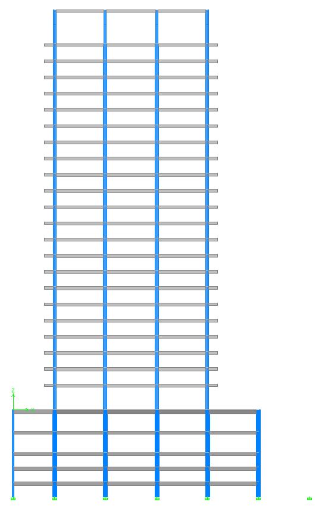

---
## 第 27 頁

混凝土材料強度說明
1F柱~屋頂層
fc'=280kgf/cm2 (4000psi)
280
B5F~1F梁
fc'=350kgf/cm2 (5000psi)
350

---
## 第 28 頁

柱內灌漿材料強度說明
B5F~2F
fc'=490kgf/cm2 (7000psi)
490
3F~8F
fc'=420kgf/cm2 (6000psi)
420
9F~23F
fc'=350kgf/cm2 (5000psi)
350
3F
B1F
B2F
B3F
B4F
B5F

---
## 第 29 頁

開挖
擋土
RIDO V4
結構分析商用程式
基礎
構造
SAFE V12
主結
構體
ETABS V9.7.4
靜力分析、動力反應譜分析
非線性靜力分析(極限層剪力)

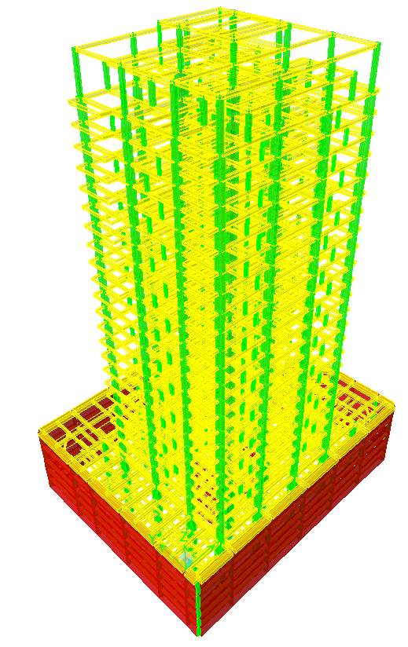

---
## 第 30 頁

結構設計規範依據
「建築技術規則建築構造篇」
內政部，110年
「建築物耐震設計規範及解說」
內政部，111年
「建築物耐風設計規範及解說」
內政部，104年
「混凝土結構設計規範」
內政部，110年
「結構混凝土施工規範」
內政部，110年
「建築物基礎構造設計規範」
內政部，90年
ACI Code
318-05.
Building Code Requirements for Structural Concrete

---
## 第 31 頁

合理結構設計
結構銷售話術
‧合理化結構構造型式
‧合理化結構抗力系統
‧合理化開挖構築工法

---
## 第 32 頁

超偉工程
合理
設計
結構構
造型式
結構抗
力系統
構築開
挖工法
合理化
結構設計

---
## 第 33 頁

S.S.+S.C.構造=耐震性能結構構造
內部鋼骨梁柱需防鏽處理及防火被覆。
外周圈SC鋼骨混凝土梁柱，符合防火構
造要求
設置斜撐配合外周圈SC構造，可提高勁
度，住宅的舒適性更佳。
內部SS鋼構件尺寸較小、不影響住宅使
用空間
外周圈SC鋼骨凝土構件、與RC外牆結合、
防水性佳
主要多為鋼構造，施工性及施工品質優良
(SC梁柱採用小號鋼筋，減少與鋼骨介面
的複雜性)。
合理
設計

---
## 第 34 頁

建築物基礎構造
樁筏共構基礎能安全承載結構物荷重
及抵抗地震力、風力。
結構耐震設計原則
『小震不壞-彈性結構設計』
『大震不倒-韌性耐震設計』
結構物舒適性檢討
設計地震力與設計風力的層間變位角
皆小於規範所規定之值。
All < 千分之5  OK !
合理
設計
規則性結構系統=抗震最佳保證
平面、立面頗具規則性、構件配置整齊、結
構力學傳遞路徑連續、順暢。
抗彎矩構架+挫曲束制斜撐構架+耐震間柱
利用斜撐及耐震間柱分擔地震力、改善結構
行為。
利用梁、柱及斜撐及耐震間柱的韌性來消能，
提升整體側向勁度，並降低層間變位角，提
高舒適性。
利用非彈性變形將動能轉換為應變能來消釋
能量。
韌性設計＝梁端、柱端剪力、梁柱接頭、強
柱弱梁、軟弱層檢核
＝大地震來臨時可以穩定消能。
梁柱構架韌性設計
梁端、柱段剪力破壞– SS梁柱(OK)
接頭剪力破壞– SS梁柱(OK)
全面性破壞–強柱弱梁設計(OK)
整體崩塌破壞– 構架軟弱層檢核(OK)
最大層間位移角(‰)
X向
Y向
設置BRB+耐震間柱
3.71
3.51

---
## 第 35 頁

超偉工程
合理
設計
逆打
工法
有效縮短
工期
大幅提高基
礎承載力
筏式基礎+
樁基礎
提高對於
鄰房保護
適用各土層

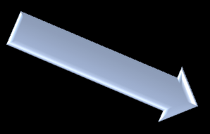

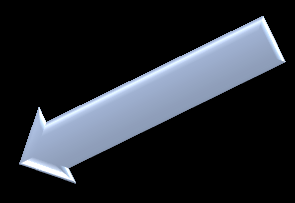

---
## 第 36 頁

合理結構設計
結構銷售論述

---
## 第 37 頁

超偉工程
設計
總結
構造型式
鋼構造(S.S.構造)+鋼骨混凝土(S.C構造)
結構系統
抗彎構架+挫曲束制斜撐系統+耐震間柱
斜撐及耐震間柱吸收部分水平力，分擔梁、
柱應力，構件尺寸可較小。
基礎構造
基樁& 筏基之共構基礎
地梁深280cm、筏基版厚70cm
矩形壁樁150cm寬，深度至GL-58m
無土壤液化問題
耐震性能結構構造
穩定、有效的耐震消能系統
結構規劃
基樁深入卵礫石層，整棟座落
在堅固的承載層之上

---
## 第 38 頁

耐震設計
抗風設計
耐震等級
按最新震度分級規定，採用最大地表速度VPG
VPG=100 I SDS =100 x 1.1 x 0.6 = 66 cm/s
結構物耐震能力: 6弱(50-80 cm/s)
舒適性
層間變位角X向3.71‰，Y向3.51‰
皆小於規範5‰
耐震設計
小震不壞-彈性結構設計
大震不倒-韌性耐震設計
設計風速
基本設計風速=42.5m/s
可以抵抗最大陣風風速達17級之颱風
舒適性
層間變位角<5/1000
抗震6弱震度
中小度地震結構體不會毀損
475年、2500年回歸期地震結構物不會崩垮
舒適度佳、減少非結構體毀損
起居感受舒適度佳
結構體抗風能力安全

---
## 第 39 頁

設計載重
地面層2樓以上設計活載重L.L.=200kgf/m2
1FL
施工載重L.L=1000(室內)、1500(室外)kgf/m2
地下層
設計活載重L.L.=500kgf/m2
鋼骨
韌性鋼材SM570M、SN490YB、SN490YC
混凝土
基礎~1F版梁: 5000psi 混凝土
1F柱~屋頂層: 4000psi 混凝土
柱內灌漿
B5F柱~2F柱: 7000psi 混凝土
3F柱~8F柱: 6000psi 混凝土
9F柱以上
: 5000psi 混凝土
竹節鋼筋
鋼筋續接器
SD280W、SD420W拉力鋼筋
SA級續接性能鋼筋續接器
滿足法規要求
高強度、高性能混凝土
抗震鋼筋、SA級續接器
顧及施工需求
材料規格
高強度、耐震鋼材

---
## 第 40 頁

構築工法
開挖工法
逆打工法
有效降低對鄰房之影響、施工管理最完善
兼顧施工精度及施工品質
開挖擋土措施
120cm地下連續壁，深度GL-44m及GL-52m
60cm扶壁,計14道
兼顧開挖時土壓平衡、隆起、上舉之穩定性安全
兼有效抑制擋土壁體之變形量
永久性擋土
120cm地下連續壁，深度GL-44m及GL-52m
臨時擋土壁體兼永久性擋土措施
最安全擋土規劃
經驗最豐富之開挖工法

---
## 第 41 頁
### 簡報完畢

- 超偉工程-
- Supertech Consultants International -
2023.01.18

---
## 第 42 頁

規範採用之風速資料,係依據中央氣象局所屬 24 個測站 1947 年至1991年間,所發生之 128 個侵 台颱風最大十分鐘平均風速資料,並作合理的更 正與補齊。

該地點在回歸期50年之10分鐘平均風速,意即50 年內所發生之強颱,都已涵蓋在內。

**以本案之風壓力,對應出風速及風級, 抗風能力足以抵抗平均14級風&最大陣風風速 17級之颱風**

| 風 級   | 風 速 (公尺/秒)        | 風 壓 (公斤/平方公尺) |
|----------|-------------------------|---------------------|
| 0        | 至 0 0 2        | 0                   |
| 1        | 至 0 3 1 5   | 小於 1             |
| 2        | 至 1 6 3 3   | 1                   |
| 3        | 至 3 4 5 4   | 至 1 3         |
| 4        | 至 5 5 7 9   | 至 3 7         |
| 5        | 至 8 0 10 7  | 至 7 14        |
| 6        | 至 10 8 13 8 | 至 14 23       |
| 7        | 至 13 9 17 1 | 至 23 35       |
| 8        | 至 17 2 20 7 | 至 35 52       |
| 9        | 至 20 8 24 4 | 至 52 72       |
| 10       | 至 24 28 4 5 | 至 72 97       |
| 11       | 至 28 32 6 5 | 至 97 128      |
| 12       | 至 32 36 9 7 | 至 128 164     |
| 13       | 至 37 0 41 4 | 至 164 206     |
| 14       | 至 41 5 46 1 | 至 206 256     |
| 15       | 至 46 2 50 9 | 至 256 312     |
| 16       | 至 51 0 56 0 | 至 312 377     |
| 17       | 至 56 1 61 2 | 至 377 449     |
| 大於 17 | 大於 61 2           | 大於 449           |

---
