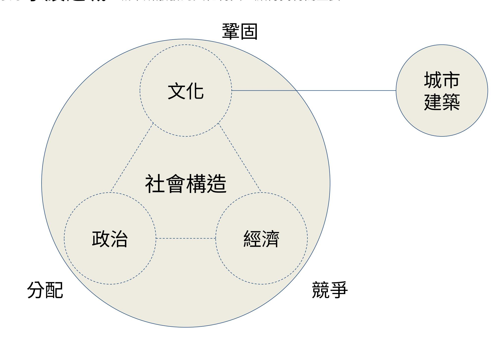
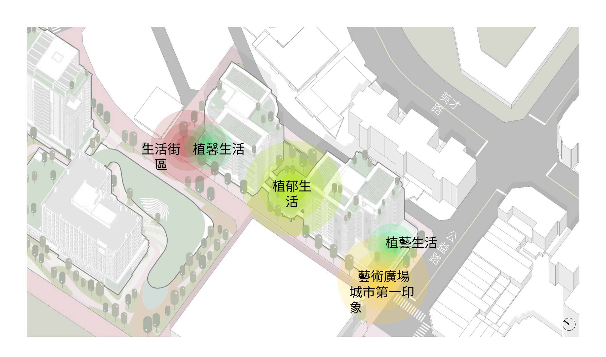
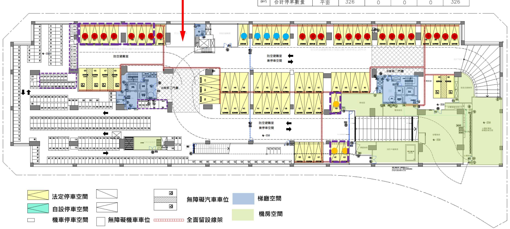
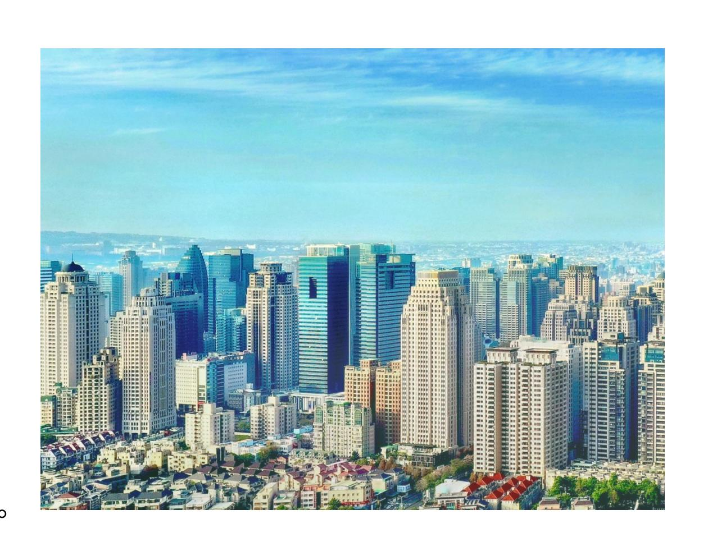

# 20241118_勤美之真_建築銷講簡報

---
extracted_main_title: "璞真建設勤美之真銷講簡報"
file_hash: "da0275f686e569abbfcd90f7d9dda319"
---

## 第 1 頁
### 璞真建設勤美之真銷講簡報

2024.11.13.

---
## 第 2 頁
### 簡報大綱

1. 環境論述
2. 建築平面圖說
3. 外觀設計及材料
4. 設計論述及區域作品

---
## 第 3 頁

---
## 第 4 頁

---
## 第 5 頁

---
## 第 6 頁
### 台中文化從河溪支流而產生......

---
## 第 7 頁
### 勤美二期基地位置

---
## 第 8 頁

---
## 第 9 頁

---
## 第 10 頁
### 全球城市競爭下的建築空間的文化形式為何如此重要?

全球化進程促成社會、經濟結構調整與國家權力下放,城市崛起成為國家競爭力的支撐力量。

後全球化是「只有城市,沒有國界」的不均質發展的競爭社會。

城市的居住環境品質,集體消費之公共空間的服務功能,將成為城市吸引人才及企業投入的最重要考量條件。

城市若要成為吸引全球人才的 永續之城,城市所散發的文化特質,顯得獨特而重要。

---
## 第 11 頁
### 景觀計畫 設計構想

本案位於台中勤美綠園道旁,融 合了現代都市生活與自然環境的 理念。這個獨特的建案位於市區 繁忙的中心地帶,擁有豐富的商 業、文化和休閒設施,同時又環 抱著美麗的自然景觀。

在商業區域,勤美之森擁有一系 列生活質感店面、餐廳和娛樂設 施,滿足居民和訪客的各種需求。 同時,建案內還規劃了多功能活 動廣場,定期舉辦各種文化藝術 活動和社區聚會,打造了一個充 滿活力和社交氛圍的生活環境。

此外,勤美之森也注重綠意環境 的打造,規劃了豐富的公共花園 和休憩區域,提供居民愜意的散 步場所和放鬆身心的空間。中庭 的蜿蜒的水景和綠樹成蔭的小徑, 營造了一個與自然共生的社區, 讓居民在都市中感受到清新的空 氣和自然的美好。

總體而言,勤美之森是一個集合 現代化生活、文化藝術和自然環 境的理想居住地,為居民提供了 高品質、多元化的生活體驗。

---
## 第 12 頁
### 基本資料

基地位置
台中市西區後壠子段235-224,237-16,237-26,239-1,239-2,239-3,239-7, 
239-13,239-14,239-18,240-3,240-4,240-6,242-16,242-20,242-22,     242-
30,243-2,243-23 等19 筆地號
基地面積
依謄本面積: 5,748 ㎡
使用分區
第二之一種商業區
使用強度
法定建蔽率: 70%  法定容積率: 350%  上限容積率: 500%
實設建蔽率: 43.57%   2504.58 ㎡  ( 757.64 坪 )
實設容積率( 不含獎勵): 349.99%   20117.43 ㎡   ( 6085.52 坪 )
實設容積率( 含獎勵): 499.99%   28739.43 ㎡  ( 8693.68 坪 )
建築規模
地上26/24 層(A/B 棟), 地下4 層；店鋪7 戶, 住宅264 戶, 合計271 戶
構造種類
鋼筋混凝土
車位數輛
實設汽車:  463 輛,   法定汽車:  353 輛,   自設汽車:  110 輛
低碳汽車:   10 輛
實設機車:  326 輛,   法定汽車:  294 輛,   自設機車:   32 輛
低碳機車:   33 輛

---
## 第 13 頁

---
## 第 14 頁
### 簡報大綱

1. 環境論述
2. 建築平面圖說
3. 外觀設計及材料
4. 設計論述及區域作品

---
## 第 15 頁
### 地下四樓配置

---
## 第 16 頁
### 地下三樓配置

---
## 第 17 頁
### 地下二樓配置

---
## 第 18 頁
### 地下一樓配置

## **地下**

**防災中心**

**店鋪車位 : 23 輛 銷售車位 : 5 輛 訪客車位 : 3 輛** 

**低碳車位 : 10 輛 /34 輛 ( 汽車 / 機 車 )**

---
## 第 19 頁
### 一樓配置

住宅入口
汽車車道出入口
機車車道出入口
土地
開放空間告示牌
開放空間告示牌
公共藝術品(1)
公共藝術品(2)
梯廳空間
店鋪空間
管委會使用空間
機房/ 機械空間
資收室
建築線
土地地界線

---
## 第 20 頁
### 一樓配置

住宅入口
開放空間告示牌
公共藝術品(1)

---
## 第 21 頁
### 一樓配置

公共藝術品(2)
汽車車道出入口
機車車道出入口
開放空間告示牌

---
## 第 22 頁
### 一樓公共藝術品(1) 型式:

鳥勘圖
角度  1
角度  2
角度  1
角度  2

---
## 第 23 頁
### 一樓公共藝術品(2) 型式:

設計理念
熱鬧雀躍的步伐，循著街道到了靜謐住宅與美術館。
轉化『四分休止符』作為裝置藝術的表現，讓節奏逐
漸和緩，慢慢的細品這生活的美妙。它在夜裡微風擾
動的姿態，像是朋友跟著漫步談笑。
在白天的陽光照射下，又是靈光乍現般的閃電符號，
不停蹦出的創造力，每天譜著不同驚喜樂章的魔幻街
區。
# 街區   # 人的參與感  # 散步生活感 # 音樂

---
## 第 24 頁
### 開發空間停車與交通動線計劃

車行動線
逃生動線
人行及行動不變動線
垃圾清運動線
鄰里動線
車輛警示燈
垃圾清運
垃圾清運
垃圾清運
汽車入口

---
## 第 25 頁
### 一樓開放空間範圍指示圖

沿街步道式等寬空間( 無頂蓋)
沿街步道式等寬空間( 無頂蓋)
開放空間告示牌
開放空間告示牌

---
## 第 26 頁

註: 該頁面是從台中市都發局宜居建築
2.0 引風增綠好生活市政會議專案
報告  (111 年07 月26 日)
本案設計採取 - 01 垂直綠化設施
02 復層式露臺
( 詳下一頁介紹)

---
## 第 27 頁
### 二樓配置

---
## 第 28 頁
### 二樓配置

---
## 第 29 頁
### 二樓配置

---
## 第 30 頁
### 二樓複層式露台示意圖(1)

複層式露台範圍
複層式露台範圍
示意圖 ( 1 )
示意圖 ( 2 )

---
## 第 31 頁
### 三樓配置

---
## 第 32 頁
### 三樓配置

---
## 第 33 頁
### 三樓配置

---
## 第 34 頁
### 二樓複層式露台示意圖(1)

複層式露台範圍
複層式露台範圍
示意圖 ( 1 )
示意圖 ( 2 )

---
## 第 35 頁
### 三樓配置

---
## 第 36 頁
### 三樓配置

---
## 第 37 頁
### 三樓配置

---
## 第 38 頁
### 四樓配置

---
## 第 39 頁
### 四樓配置

1
2
公共植栽穴( 低)( 屬商場)
3
公共維修通道( 屬商場)
4
公共植栽穴( 高)( 屬商場)
建築造型版
5
私戶露臺
1
2
3
4
私戶
商業公共
5
H=25cm
圍欄及
安全扣環定點位
Section
1
2
3
4
5

---
## 第 40 頁
### 四樓配置

1
2
B7 專有戶露臺範
圍
B7 專有戶露臺範
圍
1
2

---
## 第 41 頁
### 標準層奇數樓層配置

---
## 第 42 頁
### 標準層偶數樓層配置

---
## 第 43 頁
### 屋突一層配置

梯間/ 梯廳空間
機械室/ 機房空間

---
## 第 44 頁
### A 棟奇數各單元坪數

---
## 第 45 頁
### B 棟奇數各單元坪數

---
## 第 46 頁
### A 棟偶數各單元坪數

---
## 第 47 頁
### B 棟偶數各單元坪數

---
## 第 48 頁
### 標準層垂直綠化設施( 宜居建築宜居陽台) -1 :

---
## 第 49 頁
### 標準層垂直綠化設施( 宜居建築宜居陽台) -2 :

---
## 第 50 頁
### 標準層垂直綠化設施( 宜居建築宜居陽台) -5 :

---
## 第 51 頁
### 簡報大綱

1. 環境論述
2. 建築平面圖說
3. 外觀設計及材料
4. 設計論述及區域作品

---
## 第 52 頁

---
## 第 53 頁

建材/ 色彩計畫
 建築各向立面造型、材質及色彩計畫
抿石子效果塗料 
網紋金屬
鋁料
金屬格柵
石材效果材料
磁磚
網紋金屬
二丁掛磁磚
抿石子效果塗料
鋁格柵欄杆
鋁料
金屬垂直欄杆
金屬格柵
大片分割石材效果材料
鋁料

---
## 第 54 頁

---
## 第 55 頁

---
## 第 56 頁

---
## 第 57 頁

---
## 第 58 頁
### 4F 露臺

4F 露臺
戶

---
## 第 59 頁
### C 棟出入

---
## 第 60 頁
### C 棟出入

---
## 第 61 頁
### 鋁格網

---
## 第 62 頁
### 中庭出入口

---
## 第 63 頁
### 柱及裝飾柱飾條

---
## 第 64 頁

---
## 第 65 頁
### 屋頂框架屋脊裝飾物

---
## 第 66 頁
### 簡報大綱

1. 環境論述
2. 建築平面圖說
3. 外觀設計及材料
4. 設計論述及區域作品

---
## 第 67 頁
### 事務所簡介

主持建築師:

---
## 第 68 頁

全球城市競爭下的建築空間的文化形式的重要性
全球化進程促成社會、經濟結構調整與國家權力下放，城市崛起成為國家競爭力的支撐力量。
後全球化是「只有城市，沒有國界」的不均質發展的競爭社會。
城市的居住環境品質，集體消費之公共空間的服務功能，將成為城市吸引人才及企業投入的最重要考量條件。
城市若要成為吸引全球人才的 永續之城，城市所散發的文化特質，顯得獨特而重要。

---
## 第 69 頁
### 「永續城市」的中心課題是「文化」

文化是被社會關係所決定的，那麼文化的基本向度之一「空間形式」便是值得以社會學的考察予以分析。
空間形式既是社會產物，必定要放在產生它的歷史脈絡中去考察。

---
## 第 70 頁

我們可以看見，
歷史中不同文化的衝突後產生了融合、轉化與創新。
而在這個過程中，
文化透過書、詩、畫、園林、建築、城市之道，展現而出。

---
## 第 71 頁
### 向全球表達自我城市文化的困境

在全球被殖民過的國家大約有80 ％以上。
能自主自信建立與市民語境相融又能「去殖民現代性」建立自己當代城市建築形象的城市，相當稀有罕見。

---
## 第 72 頁
### 何謂「當代」 **?

城市是由大量的建築所構成,

換言之建築的空間形式具有文化象徵的作用。

我們所要表現的建築形式,

應傳承歷史,回應當代,絕非複製和移植。

基於當前社會所感受的"當代性",置身的是正面臨的文化環境。 面對的是今天的現實,必然反映出今天的時代特徵。

## 什麼是「當代建築」?

與過去工業化現代主義表現語境大大不同。

面對當今的後全球化議題做空間語境上的發揮和再現。

高科技、環保意識及生態為主流共識,強調城市建築與自然的相融。

---
## 第 73 頁

換言之，我們要重建的城市建築，就是異托邦。
何謂「異托邦」?
一個具有烏托邦特質理想性的真實存在空間
烏托邦 (utopia)
指的是不存在的空間 (not-place) 。是虛擬空間。
人們援引烏托邦時，以此理想卻不現實的「理想空間」與現實世界做一對比。
異托邦 (heterotopia)
從字根上看結合了異質性 (hetero-) 以及空間 (-topia) 兩意。為一真實存在空間。
在這異質空間裡，人們可透過現實世界與此空間所產生的對比，做為與主流現實對話或批評的基石。
換言之，異托邦是偏離的社會空間。

---
## 第 74 頁

內
容
表
達
實體：物質性的對象
如：藝術作品，料理方式，建築等...
形式：形態學的元素
如：建築的柱式、拱門、飛簷等...
形式：意象化的意識形態
如：中式，西式，日式等...
實體：非物質化的意識形態
如：現代主義，儒家思想，佛學等...
實體(Entity) ：
它不需是物理存在。
如：法律
理論建構
符徵
符指
表達
內容
實體：物質性的對象
實體：非物質化的集體意識
形態
形式：形態學的元素
形式：意象化了的意識形態
集體潛意識：詩性、理性、感性......

---
## 第 75 頁

強化具主體性文化的創新主題
物質性的對象
形態學的元素
意象化的意識形態
非物質化的意識形態
被文化移植的建築項目
古典形態學元素
（裝飾柱、帝冠、拱卷
等)
外來的
( 美式、歐式、日式等)
源自外來文化的意識形態
( 拿來主義如：現代主義、古典主義
等)
千城一面
能代表主體文化的建築項目
文化創新的元素
（結合在地化集體記憶類型）
相對自主的
( 詩、書、畫、園林、建築)
具歷史性主體文化的
集體意識形態
市民的城市

---
## 第 76 頁

整體性文化的連結
深層文化中的融合
尋找主題
＿＿＿＿＿＿＿
＿＿
地方
文化
想像
具主題性文化主題
的
城市建築

---
## 第 77 頁
### 追尋與「整體性文化表現」的連結

## 追尋與「整體性文化表現」的連結

「整體性文化表現」即是精煉後的實質產物:共時性的書、詩、畫、園林、建築、城市之道 精煉出共時性的空間意象意識形態,也是遠古空間意象意識形態的最小單位。

| 共時性的書、詩、畫、園林、建築、城市之道 (詩書一體、書畫同源、園林建築集大成) (晉書、唐詩、宋詞、元曲、明清小說、文人畫、園林) |                                                                                     |
|--------------------------------------------------------------------------|-------------------------------------------------------------------------------------|
| 書法                                                                       | 字體(金文、大小篆、隸、楷、行、草) 章法(計白當黑、疏可跑馬、密不透風、組構意連、排疊、中宮、天覆、地 載) 筆法(藏鋒、中鋒、迴鋒、側鋒、露鋒) |
| 詩                                                                        | 古詩、漢賦、詩(隱逸、玄言、山水、田園、詠物、宮體)                                                          |
| 畫                                                                        | 人物、山水、界畫、花鳥、文人畫                                                                     |
| 建築                                                                       | 廡殿、懸山、硬山、卷棚、亭、台、樓、閣、廊、榭、橋、 門、窗、牆、棟梁                                                 |
| 園林                                                                       | 北方宮苑、江南文人庭、嶺南園林                                                                     |
| 城市                                                                       | 合院、商街、胡同、巷弄、里坊、橋樑、綠地、公共空間                                                           |

---
## 第 78 頁

空間的皴法：
再現自然的筆法，山水畫的空間技法—「皴」
皴，是表現山石、峰巒和樹幹表皮的脈絡紋理的一種技法，畫時先勾輪廓，再用乾墨側筆描繪紋理細節。主要有折帶皴、
斧劈皴、解索皴、豆瓣皴、米點皴等。

---
## 第 79 頁
### 探索都市建築與深層文化的融合

舉例：
1. 易經數理的「生物氣候學」與目前興起的節能減碳「綠建築」相結合。
2. 易經「乾卦五爻」與「書法五鋒」做文化符號，轉化為建築的語彙。
3. 老子道德經中的有無相生，轉化為空間的佈局安排。

---
## 第 80 頁

建構：具主體性文化主題的城市與建築
必須重塑社會關係，打造空間資本與市民參與的社會共同結構。

---
## 第 81 頁
### 台中城市性及其建築語言的歷史進程

當前台中城市房地產的建築語言（空間的文化形式或建築風格），有如在「放逐之處書寫自身」一種對他處的想像，卻不知
在何處，甚或在烏有之處（nowhere ）。

---
## 第 82 頁

| 時間              | 政治經濟資本版圖           | 台中城市性 社 ( 會 ) | 空間文化形式 語言 ( ) |
|-----------------|--------------------|---------------------------|------------------------|
| 世 16-17 紀 | 未被掠奪前的部落遊牧         | 平埔之原                      | 竹屋、板屋                  |
| 之 1895 前  | 兩岸簡單對渡貿易           | 清領小農生產基 地              | 合院、街屋、廟宇、 家祠        |
| 1895- 1945   | 農業帝國資本主義           | 日本殖民城市                    | 冠帽洋屋、市屋、和 屋         |
| 1950- 1970   | 全球工業資本邊緣位置         | 民國官僚邊城                    | 販厝、五層公寓                |
| 1970- 1990   | 全球政治更邊緣            | 非正式經濟猛城                   | 違章建築                   |
| 1990- 2000   | 全球經濟版圖重整           | 土地投機之危城                   | 美式、日式想像大拼 圖         |
| 2000- 2010   | 亞洲崛起,中國崛起          | 地震後重建之城                   | 多元混搭拼圖                 |
| 2010- 2022   | 全球金融海嘯,中美貿易爭 霸戰 | 全球科技生態城                   | 城市綠建築興起                |

---
## 第 83 頁
### 城市軸綫發展

城市軸綫發展
勤美二期基地位置

---
## 第 84 頁
### 案名:  宏銓緣溪行

---
## 第 85 頁
### 案名:  宏銓緣溪行

---
## 第 86 頁
### 案名:  宏銓緣溪行

---
## 第 87 頁
### 案名: 慶仁之間

---
## 第 88 頁
### 案名: 慶仁之間

---
## 第 89 頁
### 案名: 宏銓存美術

---
## 第 90 頁
### 案名: 惠宇天青

---
## 第 91 頁
### 案名: 惠宇天青

---
## 第 92 頁
### 案名: 宏銓入深林

---
## 第 93 頁
### 案名: 宏銓入深林

---
## 第 94 頁
### 案名: 慶仁林境

---
## 第 95 頁
### 案名: 慶仁林境

---
## 第 96 頁
### 簡報結束

---
