# 機電工法銷講簡報

---
extracted_main_title: "璞真宇見  銷售講習簡報"
file_hash: "898a0c33aabdecd3742d9bd9efeaebc9"
---

## 第 1 頁
### 璞真宇見  銷售講習簡報

璞真宇見  銷售講習簡報 
                                         機電設計說明

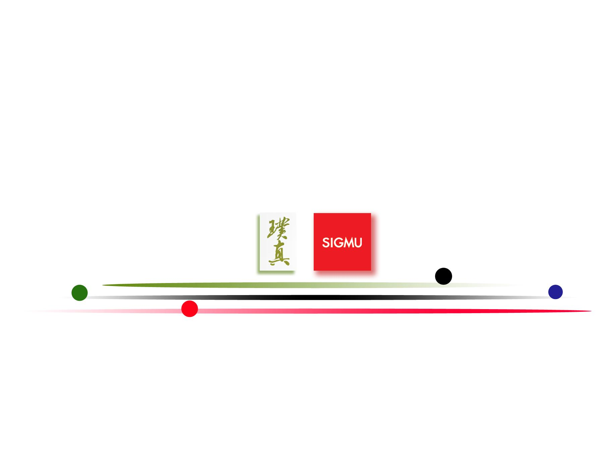

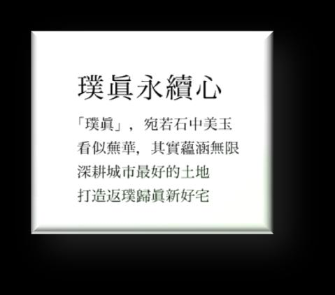
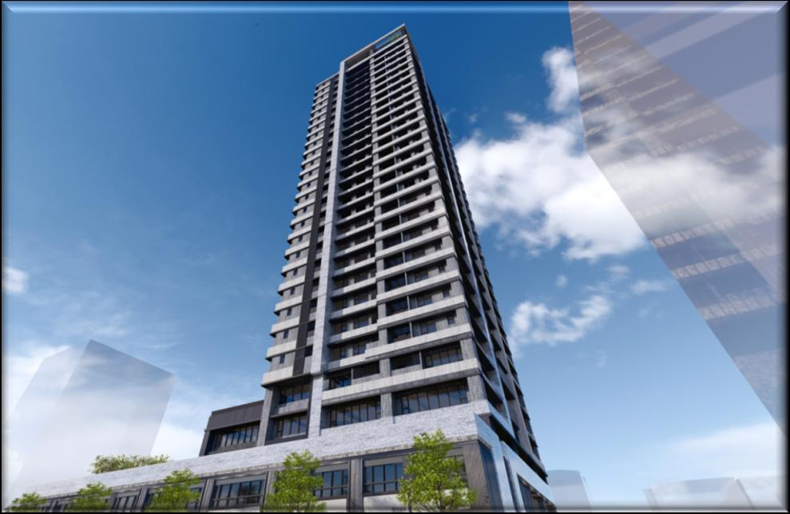
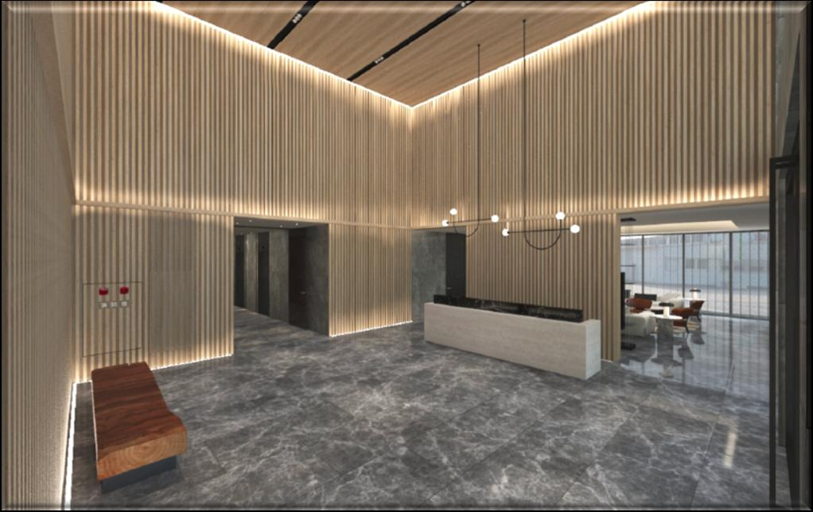

---
## 第 2 頁

■ .建築設計：PGA周簡建築師事務所 
■ .結構設計：聯邦工程顧問股份有限公司 
■ .門廳公設：潘冠榮空間設計+筑筑國際 
■ .燈光設計：月河燈光設計有限公司 
■ .景觀設計：方極景觀設計有限公司 
■ .機電設計：錦泰豐工程有限公司
規劃設計團隊 
建築物基本資料 
 
■ .基地位置：台北市中正區福和段一小段694地號等18筆 
■ .基地面積：2101㎡ 
■ .建築規模：地上28層 、地下5層 
■ .建築高度：97.44米 (高層建築物) 
■ .總計戶數：一般零售業14戶、一般事務所11戶、住宅145戶

---
## 第 3 頁
### 簡報大鋼

---
## 第 4 頁
### 公共區：

• 供電系統：3∮4W 220/380V 。
• 發電機：1000KW一台，設計油箱容量約可連續供電7小時。
• 自來水蓄水量：地下蓄水池+屋頂水塔合計約180噸，符合法規日用水量。
• 雨水再生蓄水量：筏基內設置雨水回收水池，符合綠建築法規需求。
• 空調：B1F/1F/3F/R1F公共區採VRV變頻空調系統。
• 新風：設置全熱交換器+PM2.5空氣淨化設備，採自動偵測控制。

---
## 第 5 頁
### 1F~5F 一般零售業、一般事務所：

• 供電電壓：1樓~2樓一般零售業R1戶~R12戶採3∮4W 220/380V獨立電錶。      
                         (室內照明採220V，並設變壓器降壓至110V供插座使用)
3樓~5樓一般事務所均採3∮4W 220/380V獨立電錶。 
                         (室內照明採220V，並設變壓器降壓至110V供插座使用)
• 供水口徑：1樓~2樓一般零售業R1戶~R12戶採 3/4”
3樓~5樓一般事務所無水表設置 。
• 緊急發電機供電 : 停電時供應各戶一處插座+宅內箱使用。

---
## 第 6 頁
### 6F~28F 專有住宅：

• 供電電壓：各戶均採1∮3W 110/220V獨立電錶。
• 供水口徑：各戶水表均採1 ”
• 加壓幫浦：26樓層~28樓層設置，幫浦設置於R1F水表室內。
• 發電機供電 :停電時供應室內四處插座使用 (冰箱、客廳、主臥、宅內箱)。
• 空調：預留空調排水及穿樑牆套管。
• 新風：預留外牆進氣及排氣位置，便於客戶日後引接。

---
## 第 7 頁

---
## 第 8 頁
### 系統管材概要說明

EMT鋼管-強弱電明管配置
高等級安全防火管材 
 
機械接頭-消防管材接頭
使用壽命長、抗震性能佳
CIP塗裝鑄鐵管：污水、廢水管
使用年限長
防火、抗腐蝕性強
低流體摩擦係數(低噪音) 
 
PVC-DWV發泡管：污水、廢水管(管道處立管)
耐酸鹼、質輕
發泡體吸收噪音 
 
不鏽鋼保溫披覆管-冷水、熱水管
避免溫差大，造成冷凝水滴
隔熱性能好 可確實達到保溫 
    及節能效果
特性：防火、耐用、低噪音、保溫

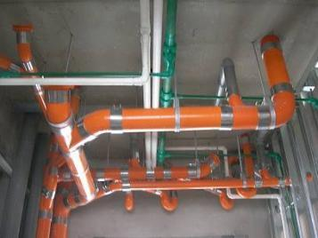

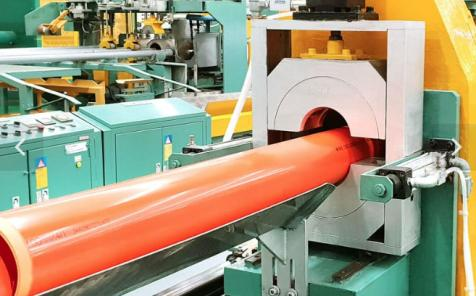

---
## 第 9 頁

---
## 第 10 頁
### 機電重點設備及特色

綜合佈線、資訊通訊 
1
安全防災 
2
智慧節能 
3
舒適便利 
4

---
## 第 11 頁

綜合佈線 
資訊通訊
行動通訊改善
大樓監控智慧化，用戶資通高速化
資訊模組 
宅內整合箱建置
公共區 
無線網路
FTTH 
光纖到府建置

---
## 第 12 頁
### 資訊模組宅內整合箱建置

本案示意 
他案案例

以模組方式整合住戶內電話、光纖網路、有線及無線電視訊號。

設置多組網路、電話、電視專用插座，方便住戶隨時擴充。

整體箱體內外美觀整齊，看不到雜亂無章的電線。

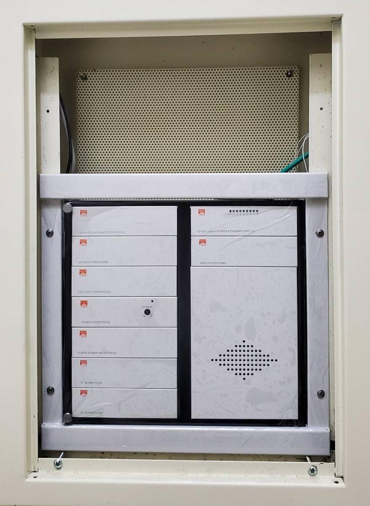
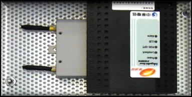
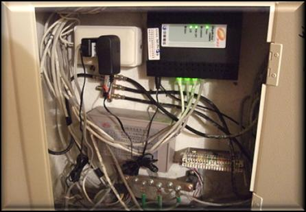

---
## 第 13 頁
### 社區無線網路

社區住戶可於公共使用空間 
透過公共無線專屬網路  Wi-Fi上網 
(如健身房、交誼廳、大廳、停車空間…)

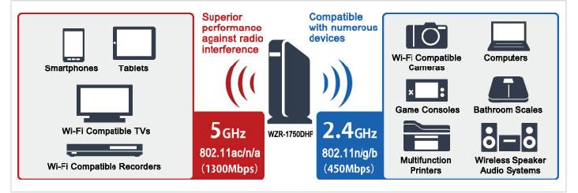

---
## 第 14 頁
### 社區無線網路

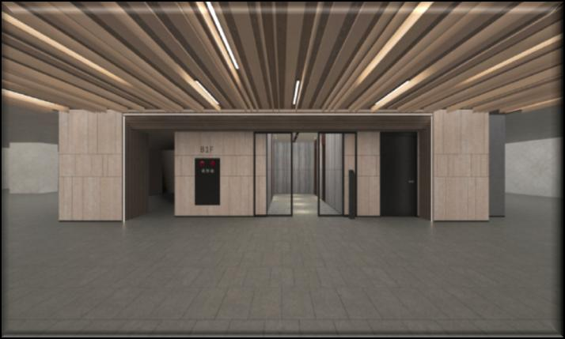

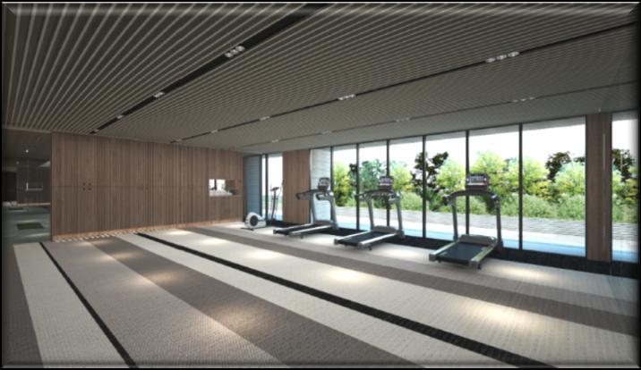
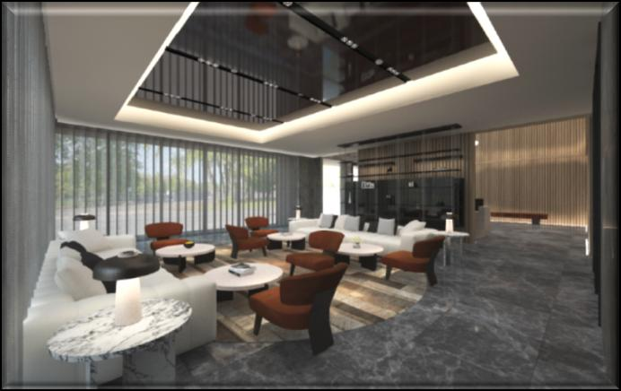
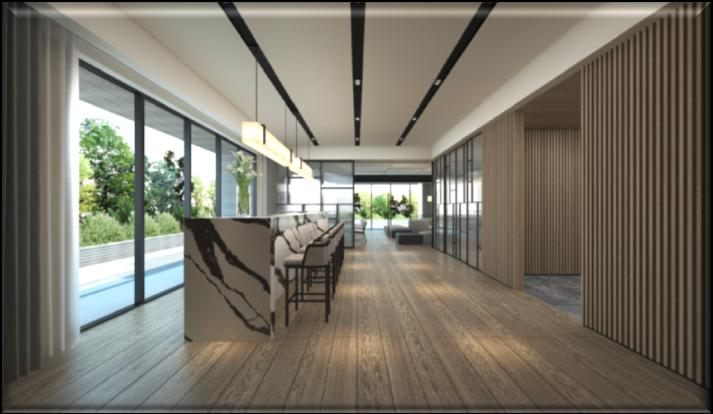
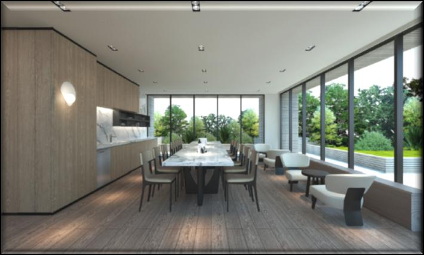

---
## 第 15 頁
### 行動通訊改善

Donor antenna
Splitter
R24
Service antenna
Cable

解決建築物收訊死角

建置於各電梯昇降道、各樓層梯廳並預留供住戶
可引接至室內

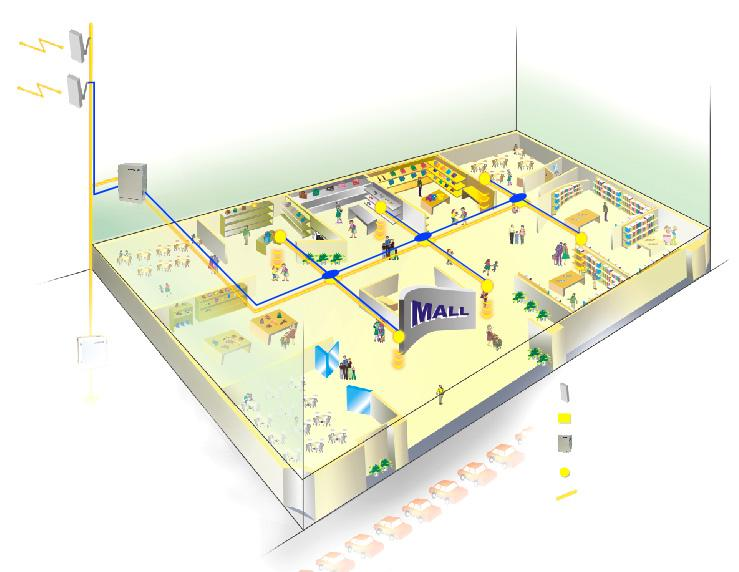

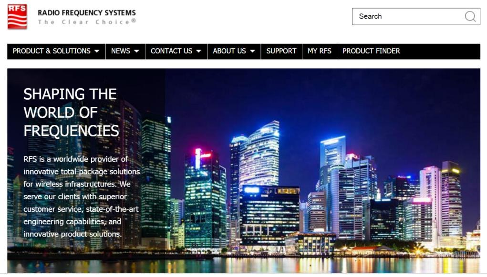

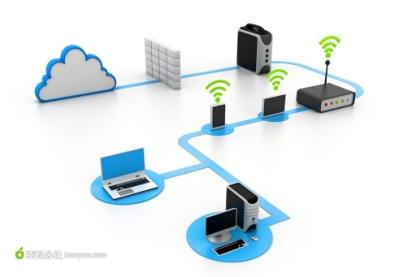

---
## 第 16 頁
### 各層梯廳預留日後客戶自行擴充接點

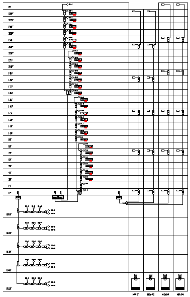

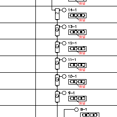

---
## 第 17 頁
### FTTH光纖到府建置

優劣比較 
FTTH 
ADSL傳統網路
線 路 
 媒 介
光纖-傳輸品質高、
傳輸距離遠
銅纜線-品質低、
傳輸距離短
電 器  
特 性 
電磁屏蔽、不受干擾 
易受電器干擾或受潮故障
信 號  
轉 換
光電轉換器- 
整合智能宅內箱 
數據機
擴充性 
擴充不需重新佈線 
擴充速率受影響

建置光纖社區，全面升級數位生活

提高未來系統傳輸可擴充性

降低日後擴充時之佈線難度及費用

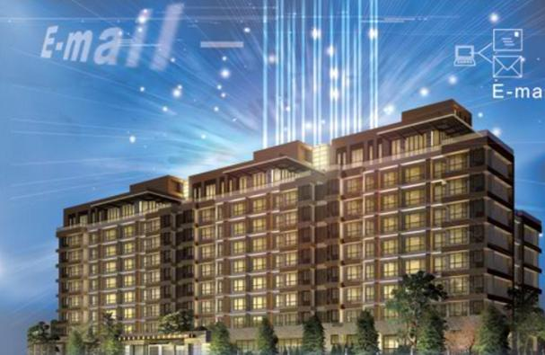

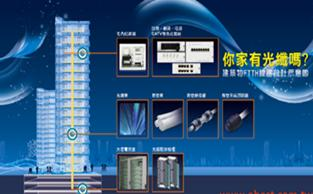

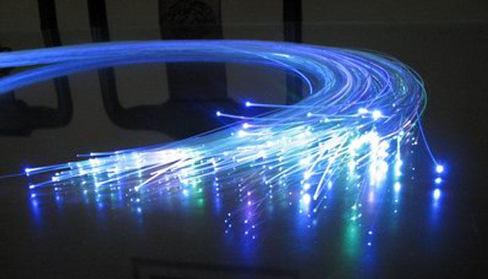

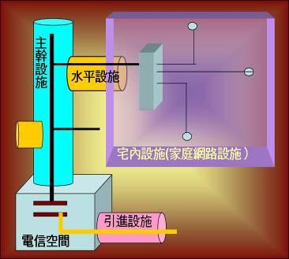

---
## 第 18 頁
### 安全防災

吸收反射式
避雷針
空間 
防火阻絕
火警連動
提升大樓安全防災及防護能力

---
## 第 19 頁
### 反射吸收式避雷針

他案屋頂層雷擊點 
擊碎石片散落1F地面
他案屋突一層雷擊點
設備型式 
傳統式 
放電式 
吸收反射式
分類 
補救性避雷 
補救性避雷 
預防性避雷
避雷方式 
引雷 
主動式引雷 
主動式驅雷
本案為了人員及建築物安全，採用能確
實有效防護建築物的吸收反射式避雷針。

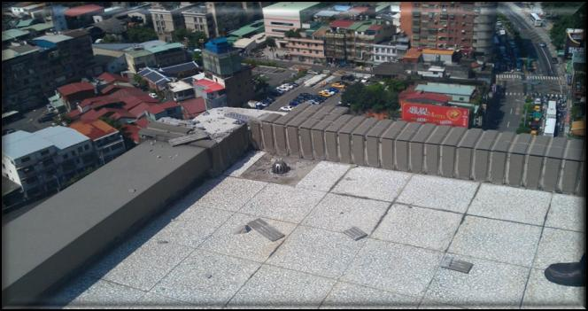
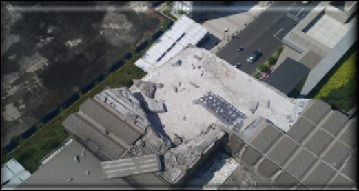
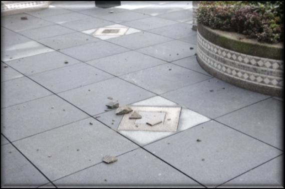
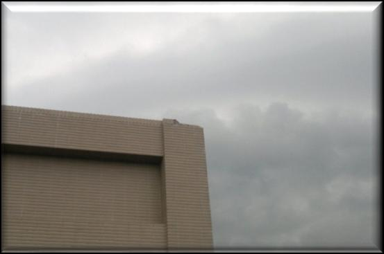

---
## 第 20 頁

電暈效果可達平均
高度2500公呎以上
故障監視
避雷保護頭
1. 採預防性驅雷，能有效降低在保護範圍內的雷擊發生。
2. 可在防災中心加裝避雷系統故障監視器，可明確知道避雷系統組件是否故障
或線路斷路等情形，能隨時監視避雷系統是否健全，提高其可靠性。

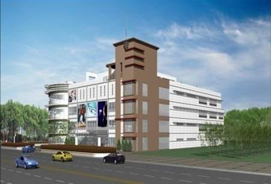

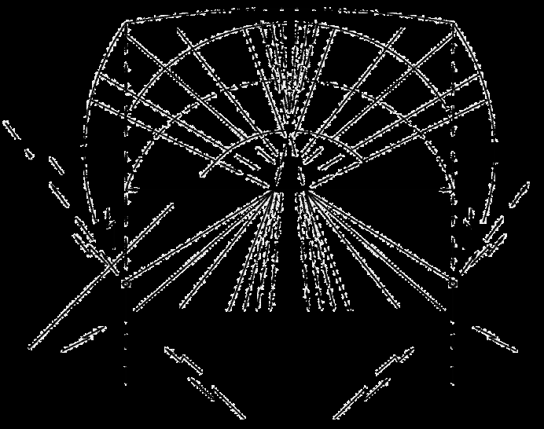

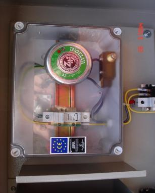

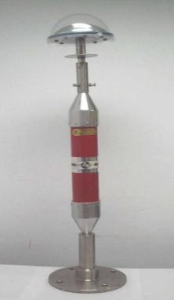

---
## 第 21 頁
### 空間為何需要防火阻絕

火勢阻絕，人員爭取 
有效逃生時間及空間
火勢延穿越牆壁
管線縫隙蔓延
火勢延樓板 
管道上下蔓延 
火勢延管線蔓延
空間防火阻絕

---
## 第 22 頁
### 他案常見錯誤施作案例

一般非防火發泡
沒綁防火帶、防火阻絕不確實
未填防火材料
常見方便行事只填砂漿替代

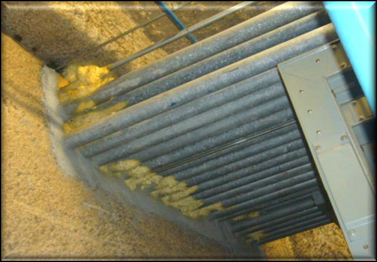
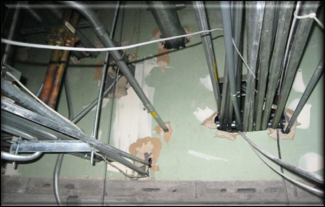
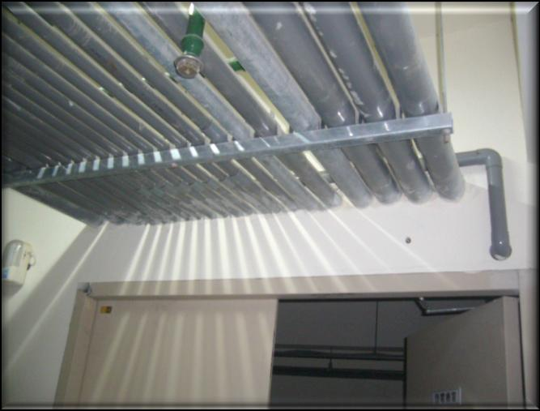

---
## 第 23 頁

防火阻絕有效及重點位置： 
管道間 
機房 
梯廳及排煙室
•本案採用有防火認證個別工法的防火材料填塞。
•在不同管材施予不同的個別工法認證，明確訂
定嚴謹的施工程序及規範。
•能有效防止火燄及濃煙延燒，以增取逃生時間。

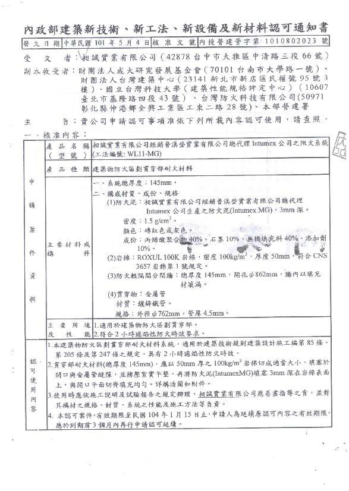
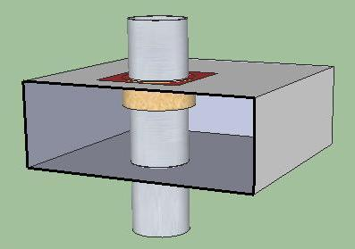

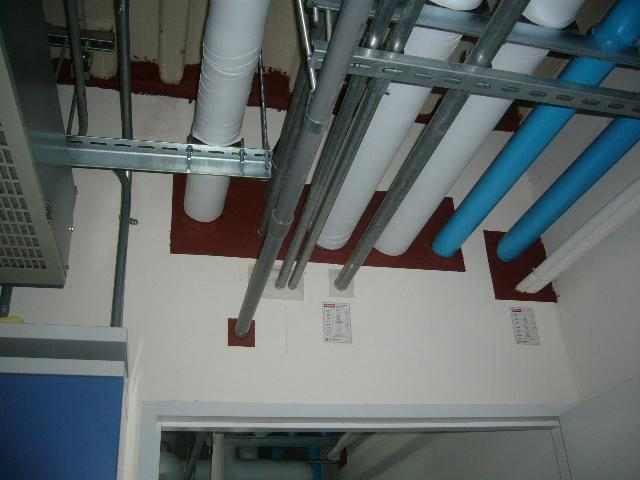

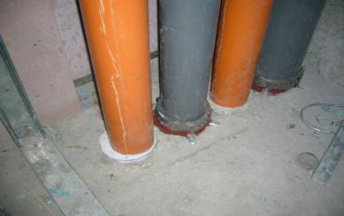

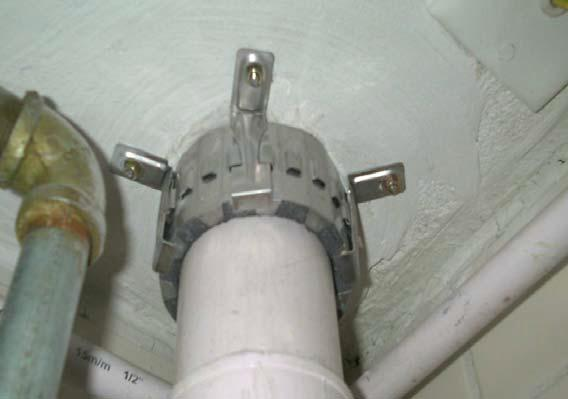

---
## 第 24 頁

1.梯廳、排煙室
2.特別安全梯
3.公共管道
4.排水管道
5.廚房
6.隔戶牆
標準樓層 
(防火阻絕施作位置)

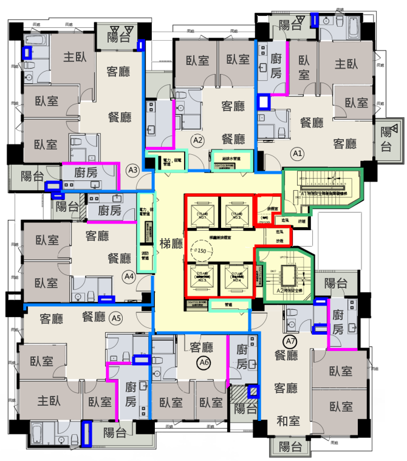

---
## 第 25 頁
### 火警連動

O2
O2
O2 
O2
CO2 CO2
CO2 CO2 
X
火警連動消防通道安全門、風車： 
火災發生時,進風設備自動關閉,開啟安全門(避免新鮮空氣持續引入，造成火勢助燃)

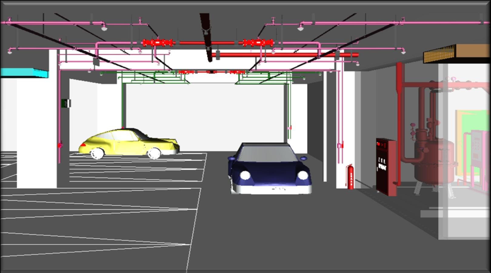

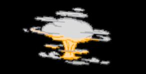

---
## 第 26 頁
### 智慧節能

節省能源及低碳排放，使居住環境更智慧與節能
感應燈具
應用
雨水回收
再利用 
新風系統 
太陽能 
光電板 
燈具自動 
排程控制

---
## 第 27 頁
### 燈具自動排程控制

燈光控制主機
建築物立面、室內公共、戶外景觀等
區域，燈光控制採系統自動排程控制
並可依四季時序的不同自動調整
18:00~21:00 
21:00~23:00 
23:00~05:00

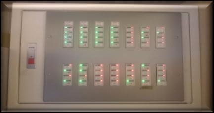

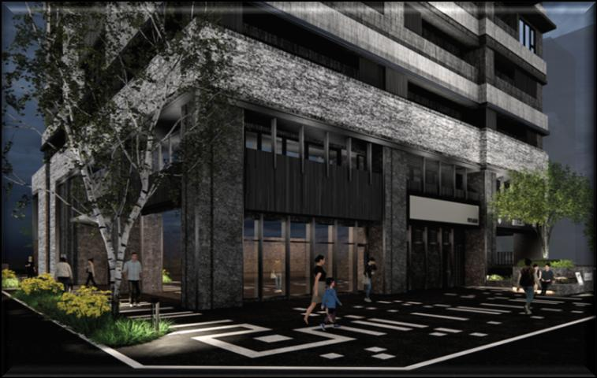
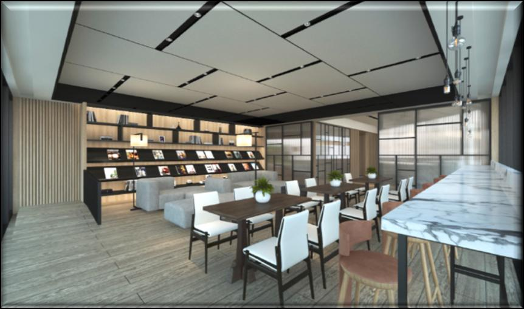
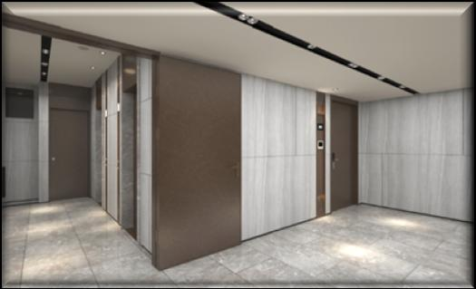
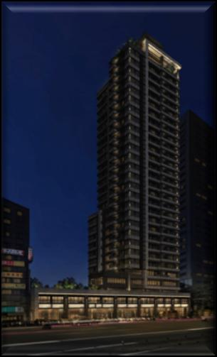
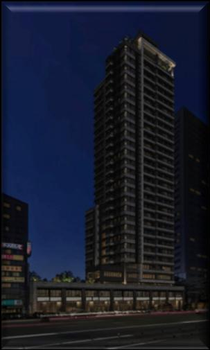
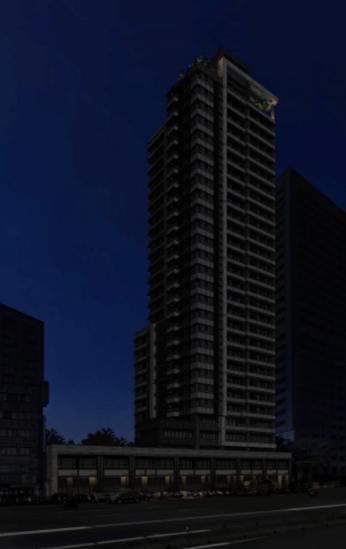

---
## 第 28 頁
### 感應燈具應用

應用場所：停車位、樓梯間、住戶玄關
平時無人時，感應燈管休眠狀態
人員靠近時，感應燈管自動點亮
紅外線感應器
感應控制開關
車位感應燈
樓梯感應燈


---
## 第 29 頁

標準樓層 
(感應燈具位置)
停車樓層 
(感應燈具位置)


---
## 第 30 頁
### 雨水回收再利用


屋頂雨水經專屬管路集中再回收

經沉沙及除質後 ,引入綠能再生水槽供庭園澆灌

有效降低公共用水量,貫徹綠建築理念與自然共生


---
## 第 31 頁
### 新風系統

PM2.5過濾箱 ： 
PM2.5過濾網分為雙層構造 
前過濾網有效去除大顆粒異物 
PM2.5過濾層帶有大量靜電，高效率捕捉 
  細懸微粒, 2.5 μm顆粒去除率99%
雙層結構，高效過濾


---
## 第 32 頁

室內空氣品質偵測器(設備示意圖)
自動調節室內空氣品質：
當環境狀況超過條件設定值時，發出訊號，自動啟動新風設備


---
## 第 33 頁
### PM2.5過濾箱              全熱交換器

勤美之森 樣品間展示


---
## 第 34 頁
### 公設空間新風系統


引入室外活氧空氣，過濾灰塵並清除污染過敏原，提供乾淨且新鮮的呼吸空氣

控制溫度交換，降低冷暖房的能源損耗

新風組合：全熱交換器+高效率過滤PM2.5淨化設備+新風智慧控制。

設置地點：1F迎賓大廳、3F韻律室、健身房…等、R1F樓兒童遊戲室…等
污濁空氣排氣
EA
新鮮空氣進氣
OA


---
## 第 35 頁

排氣
進氣
全熱交換機 
(客戶自設)
標準樓層 
(預留新風外牆進氣,排氣位置)


---
## 第 36 頁
### 太陽能光電板

RF設置太陽能光電板
裝設面積概約16kw


---
## 第 37 頁
### 便利舒適

提供生活上需求便利及健康舒適
專有戶內預留
裝修排水
集中式 
垃圾冷藏及 
資源回收室
專有戶內
自來水 
總閥設置
電動汽車 
充電樁建置
專有戶內 
 停電備用電源
自來水 
子母水箱
FRP 
組合水箱 
中央 
淨水處理
空間溼度 
自動控制
制音防治
措施
停車場 
一氧化碳 
連動控制

---
## 第 38 頁
### 專有戶內預留裝修排水

排水口
裝修排水立管
專用沉沙池


---
## 第 39 頁
### 中央淨水處理

地下水池設置雜質過濾設備，屋頂水塔採殺菌設備
完全防護客戶飲用水安全
第1道處理
第2道處理
自來水引進
第
二
道
殺
菌
處
理
(頂樓)
(上水塔循環淨水處理)
下水管
(地下室)
揚水管
第一道 
雜質過濾
處理
自來水引進


---
## 第 40 頁
### 工作陽台自來水總閥設置

它案設置 
梯廳天花內
屋頂水錶區
法定總閥
自來水總閥-設置在工作陽台
便於管路維養或緊急狀況時啟閉


---
## 第 41 頁
### 停車場自動換氣控制

誘導式風機
排風機/排風管道 
進風機/進風管道

停車場內設置進風機/排風機，促使空氣對流並提升空氣品質。

24小時自動偵測一氧化碳濃度。

停車場進風機/排風機平時除定時起停外，當車輛進出頻繁造成一氧
化碳濃度過高時，則透過偵測器自動強制啟動進行換氣 。
一氧化碳偵測器


---
## 第 42 頁
### 集中式垃圾冷藏及資源回收室

地下一層
垃圾車位
垃圾資收室
設置於地下一層，具有合理運出動線的集中垃圾冷藏室 
室內設置垃圾廚餘冷藏櫃(投遞口自動門) 、資源回收系統櫃組、 
   水槽感應龍頭、定時排氣設備、電動管制門、UV-C紫外線燈殺菌等


---
## 第 43 頁
### 空間溼度自動控制

吊隱式自動控制除濕機
設置於地下二層~地下五層
密閉梯廳易潮濕場所。


---
## 第 44 頁
### 電動汽車充電樁建置

B2F 122號 
B3F   80號 
公共用車位 
建置充電樁
公共車位：
B2F規劃公共用汽車位，建置充電樁設備


---
## 第 45 頁

各專有戶車位：
預留配電線用電纜線架
系統採車充專用公共電表+後台計費管理
車充專用 
台電公共電錶
車充總盤
車位後方 
建置線槽
當樓層分區盤 
(內含私設電表) 
充電器 
220V/32A
c
日後車主 
建置範圍
前期系統建置 
後續客戶自行施作(含配線)
預留配線 
電纜線架 
軟體計費 
整合管理


---
## 第 46 頁

充電系統設計目標：
低基本費,低電價,全載充電


---
## 第 47 頁

配線電纜架
分區配電盤
停車樓層 
(電動車充電預留)


---
## 第 48 頁
### 制音防治措施

項
次 
項目 
設計標準 
設計制音對策
1 
B1F緊急發電機
依環保署噪音管制區類別設計
1.進氣機及排氣機設計消音箱 
2.機房內頂板及牆面設計吸音材料處理 
3.浮動地板設計，且與設備基座分開 
4.採用隔音防火門
2 
R1F消防中繼機房 
浮動地版設計，且與設備基座分開
3 
給水管路 
水錘吸收器設計

機房 制音： 
       風機消音箱 
       浮動地板 
       頂版+牆面吸音材料

管路 制音： 
       水錘吸收器
專有浴廁 
水管末端
公共機房 
揚水管轉折處


---
## 第 49 頁
### 專有戶內 停電備用電源

緊急電自動切換開關
宅內配電箱
停電時，室內自動切換由發電機供電範圍： 
室內四處插座使用 (冰箱、客廳、主臥、宅內箱)


---
## 第 50 頁
### FRP組合水箱

• 配合結構耐震設計，具耐震能力
• 水箱内有防護膜可抑制青苔滋長
• 使用年限長.減少維修費用
• 主要在自來水蓄水用

---
## 第 51 頁
### 自來水子母雙水箱

屋頂水塔採雙獨立水塔，管路交替補水的設計
當清洗水塔時,住戶端持續正常供水
雙水箱設計 
洗水塔不停水
水箱型式示意 
水箱型式示意
本案採具抗震能力
組合式水箱


---
## 第 52 頁

設計重點說明(新工法、新設備)

---
## 第 53 頁
### 排水轉折層幹管 堵塞感知設計

 1F排水匯流轉折層，主立管轉折處堵塞檢知設計。 
   (包含雨水、汙水、廢水、洗衣機排水、廚房排水等) 
 由中央監控系統自動感知管路堵塞狀況。


---
## 第 54 頁
### 污排水轉折層分流設計

污排水轉折層幹管與轉折當層支管採分流， 
至下層管道內後才匯集，避免堵塞時直接 
回灌當層器具。

---
## 第 55 頁
### 浴廁當層排氣及管道垂直/水平區劃

管道間樓版皆採RC澆築封閉，樓
板不放空，管路穿越事先預埋套管 
管道間配管後，管縫隙塡實封閉 
主浴/次浴廁當層排氣罩
當層排氣優點： 
   利用浴室本身排風裝置直接將 
   浴室廢氣排出至戶外 
 
管道垂直/水平區劃優點： 
   避免火災發生時之煙囪效應產 
   生，確保居住之安全。


---
## 第 56 頁
### 專有戶明配管工法及明掛宅內箱

明配管工法搭配線槽收線： 
   可大幅減少樓板暗埋管數量，避免樓板保護層厚度不足 
   造成日後樓板龜裂。 
明掛宅內箱，增築輕隔間美觀修飾： 
   避免內崁分戶牆，造成牆壁龜裂風險及降低隔音效果。
(它案示意)
明配管+配線線槽
輕隔間增築 
內崁電氣宅內箱


---
## 第 57 頁
### 特殊單立管排水系統


蘇維托：
具良好的通氣效果、低壓、高流量的特性


---
## 第 58 頁
### 同層排水工法


同層排水：
解決了傳統隔層排水系統所存在的維修問題，完全避免鄰居
間因為漏水產生的糾紛與衝突，工法其他的優點包含解決管
線便利維修、減少施作工時、有效降低排水噪音、增加衛浴
裝修的彈性、更可避免類似COVID 19病毒的蔓延。


---
## 第 59 頁


---
## 第 60 頁
### 停車場自動撒水系統

台灣現行停車場滅火系統：
自動泡沫滅火系統


---
## 第 61 頁
### 停車場自動撒水系統

因應未來電動車急速增長， 
消防署研議防火安全對策。


---
## 第 62 頁
### 停車場自動撒水系統

泡沫滅火系統 
撒水滅火系統 
✔ 
✘


---
## 第 63 頁
### 簡報完畢

簡報完畢 
感謝聆聽


---
