# 璞真之道-結構銷講簡報_1100907-PJ

---
extracted_main_title: "璞真建設- 璞真之道"
file_hash: "dee80db5e3722792a82a1b486617f4cc"
---

## 第 1 頁
### 璞真建設- 璞真之道

台北市中山區中山段三小段111地號集合住宅
結構設計說明
澄信結構土木大地技師事務所

---
## 第 2 頁
### 簡報大綱

2

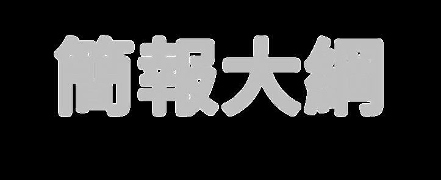

---
## 第 3 頁
### 一、基本資料

3

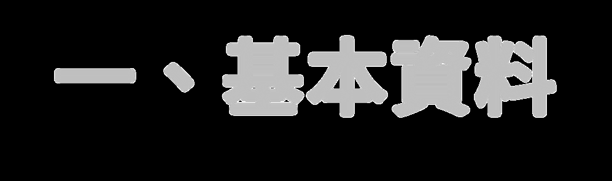

---
## 第 4 頁
### 基本資料

4

---
## 第 5 頁
### 一、基本資料

澄信結構
5
本案工址位於台北市中山區，本案規劃為地上23層、地下6層之建築，總樓高
為83.3m（不含屋突層），上部結構為鋼骨外包覆混凝土建物(SC)，地下室結構為
鋼筋混凝土造(RC)，開挖深度為23.7m。建築用途、各樓層高度如下：
樓層別
樓高
主要用途
R3F
2.6 m
水箱、電梯機房
R2F
2.7 m
水錶室、水箱
R1F
3.4 m
梯廳、屋頂平台
6F~23F
3.5 m
集合住宅
5F
3.8 m
公共空間
2F~4F
3.5 m
一般零售業、金融保險業
1MF
3.0 m
一般零售業、金融保險業
1F
3.0 m
一般零售業、金融保險業
B1F
4.0 m
停車空間、台電配電室
B5F~B2F
3.1 m
停車空間
B6F
4.2 m
停車空間、水箱、機房

---
## 第 6 頁
### 二、耐震設計

6

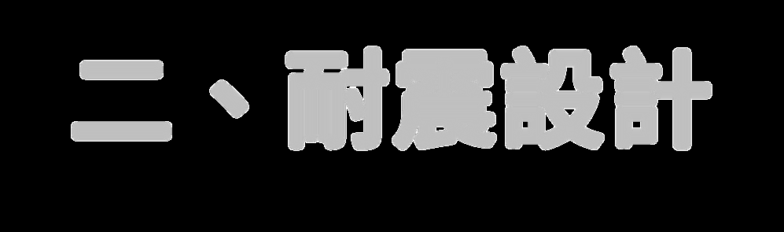

---
## 第 7 頁
### 耐震設計

7

---
## 第 8 頁
### 耐震設計

澄信結構
8
本案震區：台北一區
基地位置

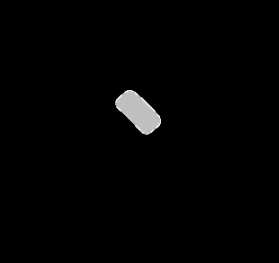

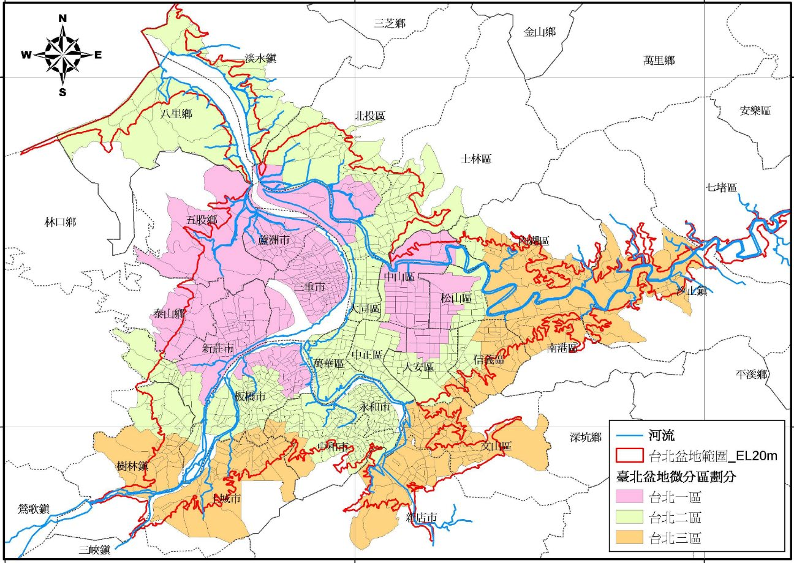

---
## 第 9 頁


設計地震力：
台北市中山區
屬台北一區

用途係數：
I = 1.0
對應5強地震
9
震度分級
人的感受
屋內情形
屋外情形
0
無感
人無感覺。
1
微震
人靜止或位於高樓層時可感
覺微小搖晃。
2
輕震
大多數的人可感到搖晃，睡
眠中的人有部分會醒來。
電燈等懸掛物有小搖晃。
靜止的汽車輕輕搖晃，類似卡車經過，
但歷時很短。
3
弱震
幾乎所有的人都感覺搖晃，
有的人會有恐懼感。
房屋震動，碗盤門窗發出聲
音，懸掛物搖擺。
靜止的汽車明顯搖動，電線略有搖晃。
4
中震
有相當程度的恐懼感，部分
的人會尋求躲避的地方，睡
眠中的人幾乎都會驚醒。
房屋搖動甚烈，少數未固定
物品可能傾倒掉落，少數傢
俱移動，可能有輕微災害。
電線明顯搖晃，少數建築物牆磚可能
剝落，小範圍山區可能發生落石，極
少數地區電力或自來水可能中斷。
5弱
強震
大多數人會感到驚嚇恐慌，
難以走動。
部分未固定物品傾倒掉落，
少數傢俱可能移動或翻倒，
少數門窗可能變形，部分牆
壁產生裂痕。
部分建築物牆磚剝落，部分山區可能
發生落石，少數地區電力、自來水、
瓦斯或通訊可能中斷。
5強
幾乎所有的人感到驚嚇恐慌，
難以走動。
大量未固定物品傾倒掉落，
傢俱移動或翻倒，部分門窗
變形，部分牆壁產生裂痕，
極少數耐震較差房屋可能損
壞或崩塌。
部分建築物牆磚剝落，部分山區發生
落石，鬆軟土層可能出現噴砂噴泥現
象。
6弱
烈震
搖晃劇烈以致站立困難。
部分耐震能力較差房屋可能
損壞或倒塌，大量傢俱大幅
移動或翻倒，門窗扭曲變形。
部分地面出現裂痕，部分山區可能發
生山崩，鬆軟土層出現噴砂噴泥現象。
6強
搖晃劇烈以致無法站穩。
部分耐震能力較差房屋可能
損壞或倒塌，耐震能力較強
房屋亦可能受損，大量傢俱
大幅移動或翻倒，門窗扭曲
變形。
部分地面出現裂痕，山區可能發生山
崩，鬆軟土層出現噴砂噴泥現象。
7
劇震
搖晃劇烈以致無法依意志行
動。
部分耐震較強建築物可能損
壞或倒塌，幾乎所有傢俱都
大幅移動或翻倒。
山崩地裂，地形地貌亦可能改變，鐵
軌彎曲。
法規要求

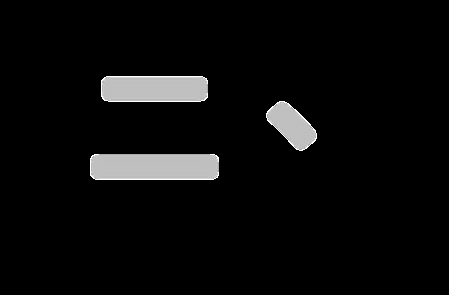

---
## 第 10 頁


新制地震分級說明

新制&舊制比較
10
PGA
(cm/s2)
<0.8
2.5
8
25
80
80~250
250~400
>400
舊制
0級
1級
2級
3級
4級
5級
6級
7級
新制
0級
1級
2級
3級
4級
5級弱
5級強
6級弱
6級強
7級
PGA
(cm/s2)
<0.8
2.5
8
25
80
震度大於5級，採PGV計算
PGV
(cm/s)
-
15~30
30~50
50~80
80~140
>140
本案EPA為0.24g = 235 gal

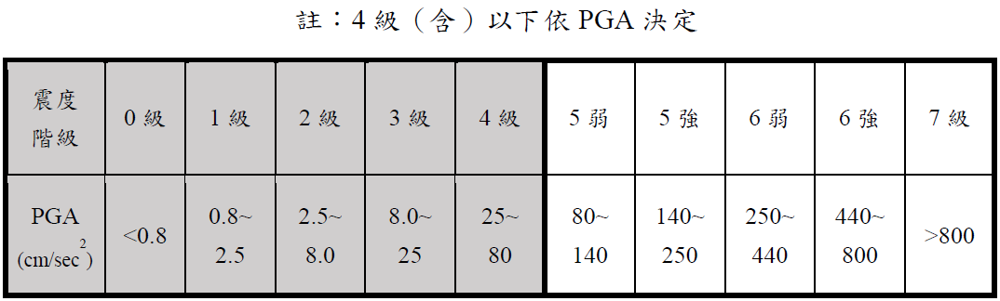
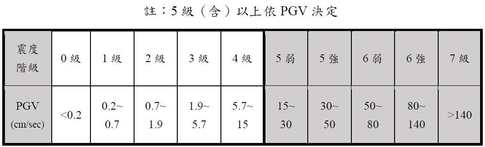

---
## 第 11 頁


耐震設計原則：採「小震不壞、中震可修、大震不倒」
地震級數
結構損壞情形& 損壞示意圖
小震不壞
3~4級
非結構物可能受損
主結構無損壞
中震可修
5~6級
主結構物可能輕度受損
修復後可立即恢復使用
大震不倒
7級以上
主結構物可能嚴重受損但不崩塌
人員可安全逃離
11

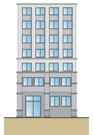
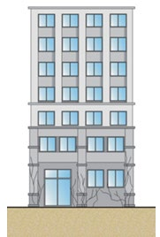
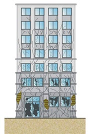

---
## 第 12 頁
### 三、結構系統規劃

12

---
## 第 13 頁
### 結構系統規劃

13

---
## 第 14 頁
### 、結構系統規劃


結構系統概要：

結構系統X向－特殊抗彎矩構架（SMRF）

結構系統Y向－特殊抗彎矩構架（SMRF）

上部結構為鋼骨外包覆混凝土造(SC)，地下室結構為鋼筋混凝土造(RC)，開挖
深度為23.7m，連續壁體長44.0m。

設計混凝土強度：

混凝土fc’= 280 kgf/cm2 (1F柱以上)

混凝土fc’= 420 kgf/cm2 (1FL以下，含1FL版、梁)

柱內灌漿混凝土強度：

21F柱以上
：
混凝土fc’= 350 kgf/cm2

16F~20F柱
：
混凝土fc’= 420 kgf/cm2

11F~15F柱
：
混凝土fc’= 490 kgf/cm2

B1F~10F柱
：
混凝土fc’= 560 kgf/cm2
14

---
## 第 15 頁
### 、結構系統規劃


混凝土強度
15
1FL
B6FL
420 kgf/cm2 (6000psi)
280 kgf/cm2  (4000psi)
PHFL

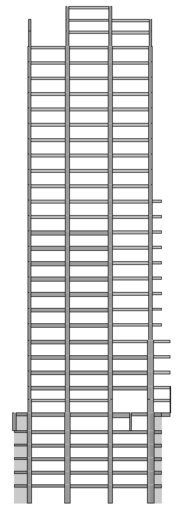

---
## 第 16 頁
### 、結構系統規劃


柱內灌漿混凝土強度
16
B1FL
560 kgf/cm2 (8000psi)
420 kgf/cm2 (6000psi)
350 kgf/cm2 (5000psi)
11FL
16FL
21FL
490 kgf/cm2  (7000psi)

---
## 第 17 頁
### 、結構系統規劃


鋼筋抗拉強度：

主體結構鋼筋均需符合CNS 560 A2006之規定，嚴禁使用水淬鋼筋

鋼筋降伏強度：#3~#10(含) fy = 4200 kgf/cm2

設計鋼骨強度：

鋼柱：
SM570M-CHW，Fy ≧4300 kgf/cm2
(B1F～13F)
板厚＜40mm，SN490B，Fy ≧3300 kgf/cm2
(14F以上)
板厚≧40mm，SN490YC，Fy ≧3300 kgf/cm2
(14F以上)

鋼梁：
SM570M-CHW，Fy ≧4300 kgf/cm2
(1MFL～14FL)
板厚＜40mm，SN490B，Fy ≧3300 kgf/cm2
(1FL、15FL以上)
板厚≧40mm，SN490YC，Fy ≧3300 kgf/cm2
(1FL、15FL以上)
17

---
## 第 18 頁
### 、結構系統規劃


標準層結構平面圖

X向－特殊抗彎矩構架（SMRF）

Y向－特殊抗彎矩構架（SMRF）
18

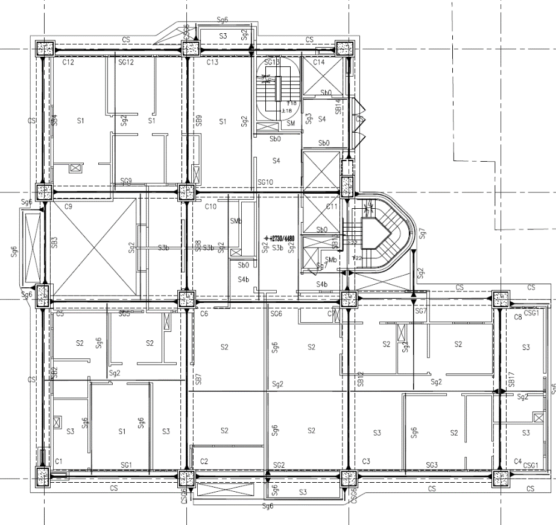

---
## 第 19 頁
### 、結構系統規劃


地下室結構平面圖

梁柱構架系統+ 110cm連續壁
19

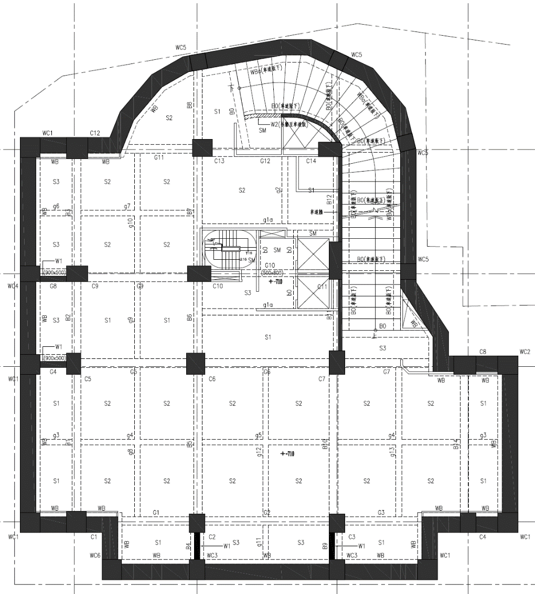

---
## 第 20 頁
### 、抗風設計

20
四、抗風設計

---
## 第 21 頁
### 抗風設計

21

---
## 第 22 頁
### 四、抗風設計


風力分區：

台北市中山區

基本設計風速V10(C) = 42.5 m/s

地況分類：地況B

用途係數I = 1.1

檢討項目：
a. 使用性：樓層變位角< 5‰
b. 舒適性：屋頂角隅加速度< 5% m/s2
c. 風洞試驗：建築物超過100公尺，或風力總橫力大於地震總橫力時建議進
行風洞試驗。(本案不需要風洞試驗)
22

---
## 第 23 頁
### 五、結構設計

23

---
## 第 24 頁
### 結構設計

24

---
## 第 25 頁
### 五、結構設計


樓版活載重設計表：
25
樓層別
樓高(m)
活載重(tf/m2)
用途
PHF
-
0.3
屋突頂蓋
R3F
2.6
0.3
水箱
1.0
電梯機房
R2F
2.7
0.3
水錶室、水箱
R1F
3.4
0.4
梯廳、屋頂平台
6F~23F
3.5
0.3
集合住宅
5F
3.8
0.3
公共空間
2F~4F
3.5
0.3
一般零售業、金融保險業
1MF
3.0
0.3
一般零售業、金融保險業
1F (室內)
3.0
1.0
一般零售業、金融保險業
1F (室外)
1.5
B1F
4.0
0.5
停車空間
1.0
台電配電室
B5F~B2F
3.1
0.5
停車空間
B6F
4.2
0.5
停車空間、水箱
0.9
機械停車
1.0
機房

---
## 第 26 頁
### 五、結構設計

26
Mode 1
Mode 2
Mode 3
模態

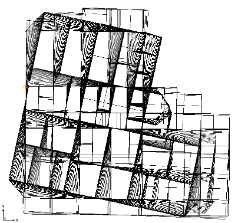
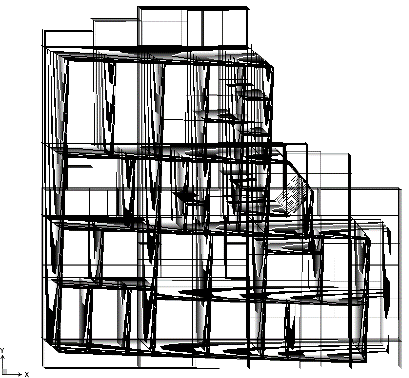
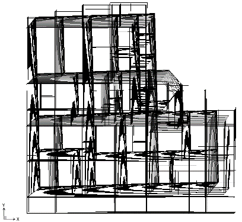
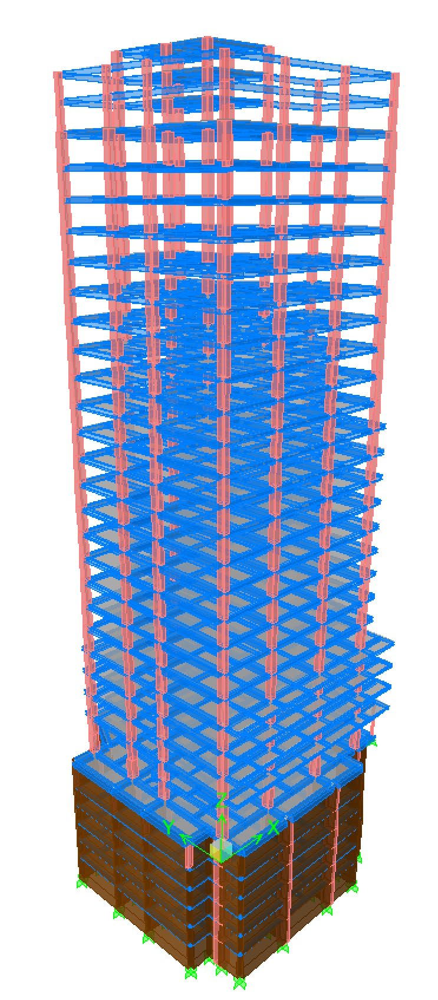

---
## 第 27 頁
### 五、結構設計

27
分析值
動力週期
X向
2.8043 s
Y向
2.6249 s
層間變位角
X向
3.95 ‰
Y向
4.54 ‰
依建築物耐震設計規範與解說第2.16.1節規定，
層間變位角需< 5 ‰

---
## 第 28 頁
### 五、結構設計


鋼骨外包覆混凝土(SC)結構系統：
SC柱標準圖
SC梁標準圖
28

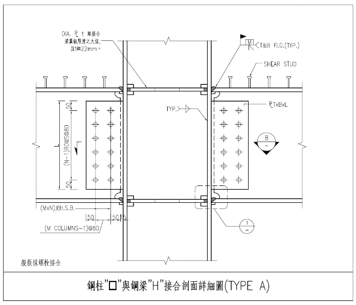
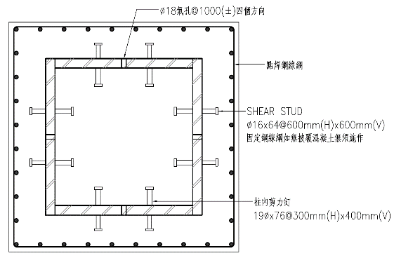
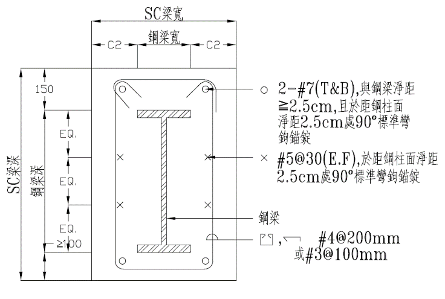

---
## 第 29 頁
### 六、結構消能

29

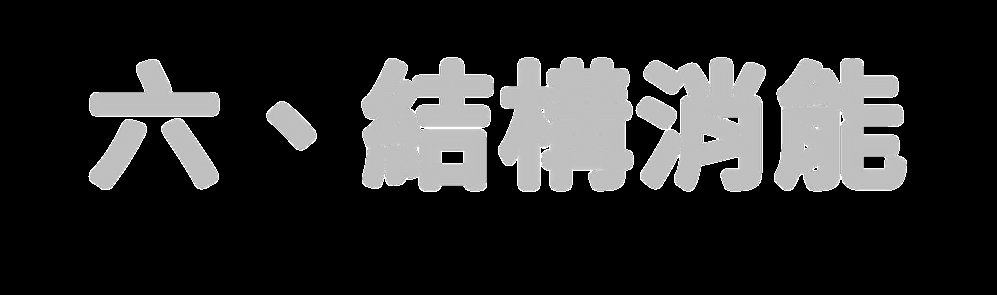

---
## 第 30 頁
### 結構消能

30

---
## 第 31 頁
### 六、結構消能


黏彈性阻尼器制震壁VEM規劃：

增加結構系統的阻尼，提供穩定有效消能

增進建築物使用性能（舒適性）

減少水平力(地震力、風力)作用時之頂層加速度& 層間位移
2F~5F裝設位置
6F~17F裝設位置
31
本工程制震壁，規劃裝設於
2F~17F，每層4組，共計64組

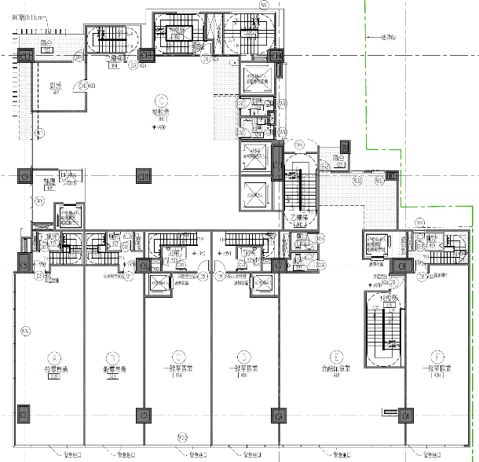
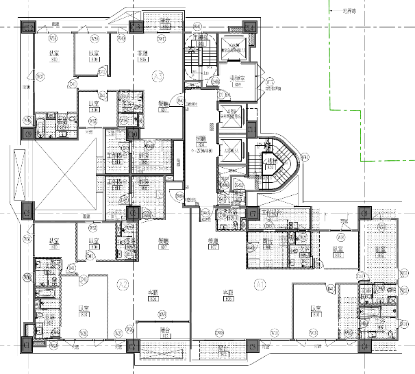

---
## 第 32 頁
### 六、結構消能


制震效益：
32
Bare Frame
Damped Frame
以制震裝置吸收地震能量
減少因地震所發生的建築物揺晃
提高建築物的安全性

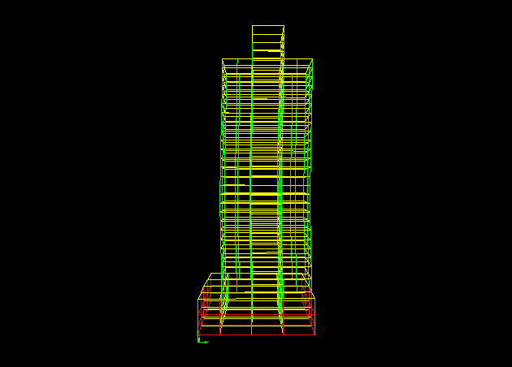
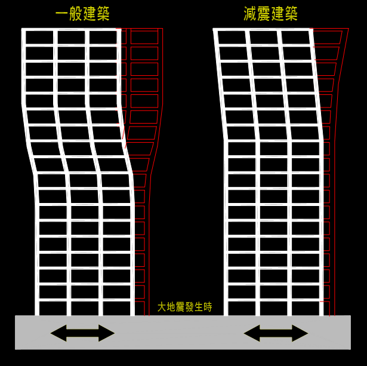

---
## 第 33 頁
### 六、結構消能


新日鐵50 tonf 黏彈性阻尼器制震壁VEM之制震效果：

可額外提升建築物耐震能力

X向提升約18.5%

Y向提升約12.5%
33

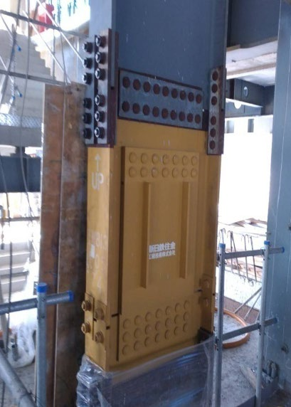
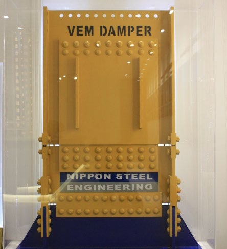
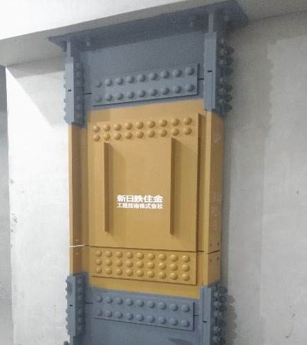
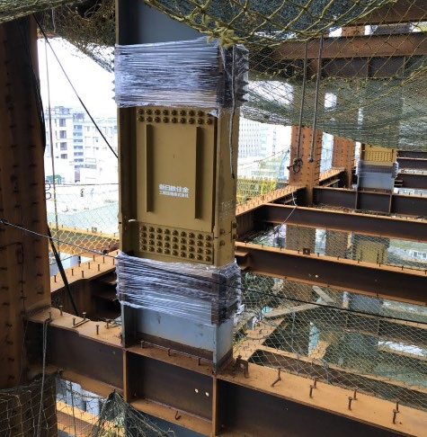

---
## 第 34 頁
### 七、基礎設計

34

---
## 第 35 頁
### 基礎設計

35

---
## 第 36 頁
### 七、基礎設計

澄信結構
36

基地土層性質：

依據塏固工程有限公司，本基地鑽探報告之土層簡化參數表
深度(m)
地層
Navg
γt (t/m3)
Su (t/m2)
C’(t/m2)
φ  (°)
0~3.6m
回填層及
粉土質粘土(CL)
3
1.93
2.0
0
29
3.6~16.0m
粉土質細砂(SM)
7
1.95
-
0
30
16.0~20.1m
粉土質粘土，軟弱(CL)
4
1.90
0.25σ’
0
29
20.1~25.7m
粉土質粘土，中等堅實(CL)
6
1.91
0.25σ’
0
30
25.7~31.6m
粉土質細砂(SM)
15
1.96
-
0
31
31.6~34.9m
粘土質粉土(ML)
11
1.95
0.27σ’
0
30
34.9~41.7m
粉土質細砂(SM)
26
1.98
-
0
32
41.7~48.4m
粘土質粉土(ML)
16
1.93
0.30σ’
0.5
30
48.4~56.7m
粉土質細砂(SM)
27
1.99
-
-
-
開挖底面
連續壁貫入深度
G.L.-23.7m
G.L.-44.0m

---
## 第 37 頁
### 七、基礎設計

澄信結構
37

土壤液化潛勢區
1.
本案工址位於台北市中山區，土壤液化分級屬於中潛勢區（黃色）
本案工址

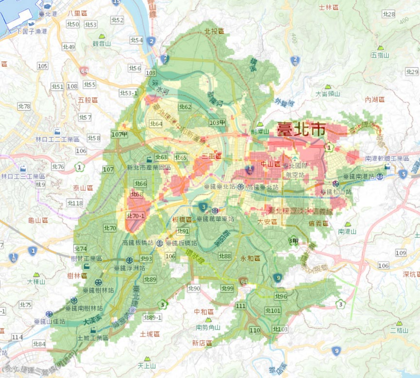

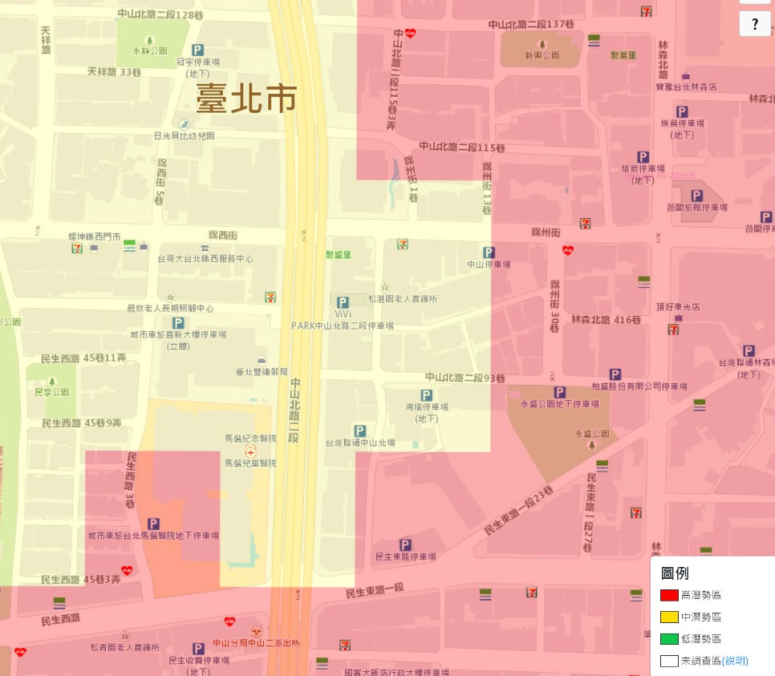

---
## 第 38 頁
### 七、基礎設計

澄信結構
38

地下水位：
1.
常時水位位於地表下2.5m
2.
高水水位位於地表下1.0m

開挖工法：
1.
順打工法：開挖深度23.7m，7層水平支撐

擋土措施規劃：

連續壁：厚度110cm，深度44.0m

地中壁+扶壁：施作高程G.L. -10.0m ~ G.L. -35.0m，克服差異沉陷問題
增加其開挖底面之穩定性及擋土設施之安全性

基礎構造：

筏式基礎：深度300cm，筏基底版厚80cm ，筏基頂版厚15cm

---
## 第 39 頁
### 七、基礎設計

澄信結構
39

地中壁與扶壁配置圖：

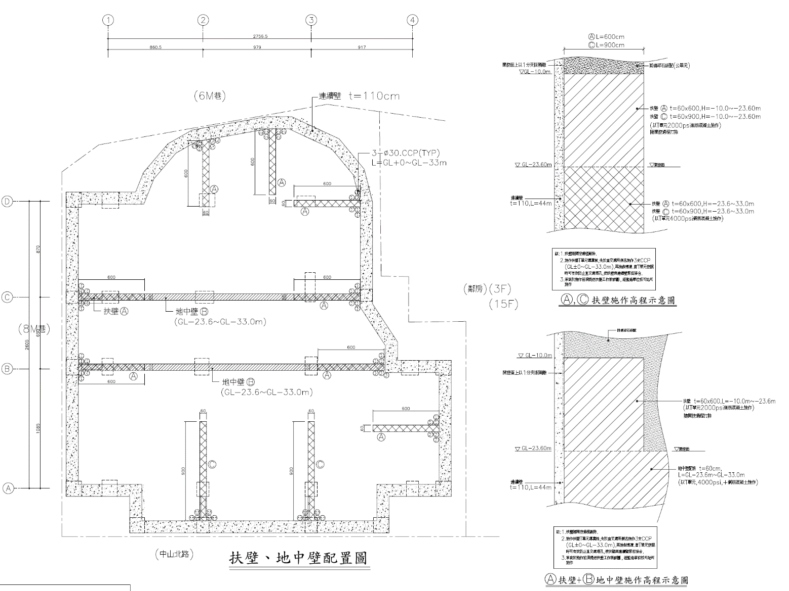

---
## 第 40 頁
### 八、總結

40

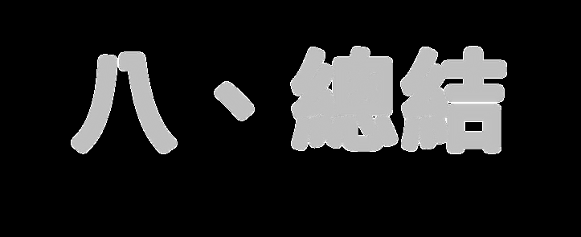

---
## 第 41 頁
### 總結

41

---
## 第 42 頁
### 、總結

澄信結構
42
抗震強度
本案設計EPA = 0.24g，耐震強度達”5強”地震
材料
混凝土
fc’= 280 kgf/cm2 (1F柱以上)    (4000 psi)
fc’= 420 kgf/cm2 (1FL以下)      (6000 psi)
柱內灌漿混凝土
21F柱以上
：
350 kgf/cm2
(5000 psi)
16F~20F柱
：
420 kgf/cm2
(6000 psi)
11F~15F柱
：
490 kgf/cm2
(7000 psi)
B1F~10F柱
：
560 kgf/cm2
(8000 psi)
鋼筋
#3~#10(含)   fy = 4200 kgf/cm2
鋼骨
鋼柱
SM570M-CHW，Fy ≧ 4300 kgf/cm2
(B1F～13F)
板厚＜40mm，SN490B，Fy ≧ 3300 kgf/cm2
(14F以上)
板厚≧40mm，SN490YC，Fy ≧ 3300 kgf/cm2
(14F以上)
鋼梁
SM570M-CHW，Fy ≧ 4300 kgf/cm2
(1MFL～14FL)
板厚＜40mm，SN490B，Fy ≧ 3300 kgf/cm2 (1FL、15FL以上)
板厚≧40mm，SN490YC，Fy ≧ 3300 kgf/cm2 (1FL、15FL以上)

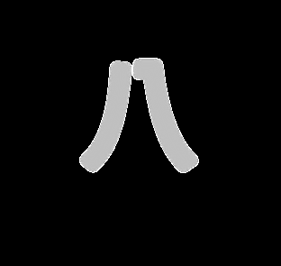

---
## 第 43 頁
### 、總結

澄信結構
43
結構系統
上部結構
鋼骨外包覆混凝土(SC)構造– 特殊抗彎矩構架（SMRF）
下部結構
鋼筋混凝土造
樓版
15cm RC樓版
牆
外牆、隔戶牆、樓梯牆、電梯牆為15cm~20cm  RC牆，隔間牆為輕隔間
基礎
筏式基礎(地梁深度300cm，筏基底版厚80cm)，與地中壁聯合
抗液化措施
應無土壤液化問題
擋土措施
110cm連續壁
開挖工法
順打工法，7層內支撐，搭配地中壁及扶壁
結構消能
2F~17F，每層4組制震壁

---
## 第 44 頁

澄信結構
44
簡報結束
敬請指教

---
