# 璞真之道_機電銷講簡報_1100528

---
extracted_main_title: "璞真之道     銷售講習簡報"
file_hash: "a2f4a4c6579a423d0ff53b4287bba5fa"
---

## 第 1 頁
### 璞真之道     銷售講習簡報

璞真之道     銷售講習簡報 
                                 機電設計 110.5.28

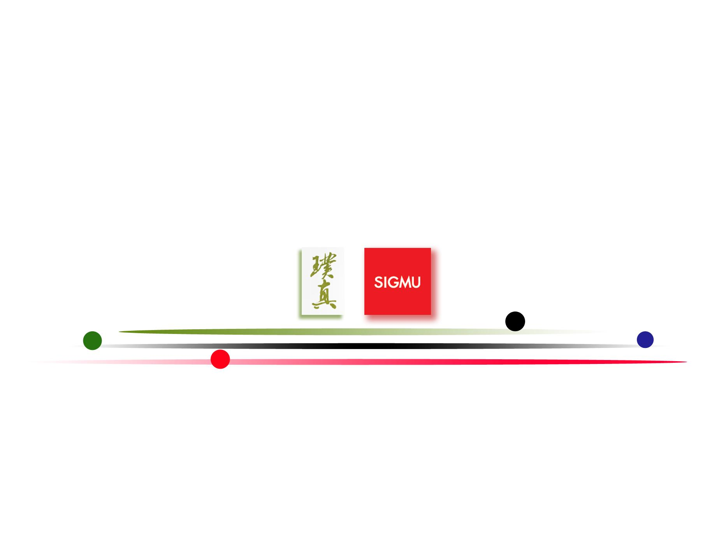

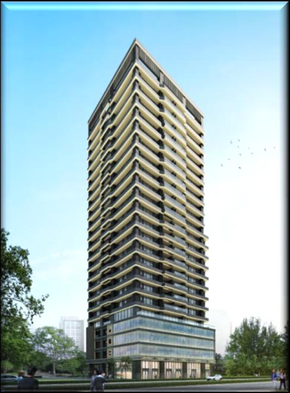

---
## 第 2 頁

■ .建築設計：陳金水建築師事務所、P&T 
■ .結構設計：澄信結構土木大地技師事務所 
■ .門廳公設：萊比室內裝修 
■ .燈光設計：肯緒照明設計 
■ .景觀設計：頤和景觀設計 
■ .機電設計：世紘工程顧問有限公司
規劃設計團隊 
建築物基本資料 
 
■ .基地位置：台北市中山區中山段三小段111…地號等10筆 
■ .基地面積：1237m2 
■ .建築規模：地上23FL 、地下6FL 
■ .樓層高度：83.3米 (高層建築物) 
■ .總計戶數：54戶(住宅)、9戶(零售、餐飲、金融)

---
## 第 3 頁
### 簡報大鋼

---
## 第 4 頁

---
## 第 5 頁
### 公共區：

• 供電系統：3∮4W 220/380V 。
• 發電機：750KW一台，設計油箱容量可連續供電約7小時。
• 自來水蓄水量：地下蓄水池+屋頂水塔合計均可達到0.8日用水量。
• 雨水再生蓄水量：筏基內雨水回收池約60噸。
• 空調：B1F/1F/5F公共區採VRV變頻空調系統。

---
## 第 6 頁
### 6F~23F 專有住宅：

• 供電電壓：各戶均採1∮3W 110/220V獨立電錶。
• 供水口徑： A3戶採 1〞， A1戶及A2戶採1 ½”。
• 發電機供電 : 停電時供應各戶室內四處插座使用 (冰箱、客廳、主臥、
宅內箱)。
• 空調：設置VRV冷暖變頻主機。
• 新風：設置全熱交換器與PM2.5空氣淨化設備。

---
## 第 7 頁
### 1F~4F 一般零售、金融保險、餐飲業：

• 供電電壓：各戶均採3∮4W 220/380V獨立電錶，室內照明
採220V，並設變壓器降壓至110V供插座使用。
• 供水口徑： A、B、C、D、F戶(一般零售)採 3/4”，
E、G戶(金融保險及餐飲)採1 ½”。
• 緊急發電機供電 : 停電時供應各戶三處插座+宅內箱使用。

---
## 第 8 頁

---
## 第 9 頁
### 系統管材概要說明

EMT鋼管-強弱電明管配置
高等級安全防火管材 
 
機械接頭-消防管材接頭
使用壽命長、抗震性能佳
CIP塗裝鑄鐵管：污水、廢水管
使用年限長
防火、抗腐蝕性強
低流體摩擦係數(低噪音) 
 
不鏽鋼保溫披覆管-冷水、熱水管
避免溫差大，造成冷凝水滴
隔熱性能好 可確實達到保溫及 
    節能效果
特性：防火、耐用、低噪音、保溫

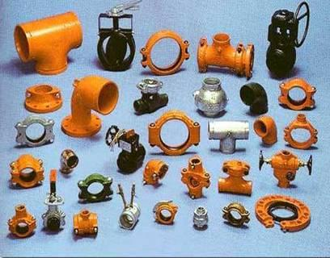

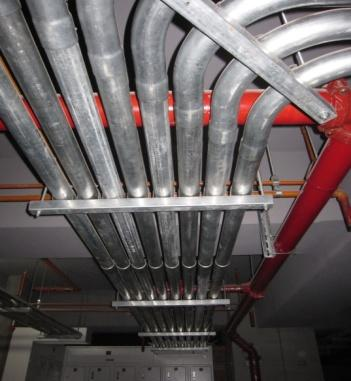

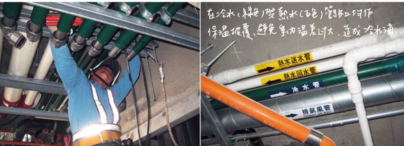

---
## 第 10 頁

---
## 第 11 頁
### 機電重點設備及特色

綜合佈線、資訊通訊 
1
安全防災 
2
舒適節能 
3
貼心便利 
4

---
## 第 12 頁
### 綜合佈線、資訊通訊

行動通訊改善
節省佈線空間，提高住戶高速資通
資訊智慧 
宅內整合箱建置 
無線網路 
FTTH 
光纖到府建置

---
## 第 13 頁
### 資訊智慧宅內整合箱建置

本案示意
網路 (Switch)模組
電話模組
110Vac 插座模組
有線電視分配模組
他案案例

以模組方式整合住戶內電話、光纖網路、有線及無線電視訊號。

設置多組網路、電話、電視專用插座，方便住戶隨時擴充。

整體箱體內外美觀整齊，看不到雜亂無章的電線。

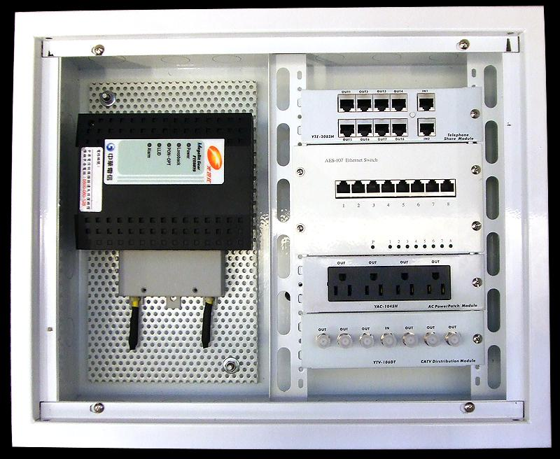
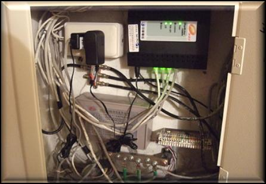

---
## 第 14 頁
### 社區無線網路

社區住戶可於公共使用空間 
透過公共無線專屬網路  Wi-Fi上網 
(如交誼廳、大廳、停車空間…)

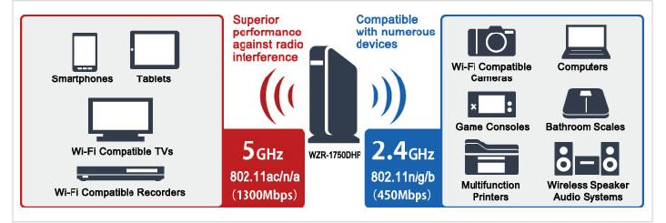

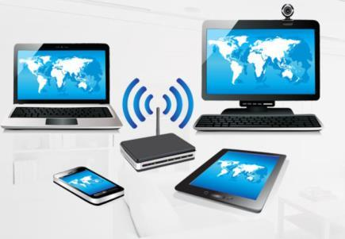
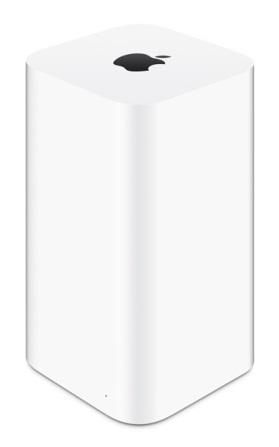

---
## 第 15 頁
### 行動通訊改善

Donor antenna
Splitter
R24
Service antenna
Cable

解決建築物收訊死角

建置於各樓層梯廳、電梯車箱、停車空間
，並預留供住戶可引接至室內

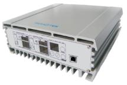

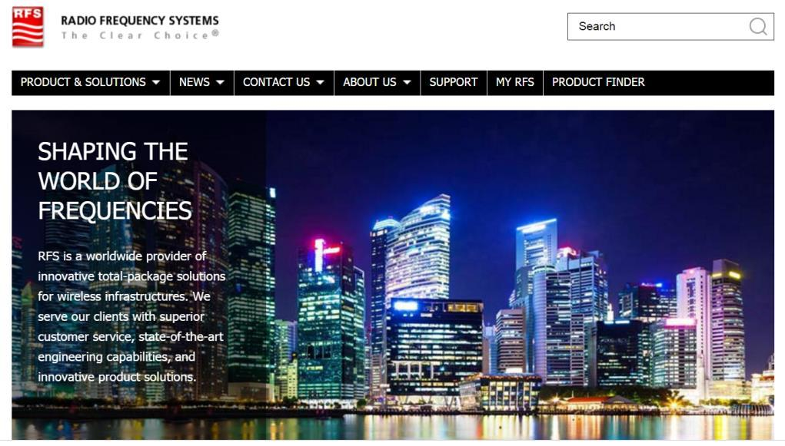
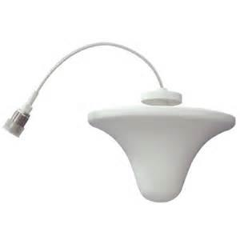

---
## 第 16 頁
### 各層梯廳預留日後客戶自行擴充接點

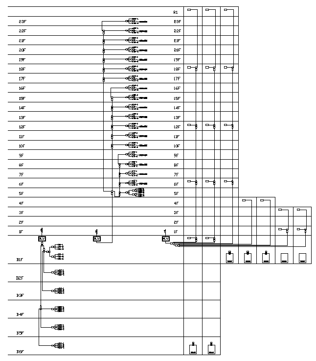
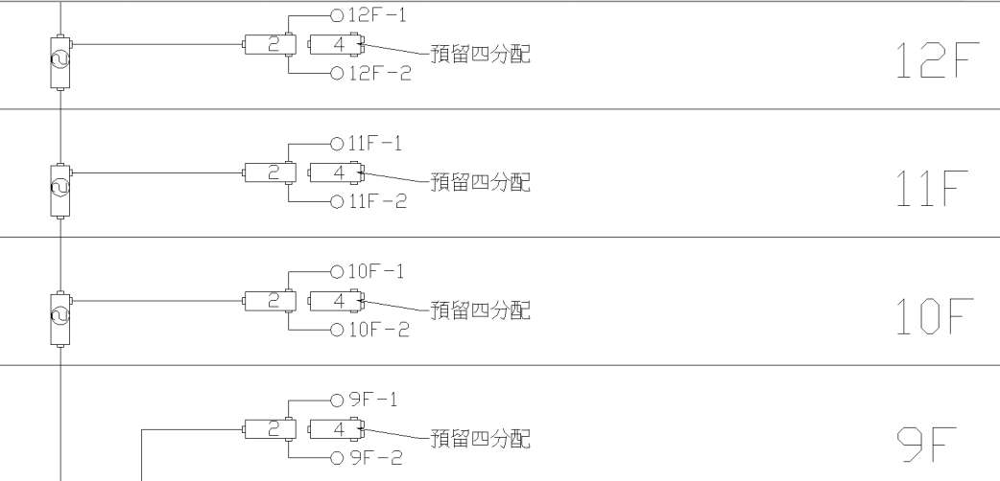

---
## 第 17 頁
### FTTH光纖到府建置

優劣比較 
FTTH 
ADSL傳統網路
線 路 
 媒 介
光纖-傳輸品質高、
傳輸距離遠
銅纜線-品質低、
傳輸距離短
電 器  
特 性 
電磁屏蔽、不受干擾 
易受電器干擾或受潮故障
信 號  
轉 換
光電轉換器- 
整合智能宅內箱 
數據機
擴充性 
擴充不需重新佈線 
擴充速率受影響

建置光纖社區，全面升級數位生活

提高未來系統傳輸可擴充性

降低日後擴充時之佈線難度及費用

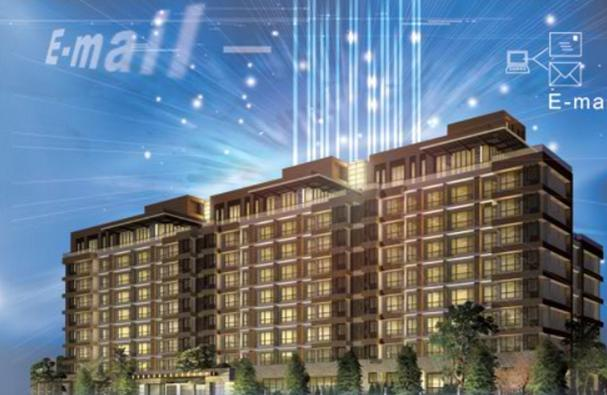

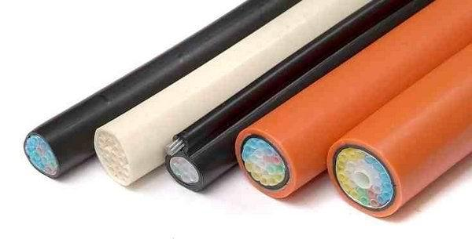

---
## 第 18 頁
### 安全防災

吸收反射式
避雷針
空間 
防火阻絕
火警連動
提升大樓安全防災及防護能力，減少物管派駐人力與管理費用

---
## 第 19 頁
### 反射吸收式避雷針

他案屋頂層雷擊點 
擊碎石片散落1F地面
他案屋突一層雷擊點
設備型式 
傳統式 
放電式 
吸收反射式
分類 
補救性避雷 
補救性避雷 
預防性避雷
避雷方式 
引雷 
主動式引雷 
主動式驅雷
本案為了人員及建築物安全，採用能確
實有效防護建築物的吸收反射式避雷針。

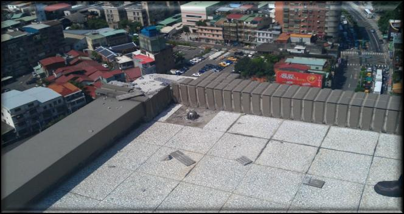
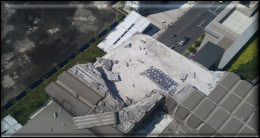
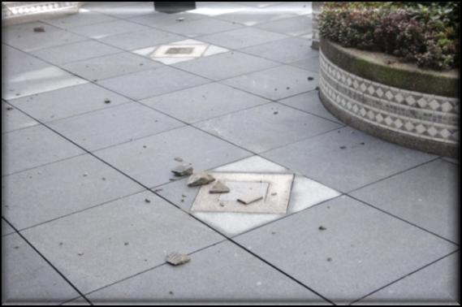
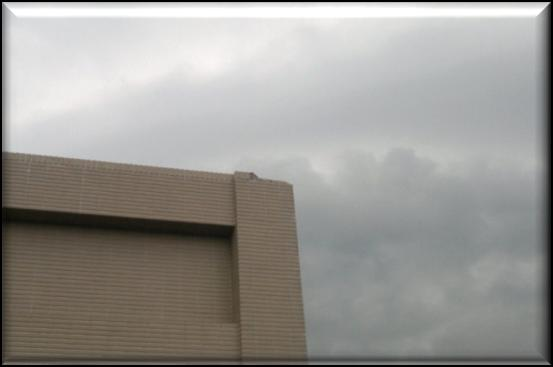

---
## 第 20 頁

電暈效果可達平均
高度2500公呎以上
故障監視
避雷保護頭
特色：
1. 採預防性驅雷，能有效降低在保護範圍內的雷擊發生。
2. 可在防災中心加裝避雷系統故障監視器，可明確知道避雷系統組件是否故障
或線路斷路等情形，能隨時監視避雷系統是否健全，提高其可靠性。

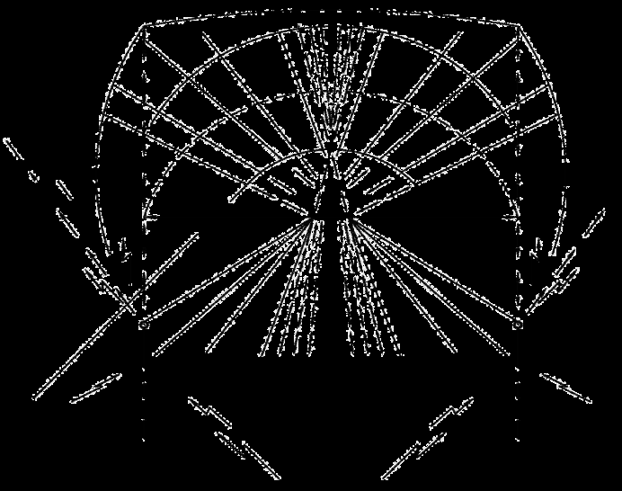

---
## 第 21 頁
### 空間為何需要防火阻絕

火勢阻絕，人員爭取 
有效逃生時間及空間
火勢延穿越牆壁
管線縫隙蔓延
火勢延樓板 
管道上下蔓延 
火勢延管線蔓延
空間防火阻絕

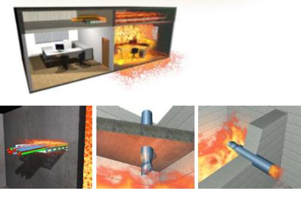

---
## 第 22 頁
### 他案常見錯誤施作案例

一般非防火發泡
沒綁防火帶、防火阻絕不確實
未填防火材料
常見方便行事只填砂漿替代

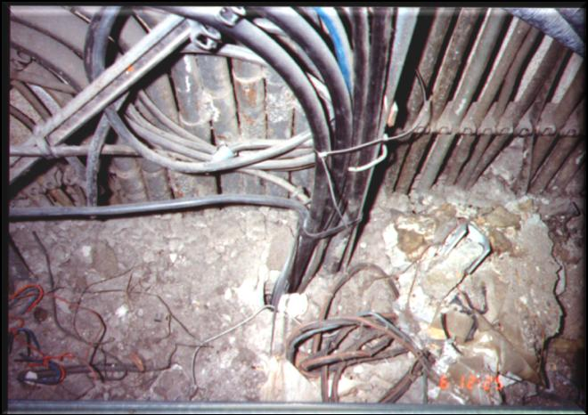
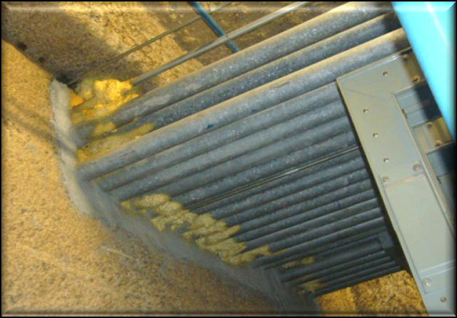
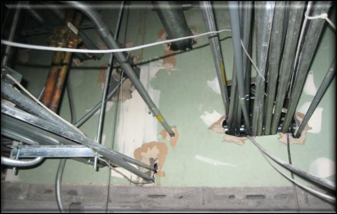
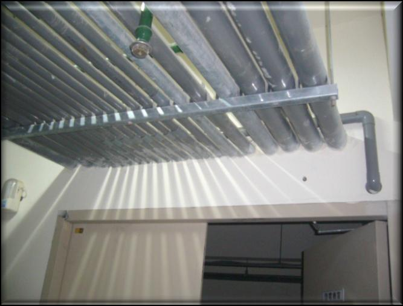

---
## 第 23 頁

防火阻絕有效及重點位置： 
管道間 
機房 
梯廳及排煙室
•本案採用有防火認證個別工法的防火材料填塞。
•在不同管材施予不同的個別工法認證，明確訂
定嚴謹的施工程序及規範。
•能有效防止火燄及濃煙延燒，以增取逃生時間。

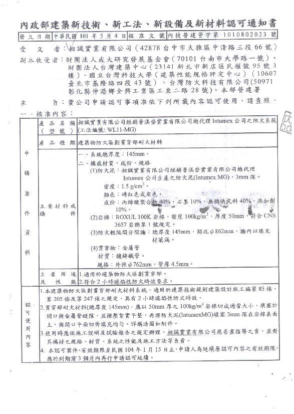
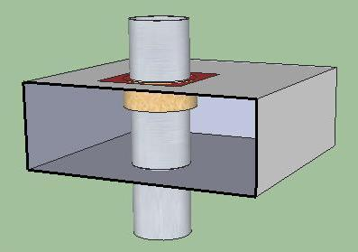

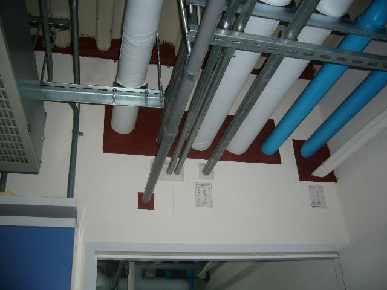

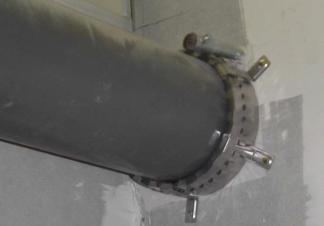

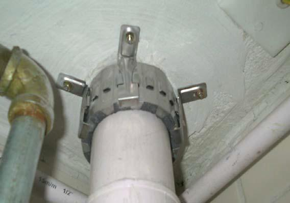

---
## 第 24 頁

1.梯廳、排煙室
2.緊急昇降梯間
3.特別安全梯
4.公共管道
5.排水管道間
6.廚房
標準樓層 
(防火阻絕施作位置)
A3
A2 
A1

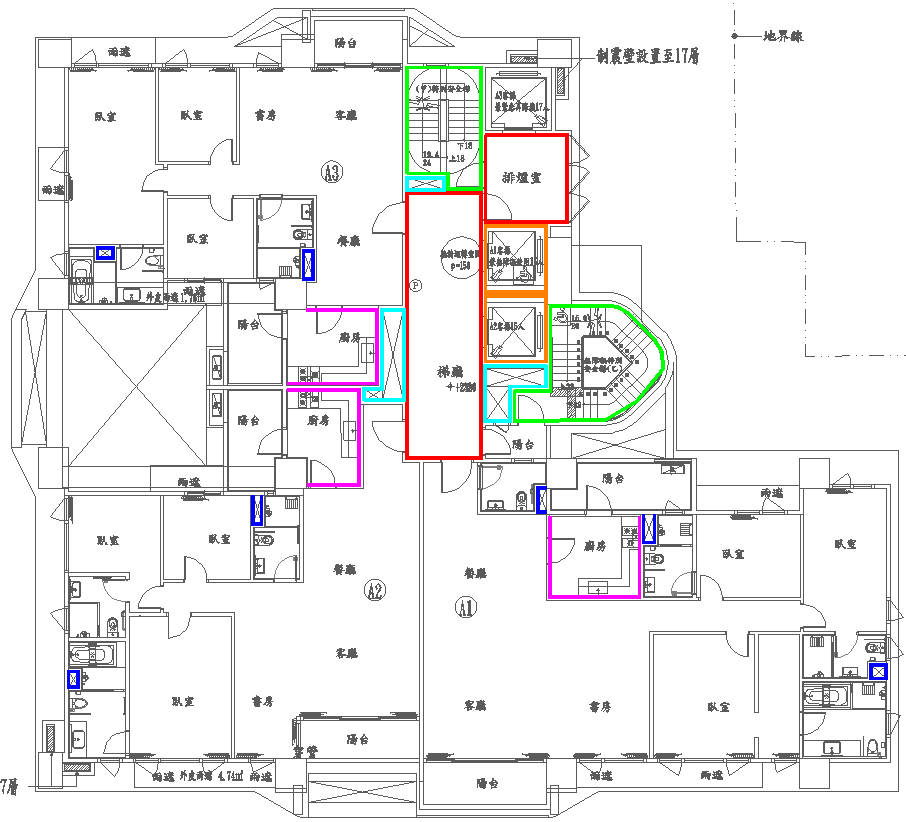

---
## 第 25 頁
### 火警連動

O2
O2
O2 
O2
CO2 CO2
CO2 CO2 
X
火警連動消防通道安全門、風車： 
火災發生時,進風設備自動關閉,開啟安全門(避免新鮮空氣持續引入，造成火勢助燃)

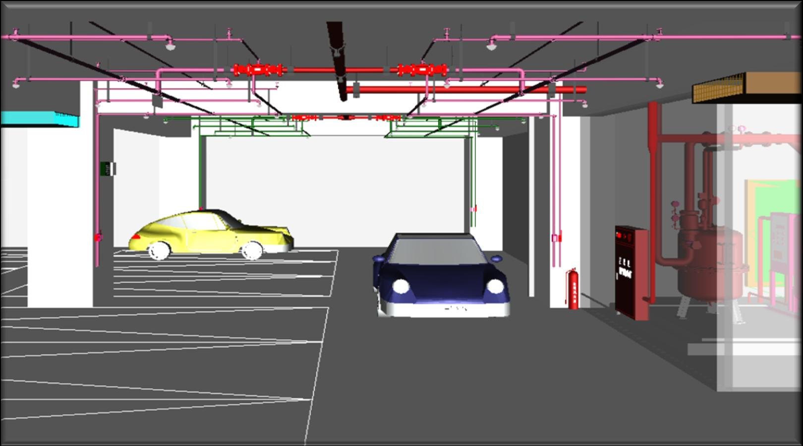

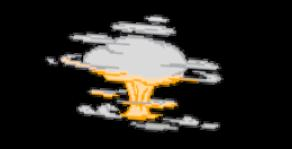

---
## 第 26 頁
### 舒適節能

直接效益可節省能源及低碳排放， 
達到住戶更舒適居住環境
中央 
淨水處理
FRP 
組合水箱
停車場 
一氧化碳 
連動控制
感應燈具
應用 
燈具自動 
排程控制
公設空間 
全熱交換機
建置
雨水回收
再利用
居家 
新風系統
制音防治
措施

---
## 第 27 頁
### 停車場一氧化碳連動控制

誘導式風機
排風管道+風機設備 
進風管道+風機設備
偵測器

停車場24小時一氧化碳濃度監控。

停車場進風、排風除定時控制外，當一氧化碳濃度過高時，
則自動強制進行進排風換氣 。

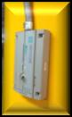

---
## 第 28 頁
### 燈具自動排程控制

燈光控制主機
建築物立面、室內公共、戶外景觀等區域，
燈光控制採系統自動排程控制，並可依四季
時序的不同自動調整

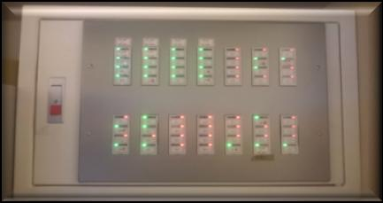

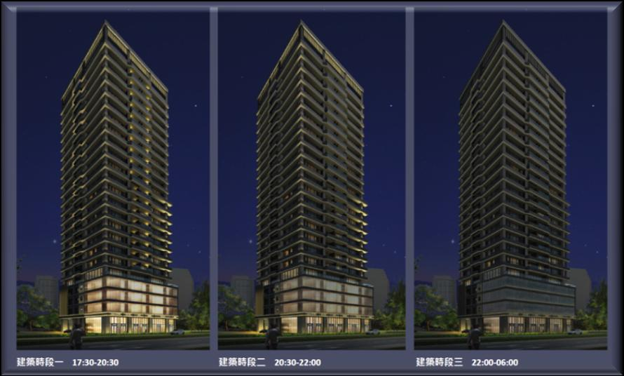
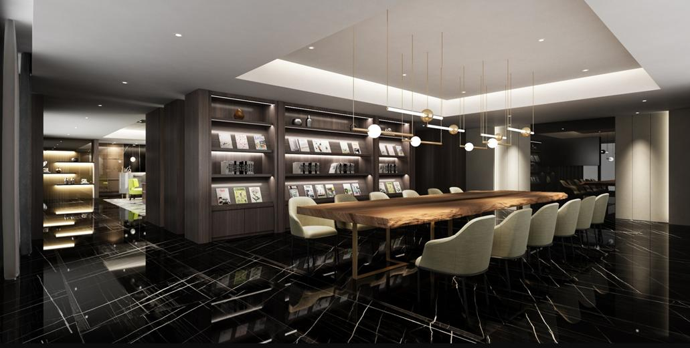
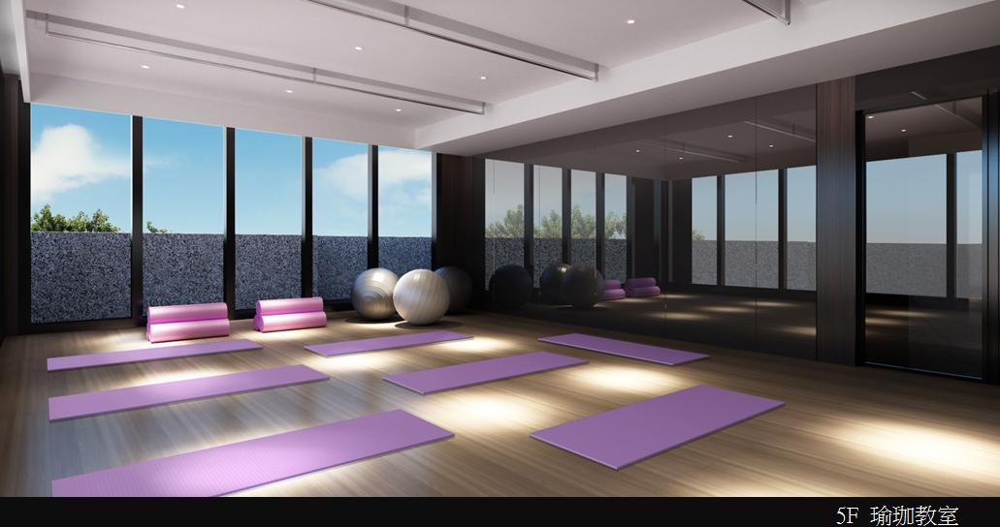

---
## 第 29 頁
### 感應燈具應用

樓梯感應燈
感應控制開關
紅外線感應器
應用場所：停車位、樓梯間、住戶玄關
人員靠近時，感應燈管自動點亮 
平時無人時，感應燈管休眠狀態

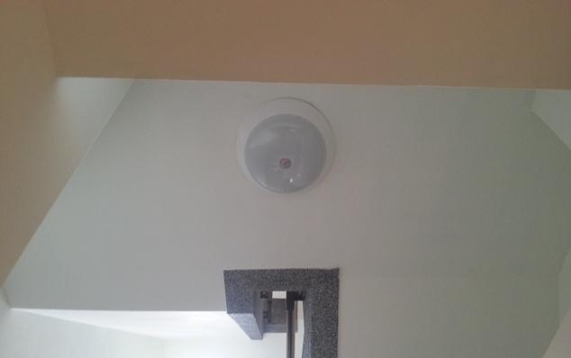
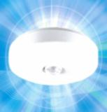

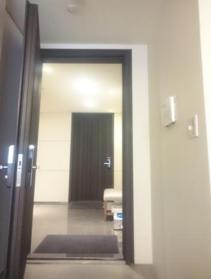
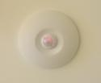
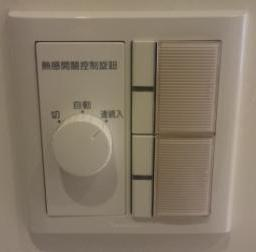

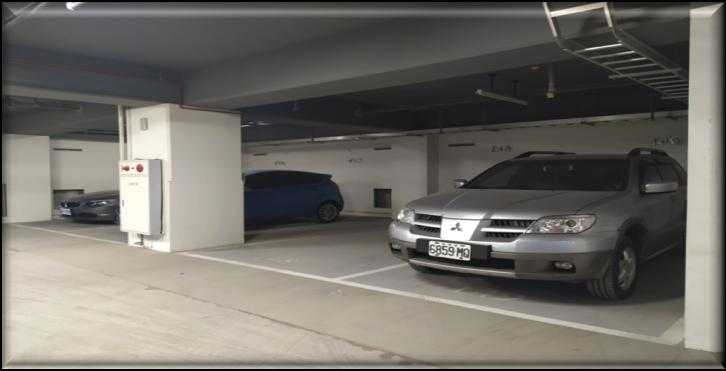
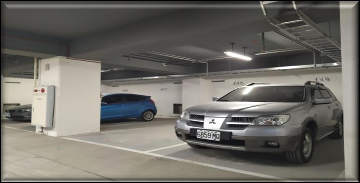

---
## 第 30 頁

標準樓層 
(感應燈具位置)
停車樓層 
(感應燈具位置)

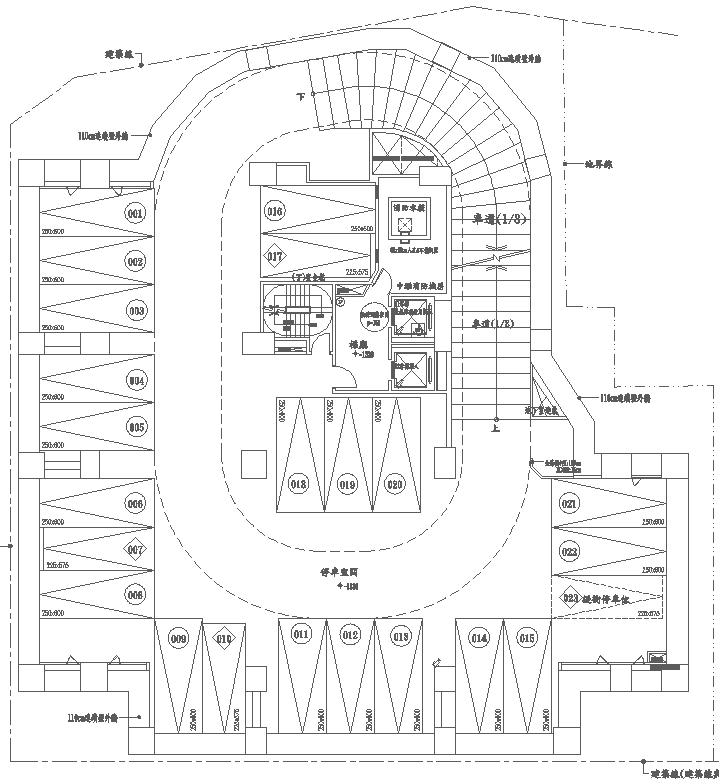

---
## 第 31 頁
### 公設空間全熱交換機建置

污濁空氣排氣
EA
新鮮空氣進氣
OA

引入室外活氧空氣，過濾灰塵並清除污染過敏原，提供乾淨且新鮮的呼吸空氣

控制溫度交換，降低冷暖房的能源損耗

設置地點：1F迎賓大廳、5F韻律室、健身房、閱覽室等、R1F交誼空間

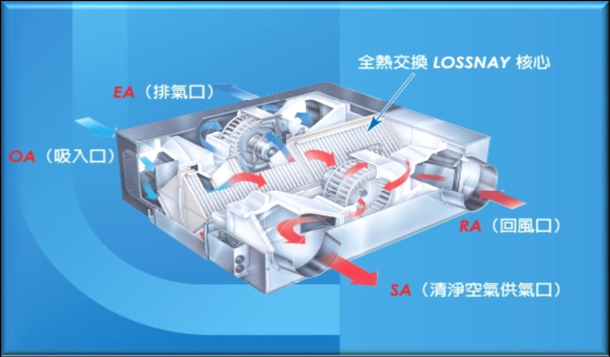

---
## 第 32 頁
### 雨水回收再利用


屋頂雨水經專屬管路集中再回收

經沉沙及除質後，引入綠能再生水槽供庭園澆灌

有效降低公共用水量，貫側綠建築理念與自然共生

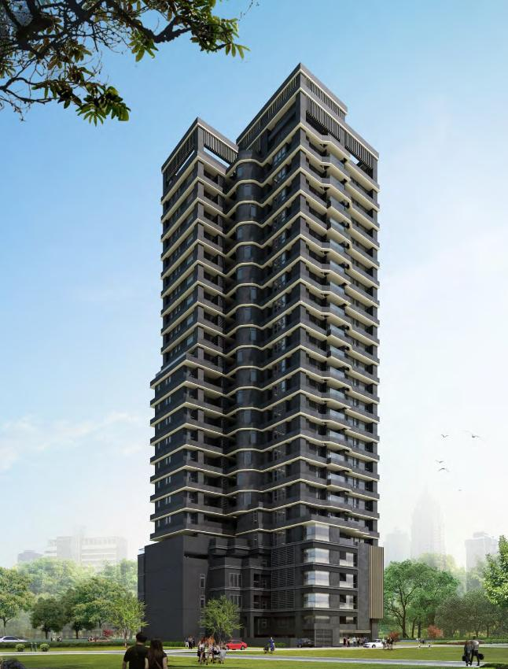
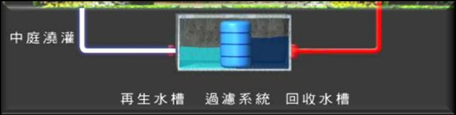

---
## 第 33 頁
### 居家新風系統


新風系統概念：將室外新鮮空氣經過過濾後送到室內，同時把室內污濁空氣排到室外，
達到系統的平衡的同時也對室內進行了空氣的置換。

有效解決空氣中含氧量、有害物質、有害微顆粒、細菌等問題。

專有戶新風建置組合：全熱交換器+高效率過滤PM2.5淨化設備+新風智慧控制。

因應客戶日後裝修，設備二次側管路由客戶自行引接。

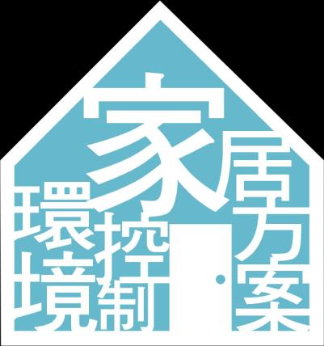
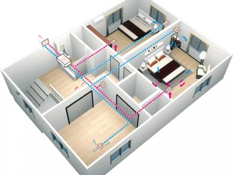

---
## 第 34 頁

自動調節室內空氣品質：
當環境狀況超過條件設定值時，發出訊號，自動啟動新風設備。
室內空氣品質偵測器 
(設備示意圖)

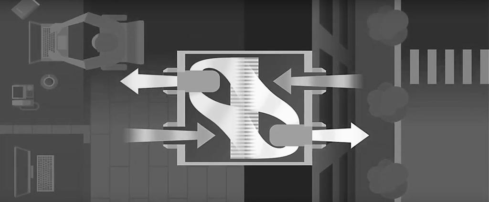
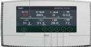
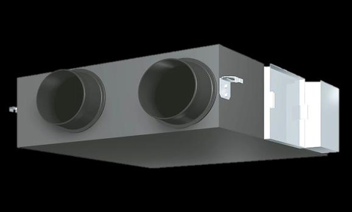

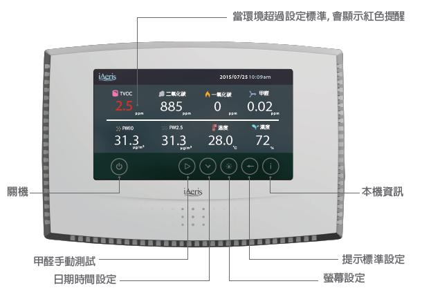

---
## 第 35 頁
### A1

標準樓層A1戶 
(新風設備位置)
全熱交換機+
空氣淨化箱

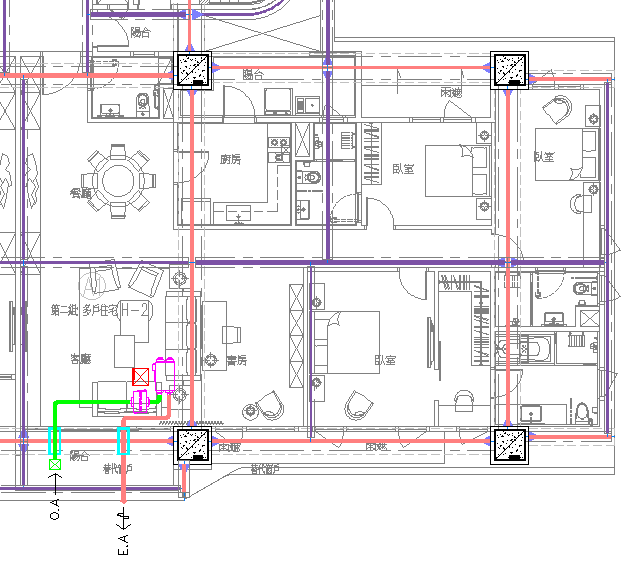

---
## 第 36 頁
### A2

(TYPE-1) 
(新風設備位置)

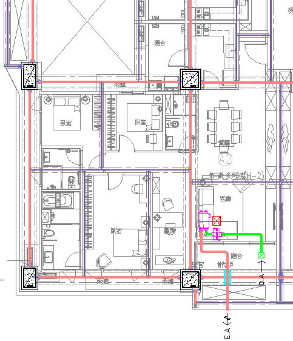

---
## 第 37 頁
### A2

(TYPE-2) 
(新風設備位置)

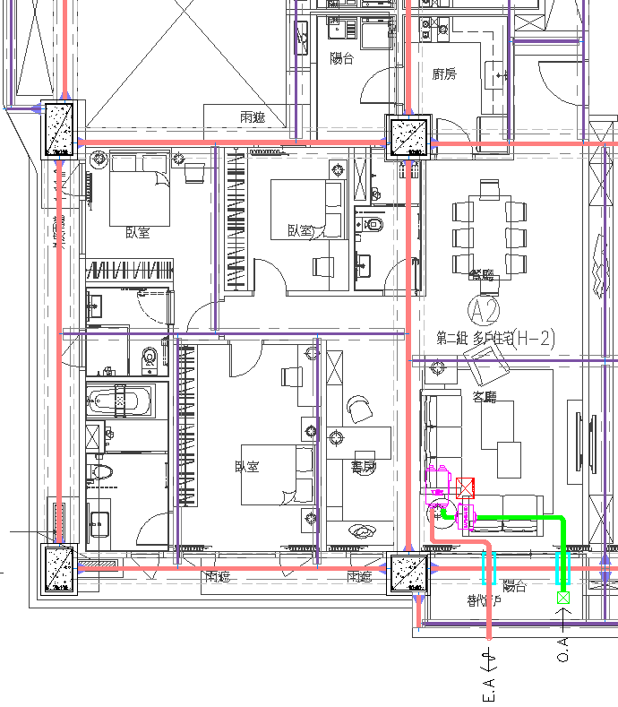

---
## 第 38 頁
### A3

標準樓層A3戶 
(新風設備位置)

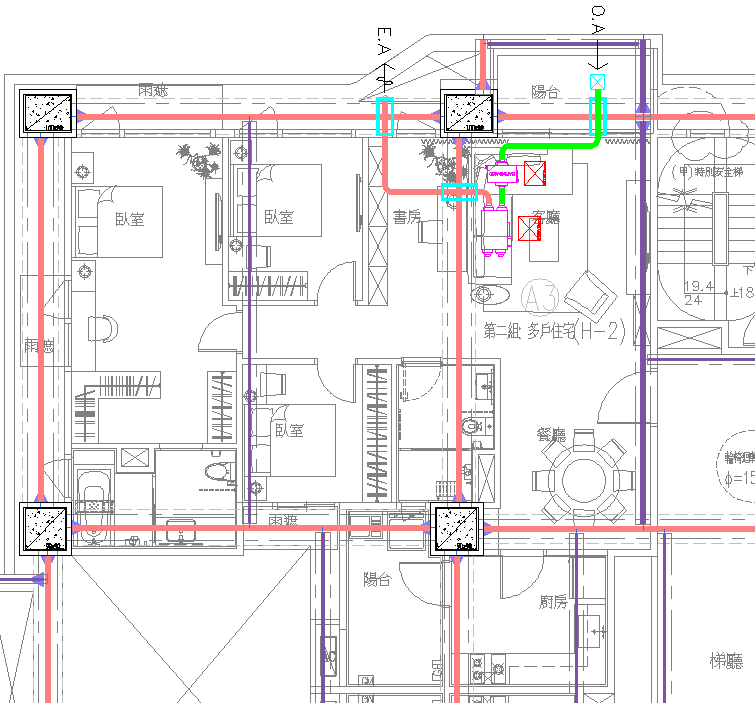

---
## 第 39 頁
### 制音防治措施

項
次 
項目 
設計標準 
設計制音對策
1 
B6F緊急發電機
依環保署噪音管制區類別設計
1.進氣機及排氣機設計消音箱 
2.機房內頂板及牆面設計吸音材料處理 
3.浮動地版設計，且與設備基座分開 
4.採用隔音防火門
2 
R2F消防中繼機房 
浮動地版設計，且與設備基座分開
3 
給水管路 
水錘吸收器設計

機房 制音：
風機消音箱
浮動地板
頂版+牆面吸音材料

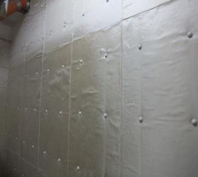

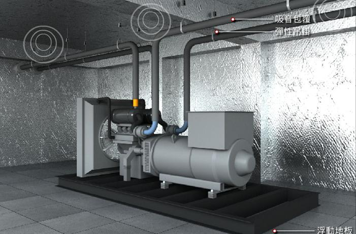

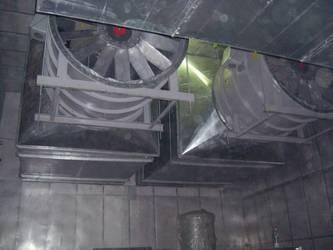

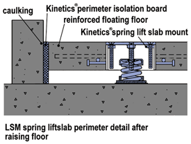

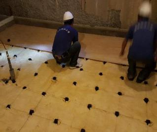

---
## 第 40 頁
### 專有浴廁 水管末端

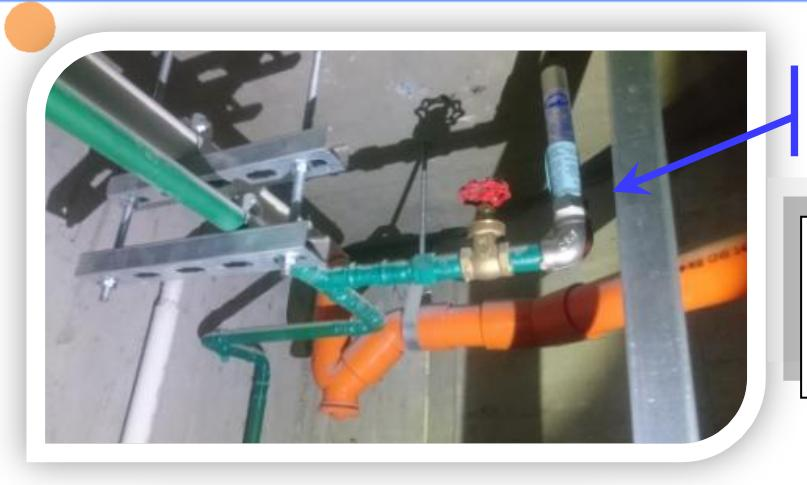

**管路 制音:**

**公共機房**

 **水錘吸收器**

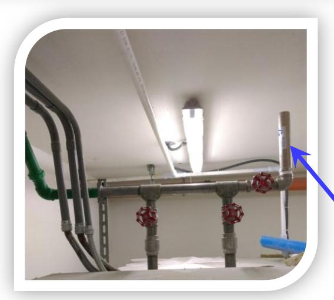

**揚水管轉折處**

**管道間排水立管壓力緩衝措施- 每10層一處(控制水錘壓力)**

---
## 第 41 頁
### 中央淨水處理

地下水池設置雜質過濾設備，屋頂水塔採殺菌設備
完全防護客戶飲用水安全
第1道處理
第2道處理
自來水引進
第
二
道
殺
菌
處
理
(頂樓)
(上水塔循環淨水處理)
下水管
(地下室)
揚水管
第一道 
雜質過濾
處理
自來水引進

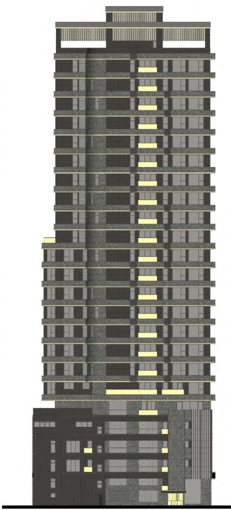

---
## 第 42 頁
### FRP組合水箱

• 配合結構耐震設計，具高耐震能力
• 水箱内有防護膜可抑制青苔滋長
• 使用年限長.減少維修費用
• 採用在自來水用

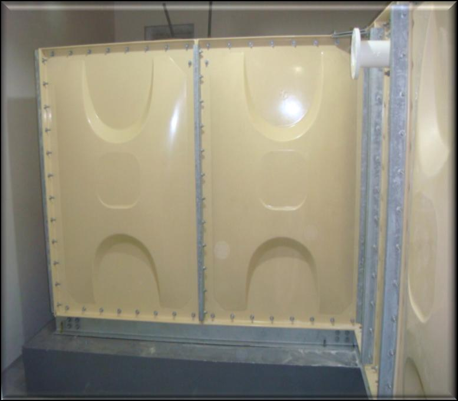
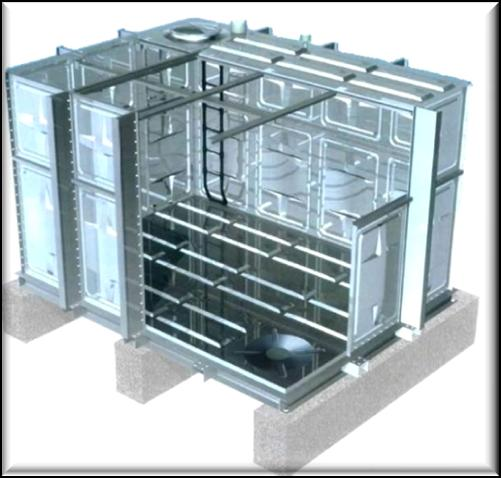

---
## 第 43 頁
### 貼心便利

提供生活需求化的便利性服務
專有戶內預留
裝修排水
集中式 
垃圾冷藏及 
資源回收室
專有戶內
自來水 
總閥設置
汽車 
充電座
電子 
讀卡信箱
專有戶內 
 停電備用電源
自來水 
子母水箱

---
## 第 44 頁
### 專有戶內預留裝修排水

排水口
專用沉沙池
裝修排水立管

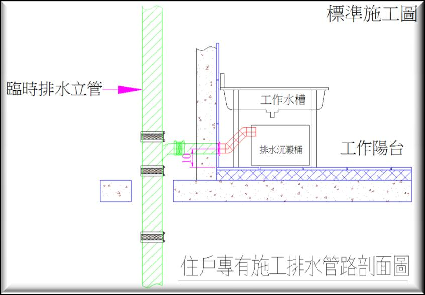

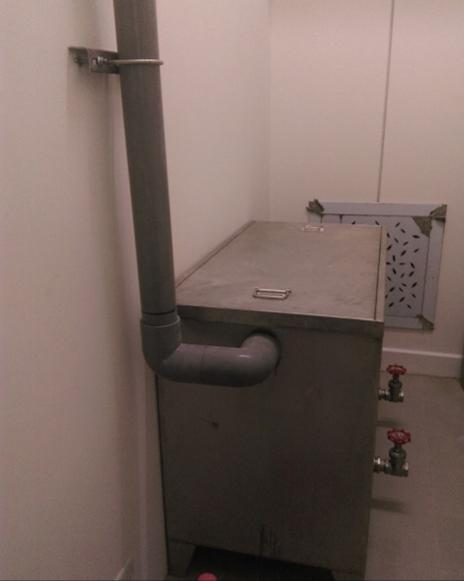

---
## 第 45 頁
### 工作陽台自來水總閥設置

它案設置 
梯廳天花內
屋頂水錶區
法定總閥
自來水總閥-設置在工作陽台
便於管路維養或緊急狀況時啟閉

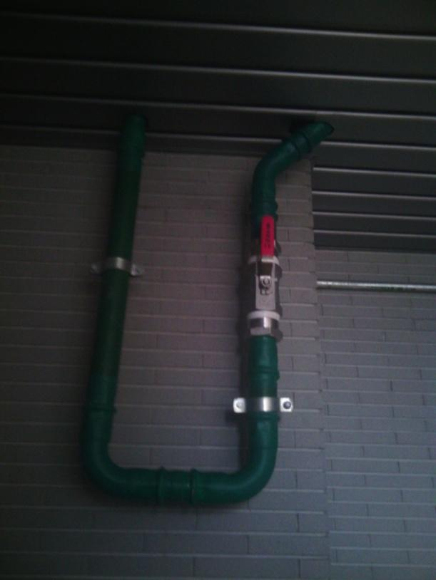

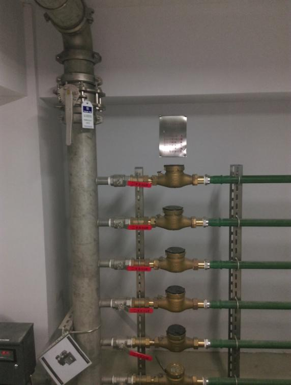
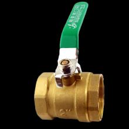

---
## 第 46 頁
### 集中式垃圾冷藏及資源回收室

地下一層

地下一層設計符合綠建築規範，具有空間充足且
合理運出動線的集中垃圾冷藏室。

室內設置垃圾廚餘冷藏、資源回收系統櫃、排風
設備等

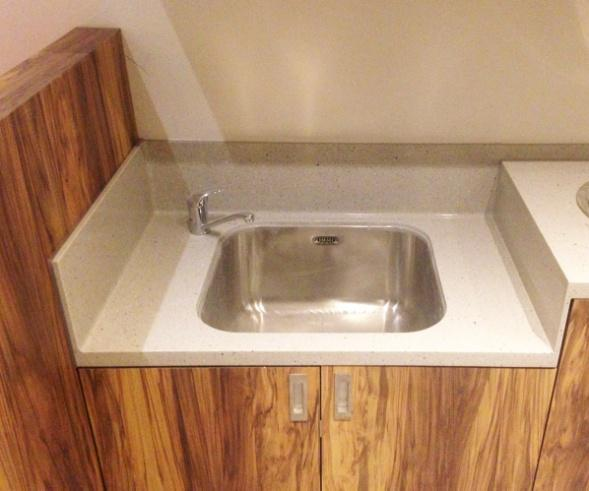

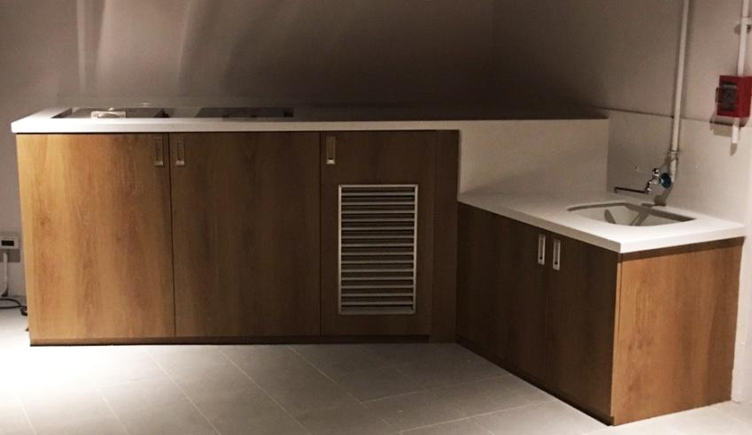

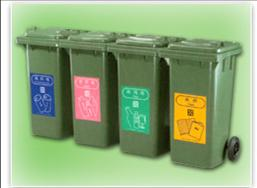

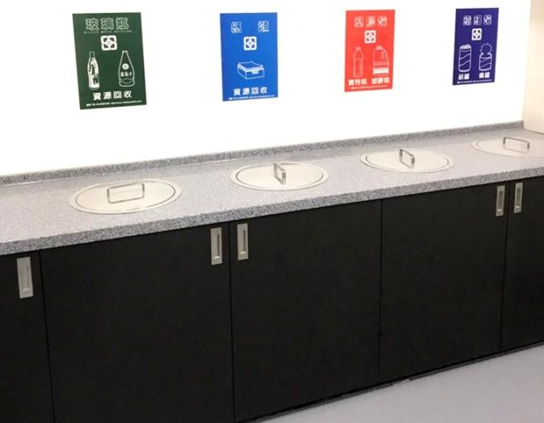
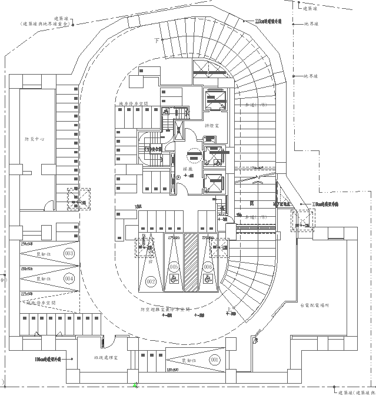

---
## 第 47 頁
### 汽車充電座建置

B1F 
兩處汽車位
公共車位：
B1F兩處公共用汽車位，建置車充設備
地下一層

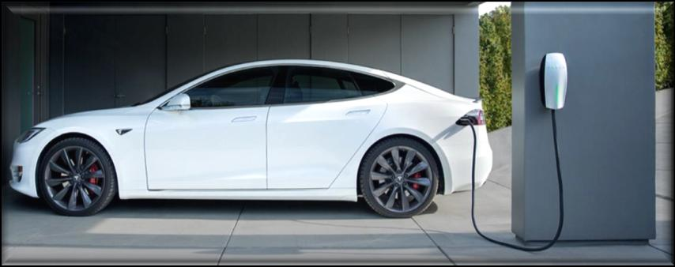

---
## 第 48 頁

車充專用 
台電公共電錶
車充總盤
車位後方 
建置線槽
當樓層分區盤 
(內含私設電表) 
充電器 
220V/32A
c
日後車主 
建置範圍
前期系統建置 
後續客戶自行施作(含配線)
各專有戶車位：
預留配電線用電纜線架
系統採車充專用公共電表+軟體計費管理
預留配線 
電纜線架 
軟體計費 
整合管理

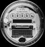

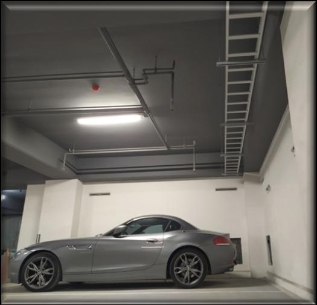

---
## 第 49 頁

優點 
缺點
專有電表 不需額外計費系統 
電費較貴(每度至少4~6元)
前期建置費用低 
客戶後期配線引接需跨樓層，距離長
每戶至多3台車位
公共專用 
車充電表
可採時間電價便宜計費 
(每度約1.4~4.4元)
需有計費相關配套設計： 
可採設置私用電表+軟體計費整合計算
客戶日後自行建置及配線引接便利
前期建置費用高： 
包含申請專用電表、動力盤、電纜線、私表
及軟體計費整合
每戶無車位數量限制

---
## 第 50 頁

配線電纜架
當層配電盤
停車樓層 
(電動車充電預留)

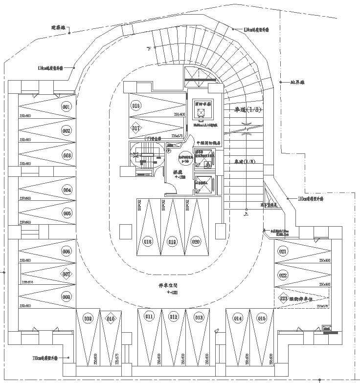

---
## 第 51 頁
### 電子讀卡(信箱)系統

• 讓社區住戶更便利的生活
• 不需攜帶鑰匙
• 可透過利用電腦管制或單機作業
• 進行資料互換，住戶只需登記一次

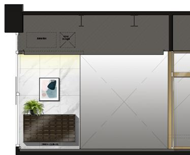

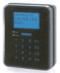
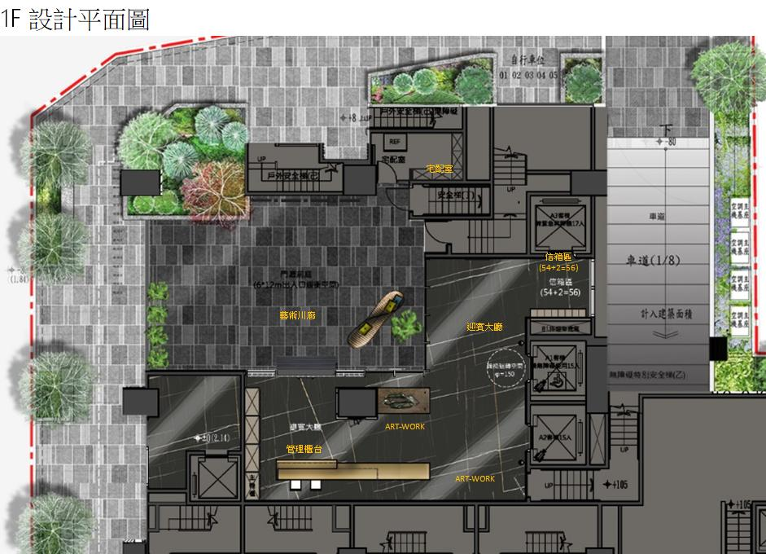

---
## 第 52 頁
### 專有戶內 停電備用電源

緊急電自動切換開關
宅內配電箱
停電時，室內自動切換由發電機供電範圍： 
室內四處插座使用 (冰箱、客廳、主臥、宅內箱)

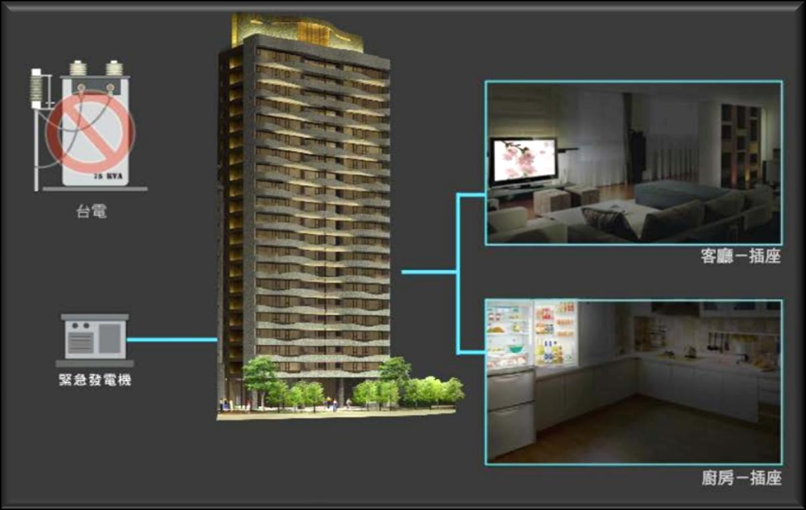

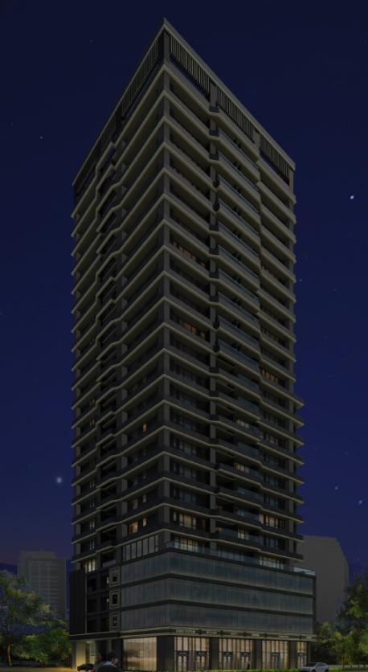

---
## 第 53 頁

停電緊急插座
A3
A2
A1
標準樓層 
(緊急插座位置)

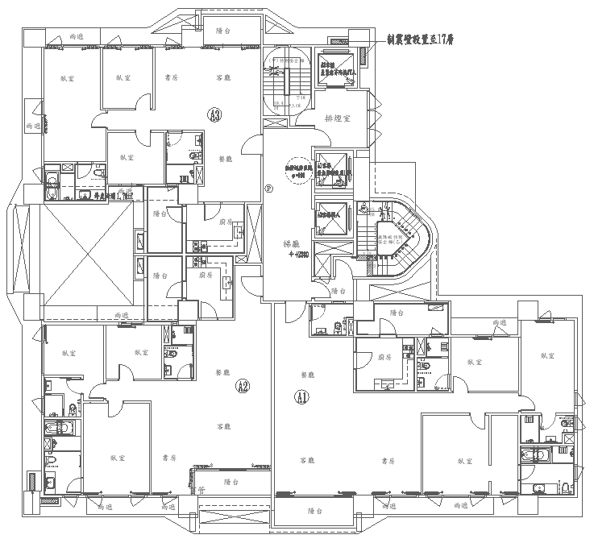

---
## 第 54 頁
### 自來水子母雙水箱

雙水箱設計 
洗水塔不停水
水箱型式示意 
水箱型式示意
屋頂水塔採雙獨立水塔，管路交替補水的設計
當清洗水塔時,住戶端持續正常供水

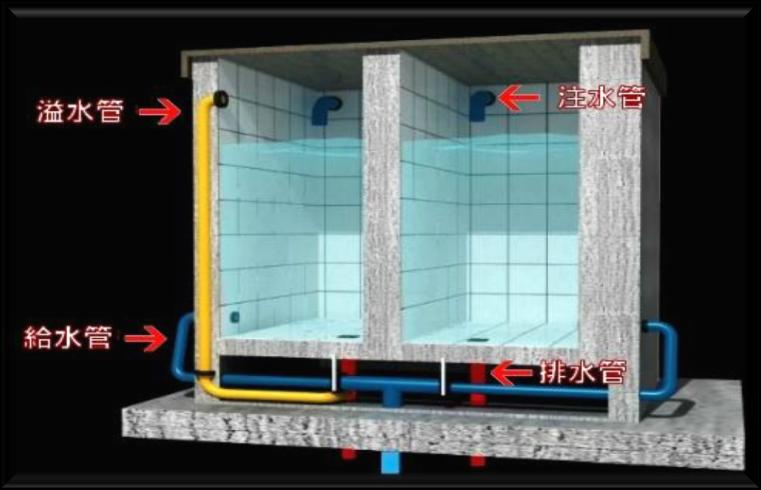

---
## 第 55 頁

---
## 第 56 頁
### 排水轉折層幹管 堵塞感知設計

 5F排水匯流轉折層，主立管轉折處堵塞檢知設計。 
   (包含雨水、汙水、廢水、洗衣機排水、廚房排水等) 
 由中央監控系統自動感知管路堵塞狀況。

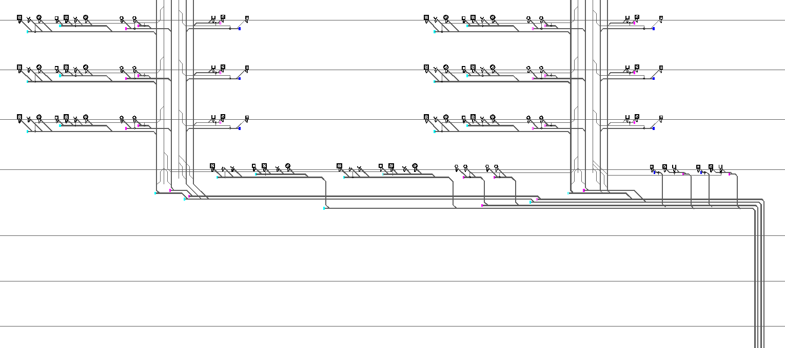

---
## 第 57 頁
### 污排水轉折層分流設計

污排水轉折層幹管與轉折當層支管採分流， 
至下層管道內後才匯集，避免堵塞時直接 
回灌當層器具。

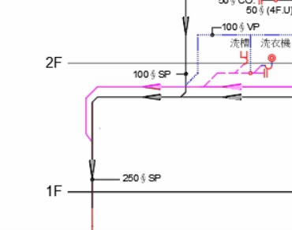
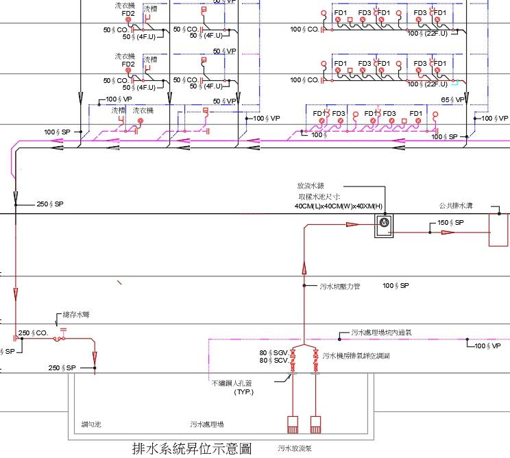

---
## 第 58 頁
### 浴廁當層排氣及管道垂直/水平區劃

管道間樓版皆採RC澆築封閉，樓
板不放空，管路穿越事先預埋套管 
管道間配管後，管縫隙塡實封閉 
主浴/次浴廁當層排氣罩
當層排氣優點： 
   利用浴室本身排風裝置直接將 
   浴室廢氣排出至戶外 
 
管道垂直/水平區劃優點： 
   避免火災發生時之煙囪效應產 
   生，確保居住之安全。

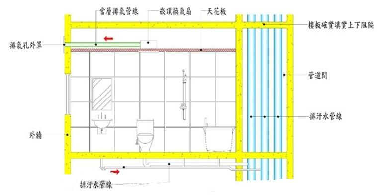

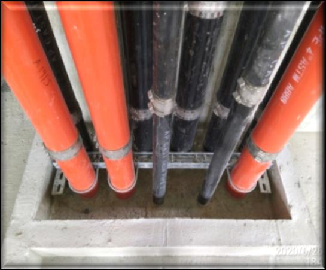
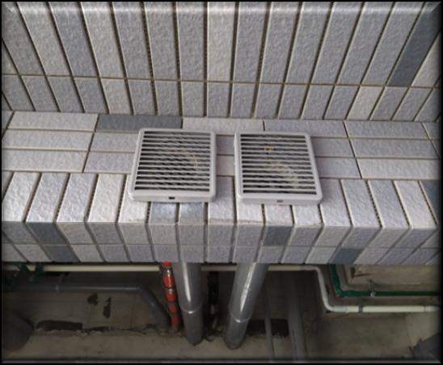

---
## 第 59 頁
### 專有戶內配電宅內箱配線槽引線

配線槽收線優點： 
   專有戶配電宅內箱處樓板暗埋管數量多，以線槽分散 
   配管位置，避免樓板保護層厚度不足造成日後樓板龜裂。 
 
增築輕隔間厚度，內崁電氣宅內箱優點： 
   避免內崁分戶牆，造成牆壁龜裂風險及降低隔音效果。
(它案示意)
頂板配線槽
輕隔間增築 
內崁電氣宅內箱

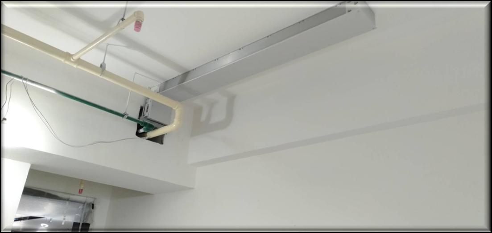

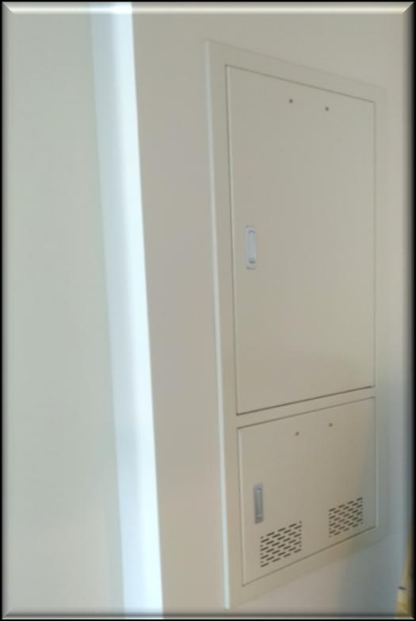

---
## 第 60 頁
### 專有戶VRV冷暖變頻主機位置

標準樓層 
(空調主機位置)

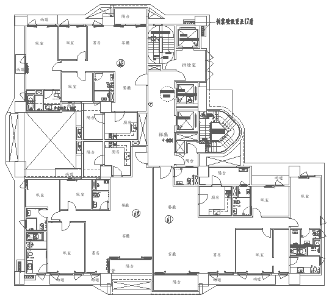
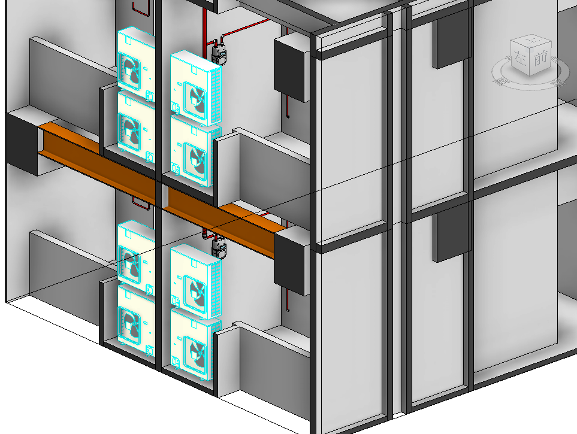
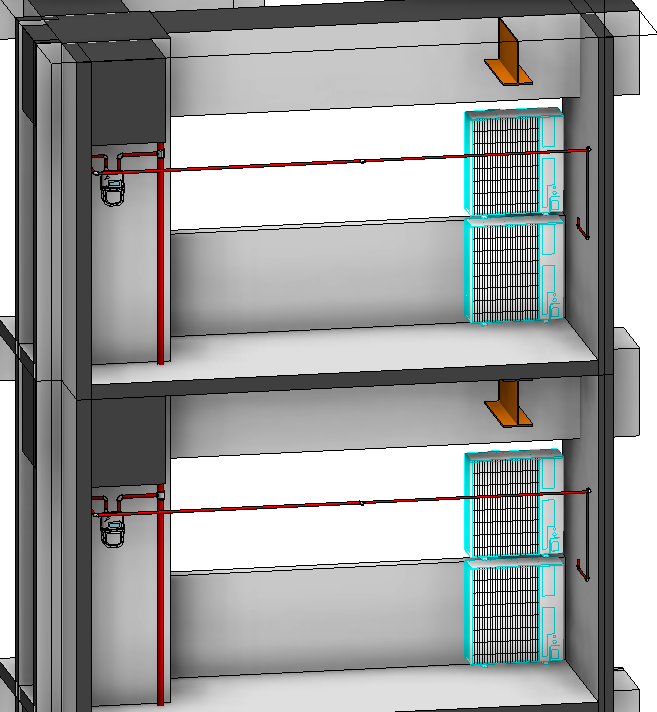

---
## 第 61 頁

---
