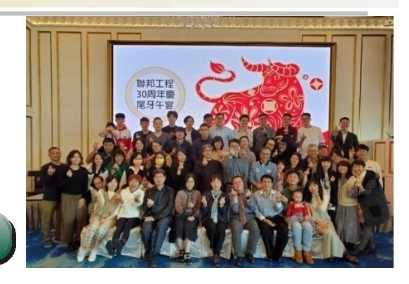
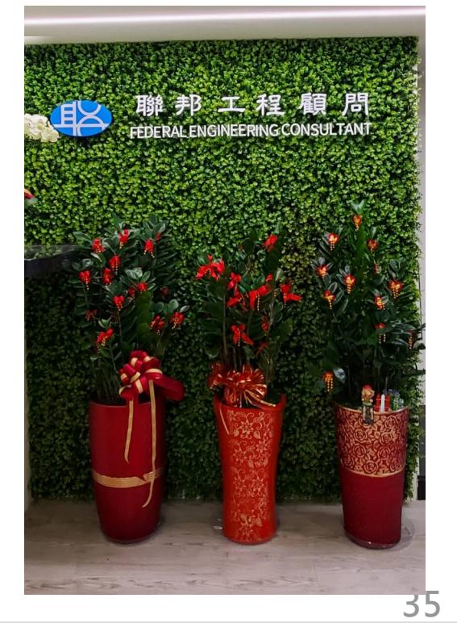

# 結構銷講簡報

---
extracted_main_title: "璞真宇見"
file_hash: "0a54ac2b725d4875a537995befad2fae"
---

## 第 1 頁
### 璞真宇見

---
## 第 2 頁
### 銷講大綱

## **銷講大綱**

- **地震概要說明**
- **結構耐震** / **耐風設計**
- **結構系統說明**
- **地質狀況說明**
- ****
- **公司簡介 公司簡介**

---
## 第 3 頁
### 地震概要說明

地震發生的原因
規模與震度
活動斷層

---
## 第 4 頁
### 地震發生原因

4
聯邦工程顧問公司
Federal Engineering Consultants INC.
地震可分為自然地震與人工地震（例如：核爆）。
一般所稱之地震為自然地震，依其發生之原因又可分為：
（１）構造性地震、（２）火山地震、（３）衝擊性地震
( 例如：隕石撞擊) 。其中又以板塊運動所造成的地殼變動
（構造性地震）為主。
由於地球內有一種推動岩層的應力，當應力大於岩層所能
承受的強度時，岩層會發生錯動（dislocation) ，而這種
錯動會突然釋放巨大的能量，並產生一種彈性波(elastic
waves) ，我們稱之為地震波(seismic waves ），當它到
達地表時，引起大地的震盪，這就是地震。

---
## 第 5 頁
### 震度與規模

5
聯邦工程顧問公司
Federal Engineering Consultants INC.
地震規模是指地震所釋放的能量，所以每個地震只有
一個規模
自1897 年以後台灣地區發生過的地震規模最大為
7.3(1951 花東縱谷/1999 集集) 。
震度是指地震時人們對於地面震動的感受程度，一個
地震發生時因為在不同的地區感受震動的程度不同，
所以會有不同的震度
以921 地震為例，其地震規模為7.3 ，在南投地區測
得最大的震度為7 級，在台中地區測得最大的震度為
6 級，在台北測得最大的震度為5 級。2011 年日本
311 大地震規模為9.0 ，在東京地區所感受的震度亦
為5 級。 2023 年2 月6 日土耳其- 敘利亞大地震規
模為7.8 ，在震央地區所感受的震度約為6 強等級。

---
## 第 6 頁
### 耐震等級

6
聯邦工程顧問公司
Federal Engineering Consultants INC.
•
耐震等級是看震度而非看規模，因為發生規模很大的地震如果震央距離很
遠，對於房屋結構的影響就不大。

---
## 第 7 頁
### 活動斷層

7
聯邦工程顧問公司
Federal Engineering Consultants INC.
舊規範
2022 年規範
獅潭斷層
新城斷層
神卓山斷層
獅潭斷層
屯子腳斷層
三義斷層
車籠埔斷層
大甲斷層
梅山斷層
鐵砧山斷層
大尖山斷層
屯子腳斷層
觸口斷層
彰化斷層
新化斷層
車籠埔斷層
米崙斷層
大茅埔- 雙冬斷層
玉里斷層
梅山斷層
池上斷層
大尖山斷層
奇美斷層
六甲斷層
觸口斷層
新化斷層
旗山斷層
米崙斷層
瑞穗斷層
玉里斷層
池上斷層
鹿野斷層

---
## 第 8 頁
### 結構耐震設計

耐震設計目標
設計地震力

---
## 第 9 頁
### 耐震設計目標

9
聯邦工程顧問公司
Federal Engineering Consultants INC.
依最新建築物耐震設計規範要求, 設計地震力分為三個等級, 本案設計地震力為0.264g
中小度地震力
設計地震力
最大考量地震力
耐震等級依據法規
設計地表加速度
0.07 g
0.24 g
0.32 g
耐震等級
4 級中震
5 級強震
6 級烈震
設計耐震等級提升
設計地表加速度
0.07 g
0.264 g
0.352 g
耐震等級
4 級中震
6 級烈震
6 級烈震

---
## 第 10 頁
### 耐震設計目標

10
聯邦工程顧問公司
Federal Engineering Consultants INC.
震度分級
地表加速度 PGA
gal
地動速度 PGV
cm/s
0 級
無感
<0.8
1 級
微震
0.8~2.5
2 級
輕震
2.5~8.0
3 級
弱震
8.0~25
4 級
中震
25~80
5 弱
強震
80~140
15~30
5 強
140~250
30~50
6 弱
烈震
250~440
50~80
6 強
440~800
80~140
7
劇震
>800
>140

---
## 第 11 頁
### 結構耐風設計

耐風設計規範
抗風等級

---
## 第 12 頁
### 耐風設計規範

12
聯邦工程顧問公司
Federal Engineering Consultants INC.
依最新建築物耐風設計規範及解說
工址
台北市中正區
風力分區
台北市
基本設計風速
42.5m/sec
地況種類
地況B
用途係數
I=1.0

---
## 第 13 頁
### 結構系統說明

結構系統一覽表
樓層高度與用途
構造型式說明
鋼骨鋼筋混凝土(SRC) 優點
材料強度
制震壁配置
結構行為需求

---
## 第 14 頁
### 結構系統一覽表

14
聯邦工程顧問公司
Federal Engineering Consultants INC.
項目
內容
備註
抗震強度
本案設計採ZI=0.264g ，四級中震無損壞、六弱烈震可修復、六強烈震不倒塌
材料
4000psi(280kgf/cm2) 混凝土，
5000psi(350kgf/cm2) 混凝土，
6000psi(420kgf/cm2) 混凝土，
鋼結構選用SN490B/YB/YC 等耐震鋼材/ 梁、柱構件主筋選用SD420W 耐震
鋼筋
結構系統
主體結構為鋼骨鋼筋混凝土特殊抗彎矩構架(SMRF) 系統
地下室結構為鋼筋混凝土抗彎矩構架系統
樓版厚度
主體結構以15cm 之RC 樓版為主，1F 室內20cm/ 室外25~35cm
地下室結構以20cm 之RC 樓版為主，
牆
外牆、隔戶牆、樓梯牆及電梯牆為15cm RC 牆，隔間牆為輕隔間
基礎
筏式基礎( 地梁深度300cm) ，筏基底版厚80cm 、頂版厚20cm
抗液化措施
開挖深度20.1 公尺，地下20 公尺內具液化潛能之砂性土層皆已挖除
擋土措施
採用100cm 連續壁，同時配置地中壁及內扶壁等加強措施
開挖工法
採用順打工法配置六層水平鋼支撐
結構外審
經台灣大學地震工程研究中心嚴格審查

---
## 第 15 頁
### 樓層高度及用途

15
聯邦工程顧問公司
Federal Engineering Consultants INC.
樓層
樓高 (m)
用途說明
6F~28F
3.4
集合住宅
5F
3.68
一般事務所
4F
3.68
一般事務所
3F
3.68
一般事務所/ 管委會空間
2F
3.7
一般零售業/ 機電空間/ 防災中心
1F
4.2
一般零售業/ 大廳/ 管委會
B1
4.5
台電配電室/ 機車停車空間
B2
3.2
汽車停車空間
B3~B5
3.2
汽車停車空間

---
## 第 16 頁
### 構造型式說明

16
聯邦工程顧問公司
Federal Engineering Consultants INC.
RC 構造
( 鋼筋混凝土)
SRC 構造
( 鋼骨鋼筋混凝土)
SS 構造
( 鋼骨構造)
SC 構造
( 鋼骨外包覆混凝土)
結構特性
自重大、勁度大
耐久、防火性佳
舒適性較佳
自重大、勁度大
強度高
舒適性較佳
自重輕、勁度小
強度高
舒適性較差
勁度大
強度高
舒適性較佳
施工特性
施工簡便
工期較長
施工技術高
施工複雜
工期最長
施工技術較高
工期較短
施工技術高
施工複雜
工期適中
相對造價
較低
次高
最高
最高

---
## 第 17 頁
### 鋼骨鋼筋混凝土構造優點

17
聯邦工程顧問公司
Federal Engineering Consultants INC.
鋼骨鋼筋混凝土梁
鋼骨鋼筋混凝土柱
結構性能
混凝土的抗壓強度高
鋼筋/ 鋼骨的延性與韌性佳
混凝土整體之防火、抗風化能力強
結構勁度高，對颱風及地震力造成之側向變形小
，結構振動較小，有較佳之舒適性
施工性
SRC 構造施工技術成熟

---
## 第 18 頁
### 材料說明

18
聯邦工程顧問公司
Federal Engineering Consultants INC.
混凝土強度
項  目
fc=2000 psi
fc=3000 psi
fc=3500 psi
fc=4000 psi
fc=5000 psi
fc=6000 psi
梁、版
PR~13F
12F~4F
3F-B5
柱、牆
PR~12F
11F~3F
2F-B5
筏式基礎

連續壁、內扶壁

無筋混凝土、筏
基回填

柱內灌漿(SCC)
3F 以上
2F-B5
其它


---
## 第 19 頁
### 材料說明

19
聯邦工程顧問公司
Federal Engineering Consultants INC.
鋼骨材料與強度
鋼柱：SN490B/YC         Fy=3300 kgf/cm2
鋼梁：SN490B/YB         Fy=3300 kgf/cm2
鋼筋材料與強度
梁、柱  (SD420/SD420W)
#3 及以上
                fy = 4,200 kgf/cm2
版、牆   (SD280/SD420)
#5 及以下
                fy = 2,800 kgf/cm2
#6 及以上
                fy = 4,200 kgf/cm2
連續壁   (SD420W)
全採
                               fy = 4,200 kgf/cm2

---
## 第 20 頁
### 制震壁配置

20
聯邦工程顧問公司
Federal Engineering Consultants INC.
樓層:6F~19F
每層4 組共56
組

---
## 第 21 頁
### 結構行為需求

21
聯邦工程顧問公司
Federal Engineering Consultants INC.
安全的居住環境
- 六級烈震抗震設計，確保人身安全。
- 耐震韌性設計，確保結構安全。
- 強度勁度分配均勻，避免軟腳蝦。
- 特殊結構審查嚴格把關( 經台大地震中心審查通過) 。
舒適的居住環境
- 地震強風下之位移檢核，減少住戶恐慌。
- RC 外牆與結構一起澆置，水密性增加。

---
## 第 22 頁
### 地質狀況說明

---
## 第 23 頁
### 土層資料

23
聯邦工程顧問公司
Federal Engineering Consultants INC.
水位GL-3.0 ( 常時)
        GL-1.0( 暴雨)

---
## 第 24 頁
### 開挖工法

24
聯邦工程顧問公司
Federal Engineering Consultants INC.
採用厚度100cm 連續壁，以順打內支撐工法開
挖
配置內扶壁/ 地中壁，可有效減少開挖變形對鄰
房之影響
階段
施工內容
1
開挖至GL.-2.6m
2
架設第一檔水平支撐GL.-1.8m
3
開挖至GL.-5.80 m
4
架設第二檔水平支撐GL.-5.0m
5
開挖至GL.-9.00 m
6
架設第三檔水平支撐GL.-8.2m
7
開挖至GL.-12.00 m
8
架設第三檔水平支撐GL.-11.2m
9
開挖至GL.-15.00 m
10
架設第三檔水平支撐GL.-14.2m
11
開挖至GL.-17.00 m
12
架設第三檔水平支撐GL.-16.2m
13
開挖至GL.-20.10 m
14~15
澆置筏基底版、地梁及B5 樓版
16~25
拆除各檔水平支撐及澆置B4~B1 樓版
26
澆置1F 樓版

---
## 第 25 頁
### 開挖工法

25
聯邦工程顧問公司
Federal Engineering Consultants INC.
連續壁
內扶壁
地中壁

---
## 第 26 頁
### 基礎型式

26
聯邦工程顧問公司
Federal Engineering Consultants INC.

---
## 第 27 頁
### 土壤液化說明

27
聯邦工程顧問公司
Federal Engineering Consultants INC.
a.
為什麼只要擔心地表20 公尺內?
       因為太深的土被壓在下面，很難產生液態流動，被壓著束
制住了。
b. 為什麼是砂土?
       因為砂土是一顆一顆，顆粒間沒有凝聚力( 不會黏黏
的) ，才有可能會像液態流動，這是土體特性。
c.
為什麼要有水，且要飽和的砂土才會?
       可以想像拿一個杯子，只裝砂不裝水，就像砂鈴，他還是
固態。如果裝了水+ 砂，搖晃的夠強，並且封住水的出入
( 水不可以有水位的上升) ，因水的體積無法壓縮，所以
水就會受到壓力，填滿在砂顆粒縫隙之間的水受到壓力，
使砂本身懸浮起來被帶著像液態流動。
條件：很高的地下水位 + 地表20 公尺內有疏鬆的砂土 + 受震時間夠長強度夠大
             ---> 有機會發生砂土液化現象

---
## 第 28 頁
### 土壤液化潛勢

28
聯邦工程顧問公司
Federal Engineering Consultants INC.
本案工址位於土壤液化低潛勢區，地下室開挖深度20.1m ，現地表下GL-6.2~-17.3m
具液化潛能之砂性土壤皆已被挖除，基礎面下無須考量土壤液化所引致問題。
基地位置

---
## 第 29 頁
### 結構說明

---
## 第 30 頁
### 結構說明

30
聯邦工程顧問公司
Federal Engineering Consultants INC.
• 耐震性能優良的SRC 構造
SRC 構造結合了鋼骨與RC 構造的優點，除了耐震性能優良，其防火、隔音性
能亦佳，且地震時搖晃的程度比鋼骨或RC 低 。
• 結構格局方正，採用優良的耐震結構系統
柱位配置方整、均衡具對稱性，結構系統採用韌性較佳的特殊抗彎矩構架系統
(SMRF) ，住得更安心。
• 基礎構造採用深度3 公尺之筏式基礎及深度達36.5 公尺之連續
壁、地中壁與內扶壁，基礎穩若磐石
本工程整棟建築物四周施作連續壁，連續壁內規劃數道地中壁與內扶壁，壁體
皆深入開挖面下至少16.5m ，連續壁、地中壁及內扶壁皆與筏式基礎崁合在一
起，可有效提昇基礎承載能力減少基礎沉陷量，使建物基礎穩若磐石。

---
## 第 31 頁
### 結構說明

31
聯邦工程顧問公司
Federal Engineering Consultants INC.
• 耐震設計標準提高
本工程耐震設計等級可達六級烈震( 六弱) ，較最新建築物耐震設計規範五級強
震( 五強) 標準，提昇一個等級。
• 耐震設計目標
本工程耐震設計可符合「小震不壞、中震可修、大震不倒」的耐震設計目標。
• 減震規劃
本工程規劃配置56 組制震壁可有效減少地震時建築物之位移及加速度反應。
• 耐風設計
本工程耐風設計可抗風速14 級以上之中度颱風，並依耐風設計規範檢核最高居
室樓層角隅側向加速度值不超過0.05m/s2 ，可避免高樓層住戶受風力擺動引起
的不舒適感。

---
## 第 32 頁
### 結構說明

32
聯邦工程顧問公司
Federal Engineering Consultants INC.
• 耐震鋼材、高強度混凝土、SA 級鋼筋續接器，本大樓更耐震
SRC 的鋼結構選用SN490B/YB/YC 等耐震鋼材，梁、柱構件主筋選用
SD420W 耐震鋼筋，結構混凝土強度4,000~6000psi ，SRC 鋼柱柱內灌漿混
凝土強度5,000~6000psi ，柱主筋續接採用SA 級鋼筋續接器，且鋼筋續接位
置最少錯開60cm 以上、避免續接於同一斷面、續接位置規劃於應力較小之非
圍束區，使得本大樓更耐震。 
• 梁柱接頭確實施工，本大樓更耐震
梁柱接頭為建築物耐震性能最重要的施工部位之一，梁柱接頭之RC 梁主筋最
少過柱斷面3/4 以上遠端錨定，柱箍筋採用耐震圍束緊密箍筋+ 輔助繫筋，間
距不得大於10cm ，且均勻配置，可確實發揮耐震軔性之效果。 
• 精工細琢、專業嚴密管理
經最具權威專業地震學術研究單位台大地震中心嚴格結構外審把關通過，並於
施工階段提供技術諮詢，落實設計與施工之一貫性。

---
## 第 33 頁
### 公司簡介

---
## 第 34 頁
### 聯邦

## **聯邦工程顧問公司**

**Federal Engineering Consultants INC.**

創立於 1990 年迄今『超過 30 年』,期間累積設計完工之大小案件『超過 2000 件』 其中高樓層建築物最高為 47 層,高度 176 m ;最深開挖為地下七層,開挖深度為 26.5 m ;單一設計個案之總樓地版面積最大為 35 萬平方公尺,大跨距構造物最大跨距為 70 m 。

## **主要專長與發展領域**

- 超高樓層結構規劃設計
- 住宅結構規劃設計
- 隔震減震規劃設計
- 橋梁結構規劃設計
- 營建專案管理
- 國際合作

- 學校辦公教學大樓、圖書館、體育館結構規劃設計
- 一般廠房及精密電子廠辦結構規劃設計
- 醫療、醫院大樓結構規劃設計
- 特殊及預鑄建築結構設計
- 戲院、停車場、育樂購物中心及大賣場結構規劃設計

---
## 第 35 頁
### 團隊組織

## **團隊組織**

## **負責人 蘇晴茂**

**總經理 總經理 **

**總總工程工程師師葛文彬 葛文彬**

**大地顧問 謝旭昇 博士 營營建顧問 建顧問葉慶鐘 葉慶鐘博士博士 橋橋梁顧問 梁顧問蔣蔣福福林林博士博士**

**設計一 設計一部部**

****

**吳 訓**

**何政忠**

**黃大華**

**詹雅嵐**

**設計設計二部二部**

**陳彥廷**

**蔡兆茹**

**林孟慧**

**李哲諺**

**錢孫龍**

**賴敬正**

**設計三 設計三部部**

**黃立宗**

**吳思誼**

**蔡協展**

**鄭鵬成**

**黃建雄**

**張豐選 洪彬祐**

**洪子傑**

**葉泓毅**

**陳美玲**

**工工務部務部**

**葛文彬**

**朱春榮**

**彭建諭**

**李有禮**

**何怡儀**

**王軍進**

**徐茂珍**

**徐暐喬**

**曹榮軒**

**繪圖部 繪圖部**

**黃怡菁**

**孫怡君**

**趙 芸**

**吳苡瑄**

**王詠馨**

**古若頤**

**行行政部政部**

**郭嘉玉**

**游淑伶**

**游荌絜**

**郭士瑋**

**聯邦工程顧問公司 Federal Engineering Consultants INC.**

**璞真建設 - 中正區福和段新建工程 (694 等 18 筆地號 )**

---
## 第 36 頁

36
聯邦工程顧問公司
Federal Engineering Consultants INC.
參與工程
公共工程、社宅
廠辦建築
得獎作品
高雄海洋流行音樂中心
臺中榮民總醫院新門診大樓
國防部博愛案
新北市中和區警消社會住宅
新北市中和區莒光安居社宅
新北市鶯歌區鶯陶安居社宅
台北市明倫國小基地公共住宅
臺北市松山區寶清段公營住宅
台中世華國際大樓 47F/B6 多功能大
樓
技嘉科技新店廠辦
華固內湖E-Park 廠辦 A,B 基地 
太聯桃園廠辦
致茂林口捷運A7 站廠房
致茂電子華亞園區廠辦
鴻海精密工業蘭考玻璃廠一期工程
康寧台中廠房制震設計
康寧台南廠房制震設計
雲林科技大學5F/B1 設計三館新建
工程( 第7 屆公共工程金質獎)
衛生福利部臺中醫院長期照護大樓
擴建計畫新建工程( 第18 屆公共
工程金質獎特優)
實踐大學體育館及圖資大樓(2011
臺灣建築佳作獎)
聯邦工程顧問公司   總經理
財團法人臺灣營建研究院- 鋼骨鋼筋混凝土工程規劃設計及施工要點實務研討會主講人
中華民國鋼結構協會- 管件桿件接頭設計手冊編輯審查委員
內政部建築研究所106 年委託研究中高樓層建築非韌性RC 配筋柱擴柱補強技術研究審查委
員
管狀桿件接頭設計手冊編輯審查委員
鋼結構協會鋼結構設計規範編輯審查委員
財團法人台灣建築中心耐震標章審查委員
2023 RC 與鋼結構工程研討會
職稱
學歷
專長
得獎
國立台灣大學土木工程研究所結構工程組碩士 1990.09 ～
1992.07
國立交通大學土木工程系學士1986.09 ～1990.07
建築結構規劃、分析、設計及施工監造，結構耐震、制震
分析設計，耐震補強耐震阻尼非線性分析設計、價值工程
評估、監造、工務協調
中華民國結構工程學會94 年優秀青年結構工程師
獎
國立台灣大學111 年傑出土木校友獎
經歷

---
## 第 37 頁
### 集合

37
聯邦工程顧問公司
Federal Engineering Consultants INC.
集合住宅 Housing
Housing

---
## 第 38 頁
### 聯邦

38
聯邦工程顧問公司
Federal Engineering Consultants INC.
台北市延吉街
地上22 層/ 地下4 層
SRC 構造
陳克聚建築師事務所
勤耕延吉
大陸建設- 耑序
台北市大安區
地上20 層/ 地下4 層
SC 構造
陳傳宗建築師事務所
沅利建設溪州街集合住宅
台北市大安區
地上22 層/ 地下4 層
彭繼賢建築師事務所

---
## 第 39 頁
### 聯邦

39
聯邦工程顧問公司
Federal Engineering Consultants INC.
台北市延平北路
地上29 層/ 地下6 層
元宏建築師事務所
華威延北
台北市敦化北路
地上23 層/ 地下5 層
SS 構造
黃永沃建築師事務所
華固敦化北路名鑄
璞永中山北路( 醇建築)
台北市中山區
地上23 層/ 地下6 層
SS 構造
境向聯合建築師事務所

---
## 第 40 頁
### 聯邦

40
聯邦工程顧問公司
Federal Engineering Consultants INC.
台北市信義區
地上22 層/ 地下3 層
SC 構造
大元聯合建築師事務所
太子建設– 台北信義
大陸建設- 鐫豊
台塑敦化北路
台北市中山區
地上23 層/ 地下5 層
RC 構造
PGA 建築師事務所
台北市松山區
地上22 層/ 地下5 層
SS 構造
大元聯合建築師事務所

---
## 第 41 頁

41
聯邦工程顧問公司
Federal Engineering Consultants INC.
得獎作品
Honors
2001 臺灣建築獎：台北仁寶電腦企業總部大樓
2007 臺灣建築首獎：台北市立圖書館北投分館( 第8 屆公共工程金質獎)
2010 臺灣建築獎：台北國際花卉博覽會新生公園夢想館 來館與生活館
第7 屆公共工程金質獎：國立雲林科技大學設計三館
第11 屆公共工程金質獎：台電公司「彰化王功、大潭(Ⅱ) 及澎湖西風力發電
第12 屆公共工程金質獎：台電投中D/S 與服務所共構土建設計/ 施工統包
第13 屆公共工程金質獎： 中部國際機場國際航廈及污水處理廠統包工程
第13 屆公共工程金質獎：化校學員生大樓新建工程 正堯
第14 屆公共工程金質獎：新北市政府淡水國民運動中心
第14 屆公共工程金質獎：新北市政府蘆洲國民運動中心
第16 屆公共工程金質獎：臺中榮民總醫院新門診大樓
第16 屆公共工程金質獎：交通部臺灣鐵路管理局臺灣總督府交通局鐵道部古蹟修復再利用第一期工程
第18 屆公共工程金質獎：CCL-731 臺中車站段主體工程
第18 屆公共工程金質獎：國立成功大學理學教學大樓
第18 屆公共工程金質獎：衛生福利部臺中醫院長期照護大樓
第19 屆公共工程金質獎：新店區中央新村北側社會住宅

---
## 第 42 頁

簡報結束
       謝謝指教

---
